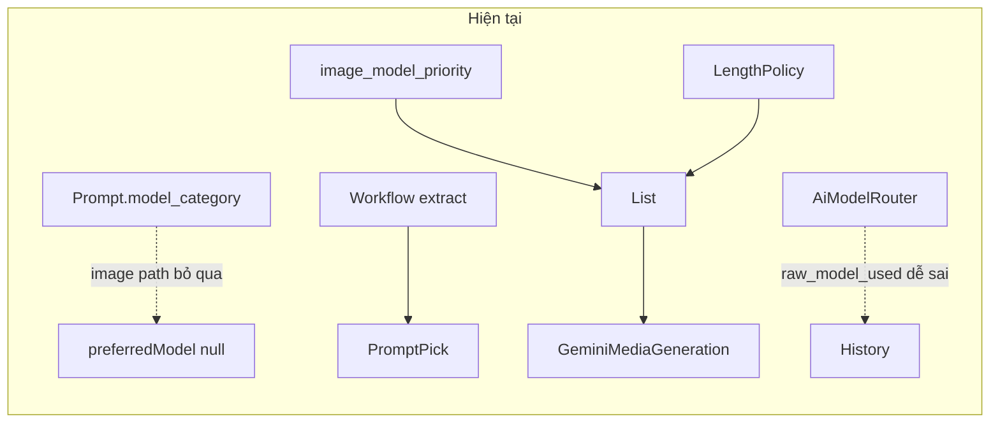
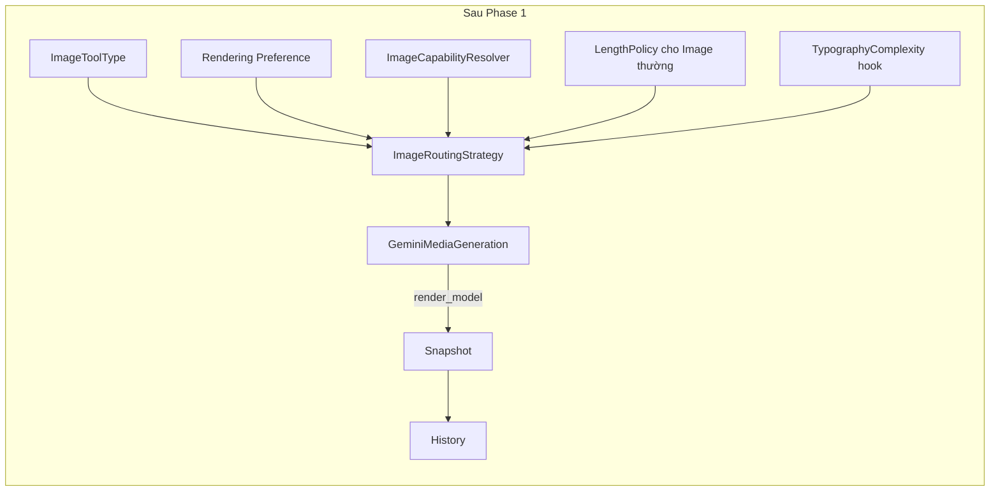

# Phase 1 — AI Image Routing Architecture (Revised)

## Tài liệu phải đọc trước

- `AUDIT_IMAGE_MODEL_ROUTING.md`
- `MAP_SEO_SETTINGS.md`

Hai tài liệu này là source of truth cho runtime hiện tại và vị trí Settings.

---

## Mục tiêu Phase 1

1. Mọi quyết định model sinh ảnh đi qua **một entry duy nhất**: `ImageRoutingStrategy`.
2. Prompt không còn chọn “Model đại diện”.
3. Settings chỉ cho khách chọn mức ưu tiên chi phí/chất lượng, không bắt khách hiểu raw model slug.
4. Thêm tool `image_typography` để phân biệt ảnh thường và ảnh có typography.
5. Tách đúng `planner_model` và `render_model` trong log/history.
6. Mỗi tác vụ Editor chỉ chọn đúng một nguồn: `prompt` hoặc `workflow`.
7. Không thay đổi full workflow runtime trong Phase 1; vẫn giữ extract prompt cuối để tương thích.
8. Không tạo thêm routing song song hoặc rải `if typography` ở nhiều nơi.

---

## Impact analysis





| Vùng | File chính | Thay đổi | Rủi ro BC |
|---|---|---|---|
| Prompt form | `PromptResource.php` | Ẩn `model_category`; thêm `image_typography` | Thấp |
| Routing core | NEW `Support/*` + `MediaGenerationService.php` + `GoogleAiModelRegistry.php` | Một cửa `ImageRoutingStrategy` | Trung bình |
| Capability sync | `AiModelRouterService.php` hoặc service sync tương ứng | Ghi `capabilities.resolved` | Trung bình |
| Settings | Theo `MAP_SEO_SETTINGS.md` | Rendering Preference + Prompt\|Workflow source | Trung bình |
| History | `PromptRunnerService.php`, `ArticlePromptRunHistoryService.php`, Gemini media return | Tách planner/render | Thấp |
| Model Status UI | `SeoSettingsOverview` + blade tương ứng | Nhóm theo capability; raw ở advanced | UX only |
| Legacy router | `AiModelCategory.php` và image path liên quan | Deprecate khỏi image routing | Trung bình |

**Không đụng Phase 1:** chạy full workflow graph từ Editor.

**Không bắt buộc migration DB:** ưu tiên dùng settings bag/JSON hiện có và `seo_ai_models.capabilities`; giữ cột `prompts.model_category` để backward compatibility.

---

# Quyết định kiến trúc

## 1. `ImageToolType`

Tạo enum/string object tại `Support/ImageToolType.php`:

```text
default
image
image_typography
video
```

Helpers tối thiểu:

- `isImagePipeline()`
- `isTypography()`
- `requiredCapabilities()`

Không thêm `image_edit` trong Phase 1. Có thể ghi TODO Phase 2, nhưng không reserve enum chưa dùng để tránh phát sinh whitelist và UI dư thừa.

---

## 2. `ImageCapability`

Phase 1 chỉ dùng tập capability tối thiểu:

```text
text_generation
image_generation
general_image
typography_supported
typography_recommended
video_generation
unknown
```

Không tạo `product_image`: product là **context**, không phải capability.

Không mở rộng sang `audio`, `embedding`, `planner`, `image_input` trong Phase 1 nếu chúng chưa phục vụ routing image hiện tại.

---

## 3. `ImageCapabilityResolver`

Ưu tiên theo thứ tự:

1. `seo_ai_models.capabilities.resolved`
2. Registry nội bộ cho các model đã biết
3. Heuristic an toàn
4. Không xác định được → `unknown`

Mapping tối thiểu:

```text
gemini image models
→ image_generation + general_image

Gemini Flash Image phù hợp typography
→ typography_supported

Gemini Pro Image phù hợp typography tốt hơn
→ typography_supported + typography_recommended

Imagen
→ image_generation + general_image

text-only model
→ text_generation, không có image_generation
```

Không được xem `image_input` là `image_generation`.

Model `unknown`:

- vẫn lưu và hiển thị trong nhóm Unknown;
- không tự vào routing mặc định;
- admin nâng cao có thể bật thủ công để test.

---

## 4. `RenderingPreference`

Tên hiển thị cho khách:

```text
Tiết kiệm
Cân bằng (mặc định)
Ưu tiên chất lượng
```

Tên code có thể là:

```text
cost_first
balanced
quality_first
```

Vai trò của setting này chỉ là **điều chỉnh thứ tự ưu tiên model**, không chứa logic riêng cho typography.

- `cost_first`: ưu tiên tier rẻ/Flash trước
- `balanced`: áp rule hiện tại phù hợp context
- `quality_first`: ưu tiên tier Pro/quality trước

Typography routing vẫn thuộc `ImageRoutingStrategy`, không nhét vào enum preference.

Setting này phải nằm trong khu vực **AI Settings / Model Settings** theo `MAP_SEO_SETTINGS.md`, không gắn về mặt khái niệm với Workflow Settings. Nếu hiện UI kỹ thuật buộc đặt chung page, phải tách section rõ ràng và ghi TODO di chuyển đúng khu vực.

---

## 5. `ImageRoutingStrategy` — entry duy nhất

Tạo `Support/ImageRoutingStrategy.php`.

Mọi image pipeline phải gọi class này để lấy danh sách model thử.

Input tối thiểu:

```text
ImageToolType
RenderingPreference
compiledPromptLength
productContext
TypographyComplexity|null
configuredPriorityList
provider/model registry
```

Thứ tự xử lý:

1. Xác định context và tool.
2. Lấy danh sách model từ `image_model_priority`.
3. Resolve capability từng model.
4. Filter model không có `image_generation` hoặc `unknown` chưa được admin bật.
5. Nếu tool=`image_typography`, chỉ giữ model có `typography_supported`.
6. Nếu product context, áp provider/context rule hiện tại, bao gồm exclude Imagen nếu logic production đang yêu cầu.
7. Áp `RenderingPreference` để reorder tier.
8. Với `image` thường + `balanced`, áp `ImageModelInputLengthPolicy` như production hiện tại.
9. Với `image_typography`, không dùng tổng prompt length làm router chính; nhận `TypographyComplexity` hook.
10. Trả list cuối cùng cho service generate và dùng first-success fallback như hiện tại.

Không để `GoogleAiModelRegistry`, `MediaGenerationService`, `PromptRunnerService` tự reorder riêng bên ngoài strategy.

---

## 6. `TypographyComplexity` stub

Tạo object/stub tối thiểu:

```text
visible_text_chars
text_block_count
max_text_block_length
layout_type
node_count
exact_text_required
language
```

Phase 1:

- cho phép null/empty;
- chưa cần parser hoàn chỉnh;
- chỉ tạo contract/hook để Phase 2 mở rộng;
- không thêm rule phức tạp giả tạo.

---

# Yêu cầu triển khai

## 1. Bỏ “Lựa chọn Model đại diện” khỏi Prompt

- Ẩn/xóa `Select::make('model_category')` khỏi Prompt form.
- Create/Edit Prompt không auto-fill bắt buộc field này.
- Giữ cột DB và dữ liệu cũ.
- Prompt không còn là nguồn quyết định model runtime.
- `AiModelCategory::resolveForPrompt()` không được điều khiển image rendering mới.

---

## 2. Thêm tool `image_typography`

Thêm vào Prompt form và toàn bộ whitelist/normalizer liên quan:

```text
Default (text)
Image
Image (Typography)
Video
```

Phải rà toàn bộ hard-code `image|video|default`, gồm:

- Prompt form options
- validation
- normalize tool type
- image pipeline detection
- post-processing visibility
- workflow image-step validation
- options service
- history label/i18n

`image_typography` phải đi cùng image pipeline nhưng truyền đúng `ImageToolType::ImageTypography` vào router.

---

## 3. Rendering Preference trong Settings

Thêm setting global:

```text
cost_first
balanced
quality_first
```

Default: `balanced`.

Không hiển thị raw model cho khách ở phần mặc định.

Khách chỉ chọn mức:

- tiết kiệm;
- cân bằng;
- ưu tiên chất lượng.

`image_model_priority` vẫn giữ cho advanced/admin và backward compatibility.

---

## 4. Đơn giản hóa Model Status

Phân nhóm hiển thị:

```text
Text
Image
Image Typography
Video
Unknown
```

Không tạo group `Product Image`; product là runtime context.

Mặc định chỉ hiển thị:

- tên thân thiện;
- capability group;
- status;
- mức khuyến nghị cơ bản.

Advanced/admin mới thấy:

- raw slug;
- priority;
- provider;
- preview/stable/deprecated nếu có;
- JSON capabilities.

Unknown không vào default routing nhưng có nút/toggle admin bật thủ công.

---

## 5. Settings Editor — một nguồn Prompt hoặc Workflow

Tại:

```text
Settings
→ Editor bài viết
→ Tạo ảnh / video
```

Mỗi slot chỉ chọn một nguồn:

```text
prompt
workflow
```

Các slot:

| Slot | Keys mới/tái dùng |
|---|---|
| Ảnh bài viết | `create_image_source` + prompt/task hiện có |
| Product gallery | `create_product_gallery_source` + prompt/task |
| Typography | `create_typography_image_source` + prompt/task |
| Video | `create_video_source` + prompt/task |

Migrate-on-load:

- có task id → `workflow`
- không có task nhưng có prompt id → `prompt`
- dữ liệu cũ tiếp tục chạy

Runtime sau migrate:

- source=`prompt` → chỉ dùng prompt đã chọn
- source=`workflow` → giữ behavior Phase 1: extract image prompt cuối

Không tiếp tục fallback ngầm `gallery prompt → workflow → legacy prompt` sau khi source đã được xác định.

---

## 6. Giữ `ImageModelInputLengthPolicy`

Không xóa và không đổi behavior production của ảnh thường.

- `image` + `balanced` → dùng policy hiện tại
- `cost_first` / `quality_first` → reorder theo preference trước/hoặc theo quy tắc được định nghĩa tập trung trong `ImageRoutingStrategy`
- `image_typography` → không dùng tổng prompt length làm quyết định chính

Các bảng UI mô tả phải phản ánh đúng logic backend thực tế.

---

## 7. Sửa History và model logging

### Gemini/media return

`GeminiMediaGenerationService::generateImage()` phải trả thêm model thực sự thành công.

Ví dụ contract:

```php
[
    'url' => $url,
    'usage' => $usage,
    'model_used' => $modelUsed,
]
```

Không dùng tuple khó đọc nếu project ưu tiên associative array/DTO.

### MediaGenerationService

- trả `model_used` lên caller;
- không discard model render thật;
- bỏ dead path `$routedModel` hoặc dùng thật theo kiến trúc mới, không để tham số giả.

### PromptRunnerService snapshot

Image run:

```text
render_model = model sinh ảnh thật
raw_model_used = render_model  // alias BC
```

Chain có planner:

```text
planner_model = model text planner
render_model = model image render
```

### History UI

Hiển thị riêng:

- Render model
- Planner model (nếu có)

Ưu tiên `seo_media.ai_generator` khi gắn được media record.

Không được dùng planner model làm tên model sinh ảnh.

---

## 8. Deprecate image path của `AiModelCategory`

Không xóa DB/schema vội.

Nhưng image rendering mới không được phụ thuộc:

```text
prompts.model_category
AiModelCategory::resolveForPrompt
AiModelRouterService raw model failover
```

nếu các lớp này không thực sự quyết định model render.

Mục tiêu là loại bỏ hai hệ routing cạnh tranh:

```text
Legacy category router
vs
ImageRoutingStrategy
```

Text path có thể tiếp tục dùng category router nếu còn cần.

Ghi rõ deprecated comment và CHANGELOG.

---

## 9. Workflow runtime

Phase 1 giữ nguyên:

```text
Workflow selected
→ extract image prompt cuối
→ run image pipeline
```

Không thêm enum/interface chỉ để tượng trưng nếu chưa có caller dùng thật.

Chỉ cần:

- document rõ behavior hiện tại;
- đặt một abstraction/resolver rõ tên;
- tránh hard-code để Phase 2 có thể thay bằng full workflow execution.

Không triển khai `ExecuteFullWorkflow` giả trong Phase 1.

---

## 10. Không tạo technical debt mới

Không rải logic dạng:

```php
if ($tool === 'image_typography') { ... }
```

ở nhiều service.

Caller chỉ truyền context vào `ImageRoutingStrategy`.

Mọi capability/filter/reorder tập trung tại:

- `ImageToolType`
- `ImageCapabilityResolver`
- `ImageRoutingStrategy`
- `TypographyComplexity`

---

# Thứ tự triển khai

1. Tạo support layer tối thiểu + unit tests.
2. Wire `ImageRoutingStrategy` vào runtime image generation.
3. Sửa return contract để lưu `render_model` thật.
4. Sửa History planner/render.
5. Bỏ Representative Model khỏi Prompt + thêm `image_typography`.
6. Thêm Rendering Preference đúng khu vực Settings.
7. Chuẩn hóa Prompt|Workflow single source + migrate-on-load.
8. Sync capability + đơn giản hóa Model Status.
9. Deprecate image path của `AiModelCategory`.
10. Viết CHANGELOG.

---

# Test bắt buộc

## Unit tests

- `ImageToolType` normalize và helpers.
- `ImageCapabilityResolver` cho text-only, Gemini image, Imagen, unknown.
- Typography tool chỉ nhận model có `typography_supported`.
- Product context vẫn áp rule exclude Imagen hiện tại.
- `balanced + image` giữ behavior LengthPolicy hiện tại.
- `image_typography` không gọi LengthPolicy làm sole router.
- Unknown không vào route mặc định nhưng admin-enabled có thể vào.

## Regression/manual tests

- Prompt cũ `tools=image` vẫn generate ảnh.
- Prompt mới `image_typography` chạy image pipeline.
- Site chưa có Rendering Preference → mặc định `balanced`.
- Site chỉ có `create_image_task_id` cũ vẫn chạy.
- Site chỉ có legacy prompt id vẫn chạy.
- Product gallery cũ vẫn hoạt động.
- History hiển thị đúng model ảnh thật.
- Planner model chỉ xuất hiện khi thực sự có planner step.
- Model text như `gemini-3-flash-preview` không bao giờ bị hiển thị là render model nếu ảnh được tạo bởi model khác.
- Model Unknown không tự vào priority list.
- Prompt form không còn “Lựa chọn Model đại diện”.

---

# Không làm trong Phase 1

- Không chạy full workflow graph từ Editor.
- Không OCR/chấm điểm ảnh typography.
- Không generate nhiều candidate rồi chọn ảnh tốt nhất.
- Không thêm provider mới.
- Không tạo parser typography complexity hoàn chỉnh.
- Không xóa cột DB legacy.

---

# Phase 2 dự kiến

```text
TypographyComplexity parser
→ visible text blocks
→ exact-text validation
→ generate N candidates
→ OCR/Vision compare blueprint
→ giữ ảnh tốt nhất
→ xóa candidate lỗi
```

---

# CHANGELOG bắt buộc

Tạo:

`docs/CHANGELOG_AI_IMAGE_ROUTING_PHASE1.md`

Nội dung:

- file đã sửa;
- behavior cũ;
- behavior mới;
- backward compatibility;
- deprecated paths;
- settings keys mới;
- test đã chạy;
- các việc để lại Phase 2.