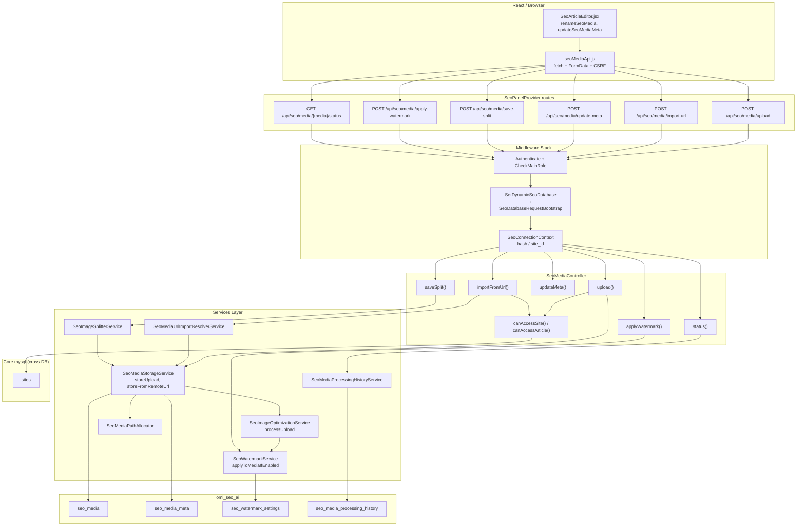
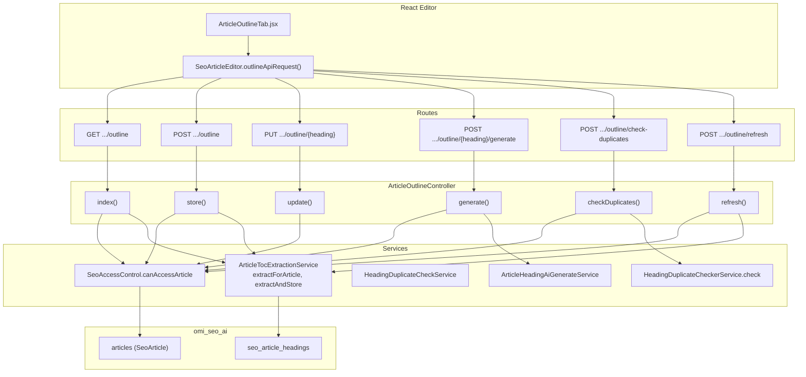
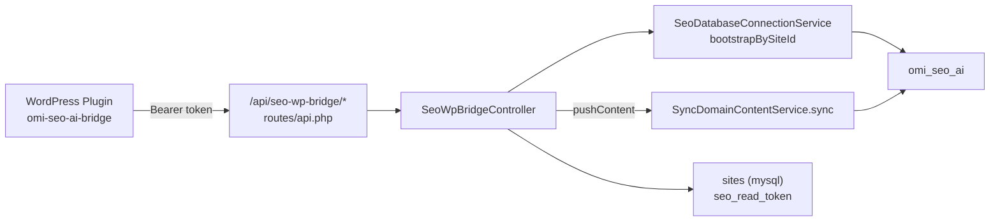
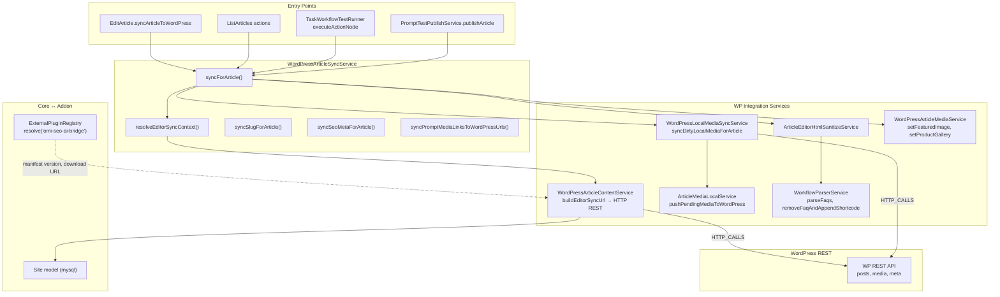
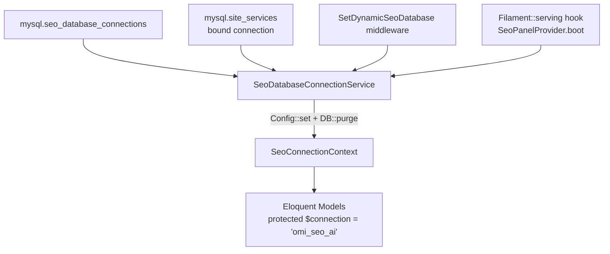
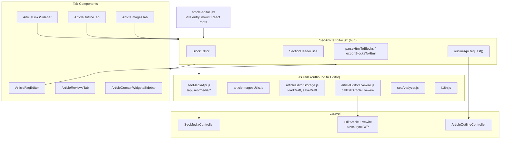

# MCP SeoContentAi Architecture Map

> Tài liệu được sinh từ knowledge graph `D-work-omnichannel-backend` (index mode: `full`, 17,017 nodes / 66,086 edges).
> Công cụ MCP đã dùng: `get_architecture`, `search_graph`, `trace_path`, `search_code`.

---

## 1. Tổng quan addon

| Thông tin | Giá trị |
|-----------|---------|
| **Đường dẫn** | `app/Addons/SeoContentAi/` |
| **Panel Filament** | `/seo` (provider: `SeoPanelProvider`) |
| **DB runtime** | Connection `omi_seo_ai` (bootstrap động) |
| **DB credential core** | Bảng `seo_database_connections` (mysql) |
| **Services** | ~150 class trong `Services/` |
| **HTTP Controllers** | 19 class trong `Http/Controllers/` |
| **Frontend entry** | `resources/js/article-editor.jsx` → Vite bundle |

**Middleware chuỗi API SEO** (`$seoWebApiMiddleware` trong `SeoPanelProvider`):

`web` session stack → `Authenticate` → `CheckMainRole` → **`SetDynamicSeoDatabase`** → `SubstituteBindings`

Mọi request `/api/seo/*` đều bootstrap connection `omi_seo_ai` trước khi Eloquent query.

---

## 2. Sơ đồ luồng: Route → Controller → Service → DB

### 2.1 Media API (`/api/seo/media/*`)



**Trace MCP (`upload` outbound, depth 4):** `SeoMediaController.upload` → `SeoMediaStorageService.storeUpload` → `SeoImageOptimizationService.processUpload` → `SeoWatermarkService.applyToMediaIfEnabled` → `SeoMedia::create` qua `SeoMediaBuilder.where/update`.

### 2.2 Article Outline API (`/api/seo/articles/{article}/outline*`)



### 2.3 WordPress Bridge (inbound từ plugin WP)



### 2.4 WordPress Sync (outbound Laravel → WP)



**Trace MCP (`syncForArticle` outbound):** 30+ callees gồm `ArticleEditorHtmlSanitizeService`, `WorkflowParserService`, `WordPressLocalMediaSyncService`, `ArticleMediaLocalService`, `SeoMediaBuilder.update/where`, `ExternalPluginRegistry.all`.

**Trace MCP (`syncForArticle` inbound callers):** `EditArticle.syncArticleToWordPress`, `TaskWorkflowTestRunner`, `PromptTestPublishService`, `ArticlesOptimal.demoteToDraft`.

---

## 3. Database bootstrap (`omi_seo_ai`)



**Models chính trên `omi_seo_ai`:** `SeoArticle`, `SeoMedia`, `Keyword`, `Prompt`, `SeoProject`, `SeoArticleHeading`, `ArticleMeta`, `SeoFaq`, `SeoMediaProcessingHistory`, … (toàn bộ trong `Models/`).

**Cross-DB:** `Site`, `User`, `Service` nằm trên `mysql`; addon dùng scalar `site_id` / `BelongsToOnDefaultConnection` — không FK xuyên DB.

---

## 4. Hotspots (đồ thị call graph)

| Hotspot | Fan-in / Vai trò | File chính |
|---------|------------------|------------|
| **ExternalPluginRegistry.all / resolve** | 603 fan-in (toàn repo); trong addon: resolve manifest plugin `omi-seo-ai-bridge` | `app/Services/ExternalPlugin/ExternalPluginRegistry.php` |
| **SeoMediaBuilder.where** | 493 fan-in; custom Eloquent builder — route `where` sang `seo_media_meta` | `app/Addons/SeoContentAi/Models/SeoMediaBuilder.php` |
| **SeoMediaBuilder.update** | Cao; tách core columns vs auxiliary meta, sync `seo_media_meta` | Cùng file |
| **SeoMediaProcessingHistoryService.find** | 229 fan-in; tra lịch sử xử lý ảnh AI | `Services/SeoMediaProcessingHistoryService.php` |
| **articleMetas** (SeoArticle) | 80 fan-in; HasMany meta bài viết | `Models/SeoArticle.php` |
| **TagPersistenceService.create** | 135 fan-in; tạo tag SEO | `Services/TagPersistenceService.php` |
| **SeoAccessControl.*** | 22–30 fan-in; phân quyền panel, site, article | `Support/SeoAccessControl.php` |
| **WordPressArticleSyncService.syncForArticle** | Hub sync bài → WP; ~265 lines logic | `Services/WordPressArticleSyncService.php` |
| **WorkflowParserService** (FAQ cluster) | Cohesion 0.81; parse FAQ từ HTML | `Services/WorkflowParserService.php` |
| **SeoArticleEditor** | 528 members cluster; 112 outbound calls; 6504 lines | `resources/js/components/SeoArticleEditor.jsx` |
| **SeoMediaStorageService.storeUpload** | Hub upload ảnh → disk + DB | `Services/SeoMediaStorageService.php` |
| **SeoDatabaseConnectionService** | Bootstrap runtime DB mỗi request | `Services/SeoDatabaseConnectionService.php` |

### ExternalPluginRegistry ↔ SeoContentAi

Registry **không** nằm trong addon — là **core hub** đọc `services.config.external_plugins` (mysql), fallback `addon.json`.

**Điểm chạm trực tiếp trong SeoContentAi:**

| File | Cách dùng |
|------|-----------|
| `Filament/Resources/DomainResource/Pages/GeneralDomain.php` | `resolveOrFail('omi-seo-ai-bridge')` — kiểm tra/cập nhật plugin WP |
| `Filament/Widgets/WordPressPluginWidget.php` | Hiển thị manifest plugin |
| `Services/WordPressPluginDomainsOverviewService.php` | Inject registry, overview domain + plugin |

**Gián tiếp (trace upload/sync):** `ExternalPluginRegistry.all` / `indexedManifests` xuất hiện trong call chain media upload và outline API — thường qua service resolve site/plugin config.

### SeoMediaBuilder ↔ Media flow

`SeoMedia` override `newEloquentBuilder()` → trả về `SeoMediaBuilder`. Mọi query `SeoMedia::where('article_id', …)` hoặc `whereMeta` đều đi qua builder này.

- **Vai trò:** Ẩn schema meta phụ (`seo_media_meta`) — `where`/`update` trên field meta được route tự động.
- **Hot path:** Upload → `SeoMedia::create` → sau đó mọi lookup/rename/update-meta từ Editor và sync WP đều `SeoMediaBuilder.where`.

---

## 5. Frontend cluster: React Editor

### 5.1 Cây component (cluster id=17, 528 members)



### 5.2 API surface từ frontend

| Client module | Endpoints |
|---------------|-----------|
| `seoMediaApi.js` | `POST /api/seo/media/upload`, `import-url`, `prepare-editor`, `apply-watermark`, `rename-by-url`, `update-meta`, `save-split`, `GET splitter-source`, `GET article/{id}/ai-jobs`, `GET/POST {media}/status` |
| `SeoArticleEditor.outlineApiRequest` | `GET/POST/PUT/DELETE /api/seo/articles/{id}/outline*` |
| `article-editor.jsx` | Livewire `$wire` cho save/sync WP (không qua REST) |
| `articleFeaturedImageStorage.js` | Livewire persist featured image |
| `articleWpCategoriesStorage.js` | Livewire WP categories |

**Giao tiếp hybrid:** Editor dùng **fetch REST** cho media + outline; **Livewire** cho persist bài, sync WordPress, publish — tránh duplicate state (xem `callEditArticleLivewire`).

---

## 6. Bản đồ thư mục addon (rút gọn)

```
app/Addons/SeoContentAi/
├── SeoContentAiServiceProvider.php / SeoPanelProvider.php  # bootstrap
├── addon.json                                              # metadata addon
├── Filament/          # Panel /seo — Resources, Pages, Widgets
├── Http/
│   ├── Controllers/   # SeoMediaController, ArticleOutlineController, SeoWpBridgeController, ...
│   └── Middleware/    # SetDynamicSeoDatabase, CheckMainRole, SeoPlannerPermissionMiddleware
├── Models/            # Eloquent → omi_seo_ai (+ SeoMediaBuilder)
├── Services/          # ~150 business services
├── Jobs/              # RunMetadataDomainSyncJob, ...
├── Support/           # SeoAccessControl, SeoConnectionContext, ...
├── database/migrations/
├── resources/
│   ├── js/            # React (article-editor.jsx, components/, utils/)
│   ├── css/
│   └── views/
├── routes/
│   ├── api.php        # seo-wp-bridge only
│   └── web.php
└── tests/
```

---

## 7. Hướng dẫn prompt Cursor (quick reference)

### Khi sửa React Article Editor

```
Đọc app/Addons/SeoContentAi/resources/js/components/SeoArticleEditor.jsx (hub 6500+ dòng).
Entry mount: resources/js/article-editor.jsx.
Media API: resources/js/utils/seoMediaApi.js.
Outline API: SeoArticleEditor.outlineApiRequest → ArticleOutlineController.
Livewire bridge: resources/js/utils/articleEditorLivewire.js.
```

### Khi sửa upload / thư viện ảnh / watermark

```
Route: SeoPanelProvider.php prefix api/seo/media.
Controller: Http/Controllers/SeoMediaController.php.
Services: SeoMediaStorageService, SeoImageOptimizationService, SeoWatermarkService.
Model/Query: Models/SeoMedia.php + Models/SeoMediaBuilder.php (meta routing).
Frontend: seoMediaApi.js, components/ArticleImagesTab.jsx, ImageBlockEditor.jsx.
```

### Khi sửa Outline / TOC / heading trùng

```
Controller: Http/Controllers/ArticleOutlineController.php.
Services: ArticleTocExtractionService, HeadingDuplicateCheckerService, ArticleHeadingAiGenerateService.
Model: Models/SeoArticleHeading.php.
Frontend: components/ArticleOutlineTab.jsx.
```

### Khi sửa sync WordPress (push bài/media lên WP)

```
Hub: Services/WordPressArticleSyncService.php → syncForArticle().
HTTP: Services/WordPressArticleContentService.php (buildEditorSyncUrl).
Media: Services/WordPressLocalMediaSyncService.php, ArticleMediaLocalService.php.
Entry UI: Filament/Resources/ArticleResource/Pages/EditArticle.php.
Plugin manifest: app/Services/ExternalPlugin/ExternalPluginRegistry.php (slug: omi-seo-ai-bridge).
WP plugin repo: wp-seo-ai (omi-seo-ai-bridge.php).
```

### Khi sửa sync WordPress (pull từ WP → Laravel)

```
Inbound API: routes/api.php → SeoWpBridgeController.
Service: SyncDomainContentService.php.
Auth: site seo_read_token (mysql.sites).
DB bootstrap: SeoDatabaseConnectionService.bootstrapBySiteId().
```

### Khi sửa DB / migration / connection

```
Bootstrap: Services/SeoDatabaseConnectionService.php (CONNECTION_NAME = omi_seo_ai).
Middleware: Http/Middleware/SetDynamicSeoDatabase.php.
Core credential: app/Models/SeoDatabaseConnection.php + Filament SeoDatabaseConnectionResource.
Migrations: app/Addons/SeoContentAi/database/migrations/ (chạy trên omi_seo_ai).
Context: Support/SeoConnectionContext.php.
```

### Khi sửa phân quyền SEO panel

```
Support/SeoAccessControl.php — canAccessArticle, canSyncArticlesToWordPress, accountOwnerId.
Middleware: CheckMainRole.php, SeoPlannerPermissionMiddleware.php.
```

### MCP tools gợi ý cho session sau

```
project: D-work-omnichannel-backend

# Trace caller/callee
trace_path function_name="syncForArticle" direction=both depth=5

# Tìm service theo ngữ nghĩa
search_graph query="wordpress media sync article" file_pattern=SeoContentAi

# Hot nodes
search_graph file_pattern=SeoContentAi min_degree=20

# Cross-service HTTP
trace_path function_name="buildEditorSyncUrl" mode=cross_service depth=3
```

---

## 8. Ghi chú đồ thị

- **Cluster FAQ Parser** (cohesion 0.81): `WorkflowParserService.parseFaqsFromContent`, `parseFaqsFromHtml`, `removeFaqAndAppendShortcodeFromContent`.
- **Cluster Flow/Action** (267 members): `TaskWorkflowTestRunner.executeActionNode`, `executeNode` — workflow AI task.
- **Boundary Addons ↔ js:** 1,436 calls Addons→js, 210 js→Addons — phản ánh Filament blade + React editor tích hợp chặt.
- File này **không** thay `app/Addons/SeoContentAi/README.md` — dùng làm bản đồ MCP nhanh khi onboard hoặc prompt AI.

---

*Generated: MCP analysis session — project `D-work-omnichannel-backend`.*
