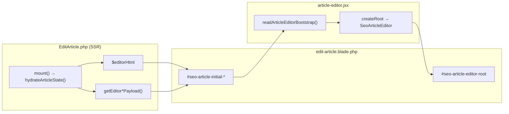
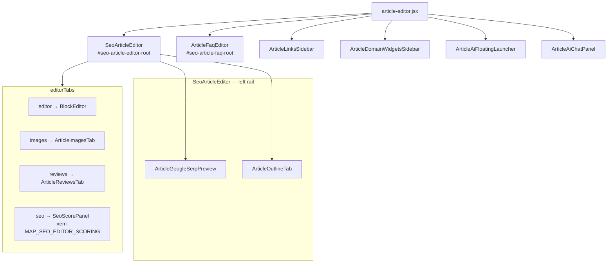
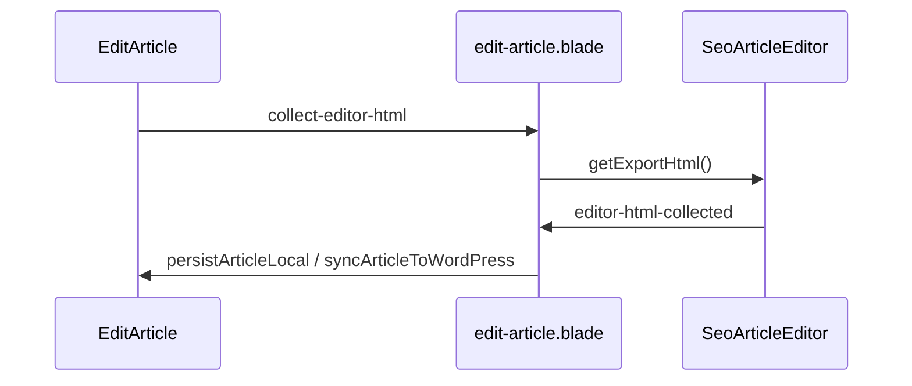
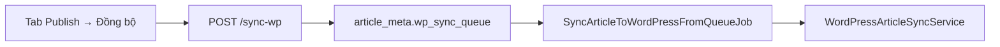
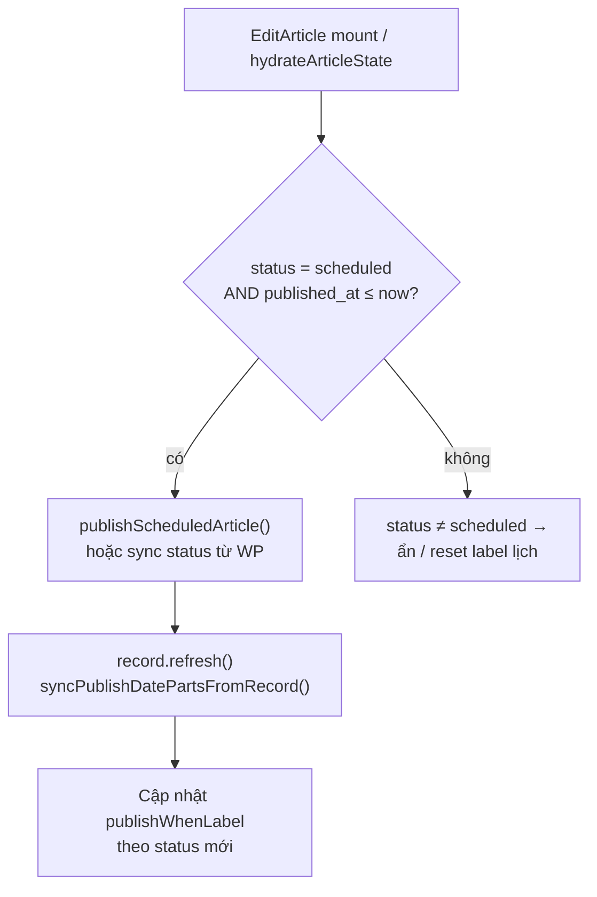
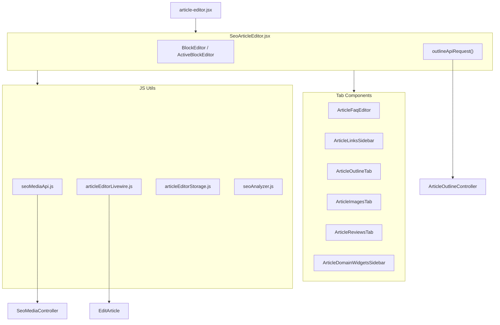
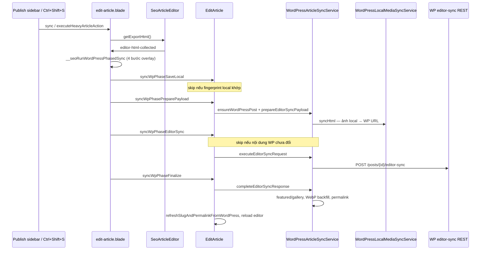
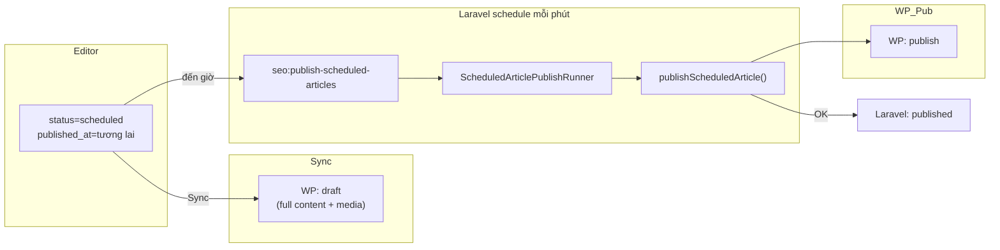

# SeoContentAi — React Editor & EditArticle

[← Quay lại Bản đồ tổng](SUPER_MAP_INDEX.md)

**Liên quan:** [Media / upload](MAP_SEO_MEDIA.md) · [WordPress sync](MAP_SEO_WP.md) · [Content Projects & Workflow](MAP_SEO_PROJECTS.md) · **[SEO Scoring (Rules + Violations)](MAP_SEO_EDITOR_SCORING.md)**

---

## 2.4 Danh sách bài viết (ListArticles)

| Thông tin | Giá trị |
|-----------|---------|
| **URL panel** | `/seo/{connection_hash}/articles` |
| **Resource** | `Filament/Resources/ArticleResource.php` |
| **Page** | `Filament/Resources/ArticleResource/Pages/ListArticles.php` |
| **View** | `resources/views/filament/resources/article-resource/pages/list-articles.blade.php` |

**Tab nội dung** (`?tab=`):

| Tab | Constant | Query mặc định |
|-----|----------|----------------|
| Bài viết | `ListArticles::TAB_POSTS` (`posts`) | `type` post/product; **`is_reviewed = 0`**; **loại `skip_seo_audit`** |
| Danh mục | `TAB_CATEGORIES` (`categories`) | `type` category/product_category; **`is_reviewed = 0`**; **loại `skip_seo_audit`** |
| Hàng đợi WP | `TAB_QUEUE` (`queue`) | Meta `wp_sync_queue`; **`is_reviewed = 0`**; **loại `skip_seo_audit`** |
| Đã duyệt | `TAB_REVIEWED` (`reviewed`) | `is_reviewed = 1` + `reviewed_at` not null — partial `reviewed-articles-tab.blade.php`; **loại `skip_seo_audit`** |
| Bỏ qua | `TAB_SKIPPED` (`skipped`) | Chỉ bài có `article_meta.skip_seo_audit=1` (ẩn khỏi các tab kia + SEO Audit) |

**Skip list/audit:** action hàng `toggle_skip_seo_audit` → `ArticleResource::toggleSkipSeoAudit()` ghi `article_meta.skip_seo_audit`. Scope: `applyExcludeSkipSeoAuditScope` / `applyOnlySkipSeoAuditScope`. Reviewed group UI: `buildReviewedArticlesGrouped()` cũng loại skip. Cùng flag với SEO Audit skip. Khôi phục từ tab **Bỏ qua**.

**Filter mặc định (tab Bài viết):** `language=vi`, `post_type=post` — `SelectFilter::default()` + `ListArticles::ensureDefaultPostsTableFilters()`; URL tương đương `?tableFilters[language][value]=vi&tableFilters[post_type][value]=post`. Có `tableFilters` trên query thì không ghi đè. Link tab Posts (`getContentTabUrl`) bổ sung default nếu thiếu. **Mount:** chỉ ghi `$this->tableFilters` — không gọi `getTableFiltersForm()` / `handleTableFilterUpdates()` (tránh `$table` chưa init trước `bootedInteractsWithTable`).

**Cột bảng:** không có cột **Reviewed** (`is_reviewed`) — trạng thái duyệt chỉ xem ở tab **Reviewed**. Cột `reviewed_at` vẫn toggle ẩn mặc định.

**Route liên quan:** `/seo/{connection_hash}/articles/queue` (`ListArticleSyncQueue`), `/seo/{connection_hash}/articles/{id}/edit` (`EditArticle`).

---

## 2.5 Cấu trúc chi tiết EditArticle (React Component Graph)

> MCP `search_graph` (`SeoArticleEditor`, out_degree **112**), `search_code` (`callEditArticleLivewire`). Files: `article-editor.jsx`, `edit-article.blade.php`, `EditArticle.php`.

### 2.5.1 Component React chính


| Vai trò          | File                                           | Ghi chú                                                                                          |
| ---------------- | ---------------------------------------------- | ------------------------------------------------------------------------------------------------ |
| **Vite entry**   | `resources/js/article-editor.jsx`              | Bundle `article-editor`. `mountArticleEditorPage()` mount nhiều React root.                      |
| **Editor chính** | `resources/js/components/SeoArticleEditor.jsx` | Hub ~8.3k dòng, `out_degree: 112`. Props từ bootstrap JSON.                                      |
| **Blade host**   | `resources/views/.../edit-article.blade.php`   | `#seo-article-editor-root` (`wire:ignore`) + JSON scripts initial data.                          |
| **Backend page** | `Filament/.../EditArticle.php`                 | Livewire `/seo/articles/{record}/edit`. SSR data + save qua `$wire` / `callEditArticleLivewire`. |

**Image block picker:** `ImageBlockPickerBox` chờ 2×`requestAnimationFrame` mới enable nút. `handleClickOutside` giữ block active khi click trong slot block đang chọn; guard ~360ms sau activate/insert image; whitelist outline rail, media/generate modal. Outline focus clear khi click ra ngoài heading (`headingCommand.action=clear`).

**Paste Ctrl+V ảnh:** `processClipboardImagePaste` → `uploadSeoMediaFromFile` (`source=clipboard`) → server slug random `paste-{hex}` (tránh `image.png` cache). `ImageBlockEditor.applyUploadedImageToBlock` xóa `wpAttachmentId`/`wpSrc` cũ khi paste local mới (tránh rename WP bằng ID stale). `shouldRenameSlugOnWordPress` / `isImageReadyForWpSlugFix` chỉ tin ID qua `resolveImageRefIds` — không fallback `rawWp`. Chi tiết: [MAP_SEO_MEDIA.md](MAP_SEO_MEDIA.md), [MAP_SEO_WP.md](MAP_SEO_WP.md) §rename.

**Featured image sidebar:** `articleFeaturedImageStorage.saveFeaturedImage()` lưu localStorage rồi dispatch `seo-featured-image-updated`; Alpine trong `edit-article.blade.php` nhận `onFeaturedImageUpdated()` để cập nhật `featuredImageDraft` ngay (không chờ reload). Clear vẫn dùng `seo-featured-image-cleared`.


**Luồng bootstrap (không REST lúc mở trang):**




### 2.5.2 Cây component React (mount graph)

`article-editor.jsx` mount **6 React root**:




| Tab id    | Component                                                         | Điều kiện                    |
| --------- | ----------------------------------------------------------------- | ---------------------------- |
| `editor`  | `BlockEditor` / `ActiveBlockEditor` (TipTap) / `ImageBlockEditor` | Luôn có                      |
| `images`  | `ArticleImagesTab`                                                | Luôn có                      |
| `reviews` | `ArticleReviewsTab` — quick create + refresh qua `articleEditorLivewire.js` | product + `show_reviews_tab` |
| `seo`     | `SeoScorePanel`                                                   | Luôn có                      |


**Modal tạo ảnh AI (**`.seo-generate-image-modal`**):** `GenerateImageModal.jsx` — mở qua event `seo-open-generate-image-modal` (`target: 'product-gallery'` từ album sidebar). Chế độ product gallery: layout 2 cột (form + preview).

**Editor media AI (queue):** `ArticleEditorMediaAiService` resolve Prompt|Workflow từ `SeoSettingsWorkflows` → `GenerateMediaJob` (`source=prompt|workflow`). Workflow full graph: `EditorWorkflowExecutionService` + `TaskWorkflowTestRunner::run()`; BC `extract_last_prompt_bc`. Image routing qua `ImageRoutingStrategy` (Gemini major ≥ 3). Typography: `TypographyPipelineService` + metadata `validation_model`/`render_model` trong history.


| Phần preview   | Hành vi                                                                                                      |
| -------------- | ------------------------------------------------------------------------------------------------------------ |
| Image preview  | Album hiện tại + ảnh AI đã kết nối bài (`connected`); ảnh kết nối không bị xóa khỏi preview                  |
| Split grid     | Chọn thumbnail có `seo_media_id` → `ImageSplitterPanel` inline; sau split giữ ảnh gốc, append mảnh vào album |
| Prompt preview | Render prompt workflow qua `preview-generate-article-image-prompt`                                           |


Split toàn trang (eraser/splitter tab): [MAP_SEO_MEDIA.md §2.2](MAP_SEO_MEDIA.md) — `/seo/media-image-editor`.

**FAQ:** `ArticleFaqEditor` mount riêng `#seo-article-faq-root` — `__seoCollectArticleFaqs`, events `save-article-faqs`, `generate-article-faqs`. Ngoài ra còn có `renewArticleFaq` (regenerate 1 item), `checkFaqQuestionDuplicate`, `extractFaqsFromSelection`, FAQ extract debug. **Extract FAQ** nằm trên FAQ bar (cùng Generate / Import / Add); disable đến khi có selection (`seo-editor-text-selection`).

**FAB:** `ArticleAiFloatingLauncher` — click mở thẳng AI images & videos (`seo-article-ai-chat-open`); không còn menu phụ (Extract FAQ đã chuyển sang FAQ bar).

### 2.5.3 Backend phục vụ EditArticleExcept

**A. Load (SSR)**


| Nguồn                        | Method                  | Dữ liệu                           |
| ---------------------------- | ----------------------- | --------------------------------- |
| `EditArticle::mount()`       | `hydrateArticleState()` | `$editorHtml`, slug, gallery, SEO |
| `getEditorSeoPayload()`      |                         | serp preview, focus keyword       |
| `getEditorImagesPayload()`   |                         | post images                       |
| `getEditorMetaPayload()`     |                         | articleId, siteId, supplemental   |
| `getEditorFaqsPayload()`     |                         | FAQ rows                          |
| `getEditorSettingsPayload()` |                         | autosave, permissions             |
| `getEditorAiDebugPayload()`  |                         | AI debug data (markdown import)   |


**B. Save — Livewire** (`articleEditorLivewire.js`)


| Trigger                          | Livewire method                                                                                                      |
| -------------------------------- | -------------------------------------------------------------------------------------------------------------------- |
| `editor-html-collected`          | `persistArticleLocal`                                                                                                |
| `__seoExecuteHeavyArticleAction` | `executeHeavyArticleAction`                                                                                          |
| Sync shortcut                    | `syncArticleToWordPress`                                                                                             |
| SEO modal                        | `updateSeoMetaFromEditor`                                                                                            |
| FAQ                              | `saveArticleFaqs`, `generateArticleFaqs`, `renewArticleFaq`, `checkFaqQuestionDuplicate`, `extractFaqsFromSelection` |
| AI image / snippet               | `generateArticleImageFromEditor`, `generateFeaturedSnippetFromEditor`                                                |
| AI video                         | `generateArticleVideoFromEditor`                                                                                     |
| Links                            | `searchInternalLinkArticles`                                                                                         |
| Assign keyword → Content Project | `mountAction('assignKeywordAnchorToContentProject')` (`LinkEditBubble`) → `completeKeywordAnchorContentProjectAssign()` → `ArticlePendingInternalLinkService::assignFromEditor()` |
| Pending internal link event      | `pending-internal-link-ready` → chèn placeholder `#hash` vào anchor đã bôi đen                                      |
| Reviews                          | `generateQuickPostReviews`, `refreshVirtualReviewsForEditor` → event `virtual-reviews-updated`                       |
| Keyboard shortcuts               | `requestSaveArticle`, `requestSyncToWordPress` (bridge → collect HTML → action); UI panel `article-editor-shortcuts-rail.blade.php` dưới Outline (`mountShortcutsBelowOutline`) — Prev/Next đổi nhóm shortcut |
| Page action bar (Edit Article)   | Partial `article-editor-page-actions.blade.php`: primary **Save → Sync WP → Preview (split WP/nội bộ) → Approve**; More `...` = History, Prompts, Assign/Open project, Restore (sync from WP), Debug MD import (icon+chữ), Delete. `EditArticle::getHeaderActions()` trống — UI More Blade; `articleEditorHeaderActions.js` mount Debug MD + dedupe |
| Polylang                         | `quickTranslateLinkedArticle`, `importMissingTranslation`, `requestTranslationGeneration`                            |
| WP Attachment meta               | `renameAttachmentSlugsOnWordPress`, `updateAttachmentMetaOnWordPress`                                                |
| Gallery picker                   | `confirmGallerySelectionFromPicker` (multi-select → album)                                                           |
| Outline                          | `rewriteOutlineFromWorkflow`                                                                                         |
| AI Prompt preview                | `previewGenerateArticleImagePrompt`                                                                                  |
| Debug                            | `importMarkdownDebug`, `importMarkdownFaqDebug`                                                                      |
| Notification forwarding          | `handleEditorNotify` (Alpine → Filament notification)                                                                |
| Slug                             | `confirmArticleSlug`                                                                                                 |
| SEO description                  | `updateSeoMetaDescriptionFromEditor`                                                                                 |





**Dual save path:**

- **Path cũ:** Alpine event `editor-html-collected` → Livewire `persistArticleLocal` / `syncArticleToWordPress`
- **Path mới (keyboard shortcut):** JS function `__seoExecuteHeavyArticleAction` → `wire.executeHeavyArticleAction()` — dùng cho Ctrl+S / Ctrl+Shift+S

**Overlay system (JS):** Blade có `__seoArticleHeavyActionOverlay` (~130 dòng) với guard timer, keyboard blocker, `inert` management, `persistUntilUnload` flag. Khi save/sync, overlay khóa toàn bộ interaction.

**Autosave client:** `saveDraft()` → `localStorage` (`seo_article_draft_{id}`) — lưu `blocks` (gồm `image.excludeQuickFix` / `data-exclude-quick-fix` trên HTML), không hit server mỗi keystroke.

**Tab Hình ảnh — Quick fix & Except** (`ArticleImagesTab.jsx` → handlers trong `SeoArticleEditor.jsx`, utils `articleImagesUtils.js`):


| Nút                       | Phạm vi                                            | Hành vi                                                                                                                                                                                                                                                                                                                                               |
| ------------------------- | -------------------------------------------------- | ----------------------------------------------------------------------------------------------------------------------------------------------------------------------------------------------------------------------------------------------------------------------------------------------------------------------------------------------------- |
| **Fix slug all**          | Ảnh trong block (không Except) + supplemental-only | Ảnh local/chưa sync: chạy local rename (`applyQuickFixSlugToBlocks(..., { wpOnly:false, includeWordPressRenames:false })` + `executeSeoMediaSlugRenamesTwoPhase`) rồi apply qua `finalizeBlocksAfterWpRename([], localResults)`. Ảnh đã có WP attachment: giữ queue `renameAttachmentSlugsOnWordPress` như cũ, map theo `attachment_id` / `seo_media_id` / `block_id` / `old_url` — không `replaceUrlSlug` theo index. |
| **Fix slug** (1 ảnh)      | Một dòng                                           | Ảnh local đổi slug local ngay; ảnh WP confirm rồi gọi `renameAttachmentSlugsOnWordPress`. Không còn gate “phải Sync WP trước” trên ảnh local.                                                                                                                                                                                                        |
| **Fix alt/title all**     | Ảnh không Except                                   | `alt` + `title` = focus keyword; đẩy meta lên SEO media + WP attachment.                                                                                                                                                                                                                                                                              |
| **Fix alt/title** (1 ảnh) | Một dòng                                           | Confirm rồi patch block/supplemental + meta stores.                                                                                                                                                                                                                                                                                                   |
| **Except**                | Ảnh có `blockId`                                   | Toggle `excludeQuickFix` trên block image → lưu `localStorage` draft + `data-exclude-quick-fix="1"` trên ``/`<figure>`. **Tự động Except** khi chọn ảnh tab **Gốc (WP)** (`pickerTab === 'original'`, `withWpPickerExcludeQuickFix` trong `onEditorBlockImageSelected`). Ảnh Except: disable Fix slug/alt; không tính slug `-N`; không bị `finalizeBlocksAfterWpRename` ghi đè.                                                                                                    |
| **UI hàng ảnh**           | Mỗi dòng trong tab                                 | Chỉ nút **Except** hiển thị trực tiếp; các thao tác còn lại (Fix slug, Fix alt/title, Xóa, Chỉnh sửa, Đóng dấu, Tách lưới) gom menu `⋯` (`.seo-article-images-more-*` trong `ArticleImagesTab.jsx` + `article-editor.css`). Cần `npm run build` bundle `article-editor` sau đổi JS/CSS. |

**Mở đầu — không chèn ảnh:** `BlockInsertMenuBar` (`BlockInsertMenu.jsx`) nhận `imageInsertDisabled={section.isIntro}` cho menu **trước** và **sau** block (`SeoArticleEditor.jsx`). `ImageBlockEditor` `imagesLocked` khi block thuộc section intro.


Logic slug/index: `assignInArticleQuickFixIndices`, `quickFixSlugIndexForBlock`, `applyQuickFixSlugToBlocks` / `applyQuickFixAltTitleToBlocks` đều filter `!excludeQuickFix`.

**C. REST routes**


| Prefix                                  | Controller                                                   | Client                               |
| --------------------------------------- | ------------------------------------------------------------ | ------------------------------------ |
| `/api/seo/articles/{id}/outline*`       | `ArticleOutlineController`                                   | `ArticleOutlineTab`                  |
| `/api/seo/media/*`                      | `SeoMediaController`                                         | [MAP_SEO_MEDIA.md](MAP_SEO_MEDIA.md) |
| `/seo/articles/{article}/media-picker`  | `ArticleMediaPickerController`                               | Alpine `fetchPickerImages`           |
| `/api/ai/chat`                          | `GlobalAiChatController`                                     | `ArticleAiChatPanel`                 |
| `/seo/articles/{article}/seo-preview`   | `ArticleSeoPreviewController`                                | `ArticleGoogleSerpPreview`           |
| `/seo/articles/{article}/preview`       | `ArticlePreviewController`                                   | Frontend preview                     |
| `/api/seo/articles/{article}/revisions` | `ArticleRevisionController` + `SeoArticleRevisionController` | Revision tab                         |
| `/seo/articles/{article}/revisions`     | `SeoArticleRevisionController`                               | Revision compare/restore             |


> **Lưu ý route change:**
>
> - Media picker: `/api/seo/articles/{id}/media-picker` → `/seo/articles/{article}/media-picker` (bỏ `api/` prefix)
> - AI chat: `/api/seo/global-ai/chat` → `/api/ai/chat` (bỏ segment `seo/`)


### 2.5.4 Media picker modal (`.seo-article-media-modal`)

Alpine `x-data` trong `edit-article.blade.php` (wrapper trang, không `wire:ignore`).


| Trigger              | Hàm                                                                                |
| -------------------- | ---------------------------------------------------------------------------------- |
| Ảnh đại diện / album | `openArticleMediaModal('featured'                                                  |
| Editor block         | `seo-open-article-media-picker` → `openArticleMediaModal('editor-block', blockId)` |


**Tabs:** `article` (catalog từ React), `original` / `local` (REST `GET .../media-picker?page&search=`), **custom WP search tabs** (client-only, sau tab Gốc WP).

**Custom WP search tabs (đã implement):**

| Thành phần | Hành vi |
|------------|---------|
| Nút `+` sau **Gốc (WP)** | `prompt` từ khóa (mặc định = focus keyword bài viết) → tạo tab `custom:{id}` |
| Tab custom | Fetch `tab=original&search={keyword}`, cache fetch + metadata trong `localStorage` (`articleMediaPickerCustomTabs.js`) |
| Nút `×` trên tab | Xóa tab + staged images + fetch cache của tab |
| Nút `↗` trên ảnh tab Gốc (WP) | Chọn tab đích → lưu tạm ảnh vào `localStorage` staged của tab đó; hiển thị đầu danh sách tab custom (badge «Đã chuyển») |

**Giữ state khi đóng/mở (không refetch):**


| Hàm                      | Hành vi                                                                                                                                                 |
| ------------------------ | ------------------------------------------------------------------------------------------------------------------------------------------------------- |
| `openArticleMediaModal`  | Nếu `pickerWasOpened` hoặc `pickerImages.length > 0` → chỉ `mediaModalOpen = true`, **return** (không `fetchPickerImages` / `loadArticleTabFromEditor`) |
| `closeArticleMediaModal` | Chỉ `mediaModalOpen = false` — giữ `pickerImages`, `pickerSearchQuery`, `pickerPage`                                                                    |
| Lần mở đầu               | Fetch bình thường, set `pickerWasOpened = true`                                                                                                         |


Cache trang (không search): `articleMediaPickerCache.js` → `localStorage`. Bootstrap bundle: `article-media-picker-cache-bootstrap`.

`article-media-picker-loaded` chỉ apply khi `mediaModalOpen === true`.

**Đồng bộ tab WP → tab Hình ảnh (§2.5.2):**


| Bước                         | Hành vi                                                                                                                               |
| ---------------------------- | ------------------------------------------------------------------------------------------------------------------------------------- |
| Chọn ảnh tab `original` (WP) | `selectPickerImage` gửi `pickerTab: 'original'`; `withWpPickerExcludeQuickFix` → `excludeQuickFix: true` + `data-exclude-quick-fix` qua `renderImageFigure` + draft `localStorage` |
| React                        | `SeoArticleEditor` cập nhật block/supplemental, `publishEditorImagesCatalog()` → event `seo-editor-images-catalog` (`autoSync: true`) |
| Tab Hình ảnh                 | `ArticleImagesTab` nhận `blocks` + `supplementalImages` mới; `imagesReloadKey++` khi nguồn WP                                         |
| Tab «Trong bài» (picker)     | Alpine lắng `seo-editor-images-catalog` → cập nhật `pickerCatalog` nếu modal đang mở                                                  |


**Product Album Gallery:** Blade có secondary Alpine component `seoProductAlbumBoxData` (drag-reorder album). Multi-select with shift+click range (`galleryPickerSelectedKeys`). `confirmGallerySelectionFromPicker` → save to album.

**Polylang Widget:** Blade include `seo-polylang-widget` (line 1145). Livewire methods: `quickTranslateLinkedArticle`, `importMissingTranslation`, `requestTranslationGeneration`.

**Video Generation:** Event `generate-article-video`, Livewire method `generateArticleVideoFromEditor`, setting flag `can_generate_video`.

### 2.5.4.1 Assistant Dock — sidebar phải Edit Article (đã implement)

Cột phải `edit-article.blade.php` dùng **Alpine-only** (không Livewire round-trip cho tab/search). CSS trong `article-editor.css`; logic `utils/seoAssistantNavigator.js` (import từ `article-editor.jsx` → `Alpine.data('seoAssistantNavigator')`).

| Thành phần | File | Vai trò |
|------------|------|---------|
| Host + slots | `edit-article.blade.php` | `.seo-assistant-host` — mỗi widget có `data-assistant-widget`, `data-assistant-widget-id`, `data-assistant-tab-label` |
| Navigator | `seoAssistantNavigator.js` | `discoverWidgets()`, `switchPanel()`, search, badge; **không** scroll-to-widget |
| Links filter | `ArticleLinksSidebar.jsx` | `linkSectionFilter` qua event `seo-assistant-link-section` (`links` / `faq` / `cta` / `all`). Gợi ý keyword: 2 nút **Cảnh báo** / **Nguy hiểm** → `KeywordReviewPopover.jsx` → `POST /api/seo/keywords/{id}/review` (`KeywordReviewController`, `source=article_suggestion`, không bắt buộc link map). Keyword `review_status` warning/danger bị loại khỏi gợi ý server (`ArticleInternalLinkSuggestionService`). |
| Keywords dictionary tabs | `ListKeywords.php` + `KeywordResource::getReviewedDictionaryQuery()` | Thẻ **Cần tối ưu** / **Không hiệu quả** lọc `review_status` warning/danger; scope site qua `forSite` hoặc `keyword_review_histories.article_id` (keyword đánh dấu từ editor chưa có link map vẫn hiện). |
| Portals React | `SeoArticleEditor.jsx` | `createPortal` → `#seo-article-seo-assistant-root`, `#seo-article-image-assistant-root`, `#seo-article-links-root`, … |

**Tabs:** auto-discover từ DOM; chip ảo **FAQ** / **CTA** inject sau tab **Links** (cùng slot `links`, filter section).

**Chế độ hiển thị:**

| State | `panelFilterActive` | UI |
|-------|---------------------|-----|
| Mặc định (load trang) | `false` | Tất cả widget xếp chồng như sidebar cũ |
| Sau khi bấm tab dock | `true` | Chỉ panel `activePanel`; class `is-panel-filter` trên host |

**Sticky (desktop ≥1024px):**

| Lớp | CSS | Hành vi |
|-----|-----|---------|
| `.wp-article-edit-sidebar` | `position: sticky` + `max-height` viewport | Cột phải dính khi scroll bài dài |
| `.wp-article-edit-sidebar-scroll` | `overflow-y: auto` | Scroll nội bộ widget |
| `.seo-assistant-dock` | `position: sticky; top: 0` | Tab bar + search luôn trên cùng vùng scroll |

**Custom events (dock ↔ React):**

| Event | Publisher | Subscriber |
|-------|-----------|------------|
| `seo-assistant-switch-panel` | `SeoArticleEditor` (mở tab ảnh), … | `seoAssistantNavigator` → `switchPanel()` |
| `seo-assistant-navigator-badges` | `SeoArticleEditor`, `ArticleLinksSidebar` | Cập nhật badge tab (SEO, Images, **Reviews** `{count}` kể cả 0, Links, FAQ, CTA) |
| `virtual-reviews-updated` | `EditArticle::generateQuickPostReviews`, `refreshVirtualReviewsForEditor` | `ArticleReviewsTab`, `SeoArticleEditor` — đồng bộ danh sách + count |
| `seo-assistant-link-section` | `seoAssistantNavigator` | `ArticleLinksSidebar` filter section |
| `seo-assistant-widget-control` | `seoAssistantNavigator` | React widgets (`set-collapsed`) |
| `seo-sidebar-open-publish-tab` | Widget xuất bản / shortcut | Mở panel Publishing |

**Lưu ý perf:** badge chỉ cập nhật qua event — không dùng `MutationObserver` + `characterData` trên subtree sidebar (gây freeze khi React SEO render).

**Reviews / Tạo bình luận nhanh:**

| Thành phần | File | Vai trò |
|------------|------|---------|
| UI panel | `ArticleReviewsTab.jsx` | Header: `{count} bình luận` + nút **Tạo bình luận nhanh** + **Làm mới** |
| Livewire | `EditArticle::generateQuickPostReviews()` | Gọi `ArticleQuickPostReviewService::runForArticle()`; `abort_if` Content Manager |
| Service | `ArticleQuickPostReviewService` | Workflow Đăng bình luận → `WordPressCommentReviewService` |
| Service | `VirtualCommentService::getFromWordPress()` | GET `omi-seo-ai/v1/posts/{id}/comment-reviews` — đọc meta `_omi_seo_virtual_comments` + `wp_comments` |
| WP plugin | `Rest_Controller::handle_get_comment_reviews` (≥ 1.0.51) | Trả virtual meta trước, merge review DB thật |
| Job (async cũ) | `GenerateArticleReviewsJob` | Hàng đợi + cache notify — vẫn dùng khi flow queue |
| Settings | `getEditorSettingsPayload()` | `can_quick_create_reviews`, `show_configure_reviews_link`, `quick_create_reviews_config_url` |
| Metadata | `publish-sidebar.blade.php` | Chỉ hiển thị trạng thái duyệt / số bình luận — **không** còn nút tạo nhanh |

### 2.5.5 Publish sidebar — lên lịch & SEO score (gap / cần sửa)

> Liên quan cron publish: [§2.6.3](#263-trạng-thái-đăng-bài--lên-lịch). Settings độ dài bài: **SEO → Settings → Prompt** → *Article content rules*.

#### C. Đồng bộ WordPress qua queue + tab Publish (đã implement)

| Thành phần | File | Hành vi |
|------------|------|---------|
| Queue meta | `ArticleWpSyncQueueService` (`QUEUE_NAME=seo`; `article_meta.wp_sync_queue`, `wp_sync_queue_bundle`) | `pending` → `processing` → `completed` / `failed`; `dispatchWpSyncJob()` purge job cũ trước dispatch + verify row `jobs`; `cancel()`/`clearQueueEntry()` purge job |
| Job | `SyncArticleToWordPressFromQueueJob` | Queue `seo`; gọi `ArticleEditorSyncOrchestrator::syncFromEditorBundle()` nền |
| Job media body | `SyncArticleBodyMediaToWordPressJob` | Queue `seo`; ảnh inline sau editor-sync nhanh |
| API | `ArticleEditorSyncController::syncWp` | Không sync inline — enqueue + toast, `reload: false` |
| Tab Publish | `publish-sync-panel.blade.php` | Checkbox **Đăng ngay** (+5 phút), lịch tùy chỉnh khi uncheck, nút **Đồng bộ** |
| Nút đồng bộ CSS | `article-editor.css` → `.seo-publish-sync-btn` | Primary full-width; dark mode `.dark .wp-article-edit …` (không dùng Tailwind utility trong Blade) |
| Widget Xuất bản | `publish-sidebar.blade.php` | Bỏ UI lên lịch; icon sync chỉ mở tab Publish (`seo-sidebar-open-publish-tab`) |
| Shortcut | `Ctrl+Shift+S` | `seo-publish-tab-request-sync` → tab Publish + queue sync |
| Submenu Articles | `ListArticleSyncQueue` (`/seo/{connection_hash}/articles/queue`) | Sidebar **Articles → Hàng đợi** |
| Tab nhanh list | `ListArticles::TAB_QUEUE` (`?tab=queue`) | Chỉ pending / processing / failed; `is_reviewed = 0` |
| Queue table | `ArticleResource::queueTable()` | Cột: tiêu đề, domain, trạng thái, queued/started/finished, lỗi; filter trạng thái; retry / cancel / edit |

**Luồng queue meta (`wp_sync_queue`):**

| Trạng thái | Ý nghĩa |
|------------|---------|
| `pending` | Đã enqueue, chờ worker |
| `processing` | Job đang chạy |
| `completed` | Đồng bộ xong (meta giữ lại để theo dõi) |
| `failed` | Lỗi — retry từ submenu Queue |

**Client sau enqueue:** `articleEditorApi.js` → `finishArticleSyncFromApi` (`queued: true`, không reload); event `article-wordpress-sync-queued`.



#### A. Trạng thái lên lịch — reconcile khi load trang (đã implement)

**Triệu chứng (đã sửa):** Sidebar **Xuất bản** từng hiển thị `Bài lên lịch: …` dù bài đã **Published** và `published_at` quá hạn.

**Implementation:**

| Thành phần | File | Hành vi |
|------------|------|---------|
| Reconcile | `ArticleScheduleReconcileService::reconcileForEditor()` | `scheduled` + `published_at ≤ now()` → WP publish nếu có `wp_post_id`, else `status=published` local |
| SSR hydrate | `EditArticle::hydrateArticleState()` | Gọi reconcile sau `record.refresh()` |
| Label lịch | `getPublishWhenLabel()` | Chỉ format khi `status === scheduled` |
| Sidebar | `publish-sidebar.blade.php` | `x-show="status === 'scheduled'"`; published hiện «Ngày đăng»; `applyStatus()` xóa `publishWhenLabel` |
| Cron publish | `seo:publish-scheduled-articles` | Vẫn chạy theo schedule (bổ sung, không thay reconcile on load) |



**Files cần chạm khi implement:** `EditArticle.php` (`hydrateArticleState`, `getPublishWhenLabel`), `publish-sidebar.blade.php` (`init`, điều kiện `x-show` dòng lịch), có thể tách `ArticleScheduleReconcileService`.

#### B. SEO score — «Content length» theo Article content rules

**Đã triển khai:** rule *Content length* chấm **pass/fail** (+15 hoặc 0), không còn partial 10 điểm.

| Điều kiện | Điểm (`MAX_LENGTH = 15`) |
|-----------|--------------------------|
| `wordCount >= target` | +15 (`seo.length.pass`) |
| `wordCount < target` | 0 (`seo.length`) — mất trọn 15 điểm |

**Target** lấy từ **SEO → Settings → Prompt → Article content rules**, theo `post_type` bài:


| Post type | Setting key | Mặc định |
|-----------|-------------|----------|
| `product` | `article_length_product` | 1000 |
| Còn lại (`article`, `page`, …) | `article_length_default` | 2000 |

Parser lấy số nguyên đầu tiên trong chuỗi setting (`SeoPromptSettingsService::parseArticleLengthTarget`).

**Luồng:**


| Layer | File |
|-------|------|
| Settings | `SeoPromptSettingsService::resolveArticleLengthTarget()` |
| Bootstrap editor | `EditArticle::getEditorSettingsPayload()` → `article_length_product`, `article_length_default` |
| Scorer client | `seoAnalyzer.js` → `resolveArticleLengthTarget(postType, settings)` |
| Scorer server | `SeoEngineService::scoreLength($html, $target)` — context `article_length_target` |
| Backend analyze | `SeoAnalyzerService`, `ArticlesOptimal` truyền target theo `ArticlePostTypeResolver` — chi tiết [MAP_SEO_AUDIT.md](MAP_SEO_AUDIT.md) |
| i18n | `lang/{vi,en}/seo.php` — `:count/:target` |

---


## 5. Frontend cluster: React Editor


### 5.1 Cây component (cluster 528 members)




### 5.2 API surface từ frontend


| Module                           | Endpoints / bridge                   |
| -------------------------------- | ------------------------------------ |
| `seoMediaApi.js`                 | [MAP_SEO_MEDIA.md](MAP_SEO_MEDIA.md) |
| `outlineApiRequest`              | `GET/POST/PUT/DELETE .../outline*`   |
| `articleEditorLivewire.js`       | Livewire save/sync (không REST)      |
| `articleFeaturedImageStorage.js` | Livewire featured image + event `seo-featured-image-updated` cho sidebar Alpine |
| `articleWpCategoriesStorage.js`  | Livewire categories                  |


**Hybrid:** REST cho media + outline; Livewire cho persist bài + sync WP.

---

## 2.6 Quy trình đồng bộ WordPress (đầy đủ)

> Chi tiết service/HTTP: [MAP_SEO_WP.md](MAP_SEO_WP.md). Media trong body: [MAP_SEO_MEDIA.md](MAP_SEO_MEDIA.md).

### 2.6.1 Hai hướng đồng bộ

| Hướng | Entry | Hub |
|-------|-------|-----|
| **Outbound** (SEO → WP) | Nút Sync editor, workflow, list actions | `WordPressArticleSyncService` |
| **Inbound** (WP → SEO) | Plugin push `POST /api/seo-wp-bridge/push-content` | `SyncDomainContentService` |

### 2.6.2 Outbound từ EditArticle



**Livewire entry:** `EditArticle::syncArticleToWordPress()` — gọi `__seoRunWordPressPhasedSync` (Alpine) thay vì một request `syncForArticle` monolithic.

**4 bước overlay** (`edit-article.blade.php` → `__seoRunWordPressPhasedSync`):

| # | Livewire | Mô tả | Skip khi |
|---|----------|-------|----------|
| 1 | `syncWpPhaseSaveLocal` | Lưu local + SEO analyzer | Fingerprint `META_WP_LOCAL_SAVE_FINGERPRINT` khớp, featured không đổi |
| 2 | `syncWpPhasePreparePayload` | Tạo/link WP post + `syncHtml` upload ảnh | — |
| 3 | `syncWpPhaseEditorSync` | `editor-sync` content/FAQ/SEO | `shouldSkipEditorSyncRequest` — không sửa local + fingerprint/meta content khớp |
| 4 | `syncWpPhaseFinalize` | Featured, dirty media, WebP backfill, permalink | — |

CSS bước: `article-edit-page.css` — `.seo-article-sync-overlay__steps`.

**Payload editor-sync (post/product):** `title`, `slug`, `status`, `post_date`, `post_type`, `post_content`, `faqs`, `seo`, `category_ids`.

### 2.6.3 Trạng thái đăng bài & lên lịch

| Trạng thái Laravel (`articles.status`) | Khi **đồng bộ** lên WP | Ghi chú |
|----------------------------------------|------------------------|---------|
| `draft` | `draft` | Bản nháp |
| `published` | `publish` + `post_date` | Đăng ngay |
| `private` | `private` | |
| `scheduled` | **`draft`** (không dùng WP `future`) | Nội dung + media đã push; WP giữ nháp |

**Lên lịch do Laravel xử lý**, không gửi `future` lên WordPress:

1. Editor sidebar (`publish-sidebar.blade.php`) — `status=scheduled`, `published_at` tương lai.
2. Lưu local / sync → Laravel giữ `status=scheduled`, WP nhận `draft`.
3. **Cron** `seo:publish-scheduled-articles` (mỗi phút, `SeoContentAiServiceProvider`) → `ScheduledArticlePublishRunner` → `WordPressArticleSyncService::publishScheduledArticle()`:
   - Điều kiện: `status=scheduled`, `published_at <= now()`, `wp_post_id > 0`
   - Gọi editor-sync `status=publish` + `post_date`
   - Thành công → Laravel `status=published`; thất bại → giữ `scheduled` để retry



**Inbound từ WP:** `SyncDomainContentService` vẫn map `future` → `scheduled` khi pull (đọc trạng thái cũ trên WP). Outbound mới **không** tạo `future` trên WP.

### 2.6.4 Các bước xử lý đồng bộ (phased)

**UI:** 4 bước overlay (xem sequence diagram §2.6.2). **Backend tương đương** `syncForArticle` khi gọi một lần:

| Bước UI | Service / method | Mô tả |
|---------|------------------|--------|
| 1 | `syncWpPhaseSaveLocal` | `persistArticleLocalSilent`, SEO analyzer, fingerprint local |
| 2 | `prepareEditorSyncPayload` | Sanitize, CTA, FAQ; **`syncHtml`** upload ảnh body |
| 3 | `executeEditorSyncRequest` | HTTP `editor-sync` (có thể skip) |
| 4 | `completeEditorSyncResponse` | Featured/gallery, dirty media, WebP backfill, flags, timestamp |

Chi tiết trong `syncForArticle` / `buildEditorSyncPayload`:

| Bước | Service | Mô tả |
|------|---------|--------|
| — | `ArticleEditorHtmlSanitizeService` | Chuẩn hóa HTML trước khi đẩy |
| — | `ArticleCtaPlaceholderService` | Thay CTA placeholder |
| — | `WorkflowParserService` | FAQ → shortcode `[omi_faq]` |
| 2 | `WordPressLocalMediaSyncService::syncHtml` | Upload ảnh local trong body, thay URL (dedupe `seo_media.id`) |
| 3 | HTTP `editor-sync` | Title, slug, status, content, FAQ, SEO meta |
| 4 | `ArticleMediaLocalService` | Featured + product gallery pending |
| 4 | `WordPressLocalMediaSyncService::syncDirtyLocalMediaForArticle` | Ghi đè ảnh đã edit |
| 4 | `syncWebpBackfillMediaForArticle` | Chỉ khi sibling `.webp` local OK — [MAP_SEO_MEDIA.md](MAP_SEO_MEDIA.md) |
| 4 | `syncPromptMediaLinksToWordPressUrls` | Cập nhật link prompt AI |
| 4 | `ArticleWordPressSyncFlagService::clearAll` | Xóa cờ pending sync |
| 4 | `WordPressArticleTimestampService` | Đồng bộ timestamp WP |

Sau sync thành công: `body` Laravel có thể set `null` (nội dung authoritative trên WP); editor reload từ WP khi cần.

### 2.6.5 Attachment & meta (không qua full sync)

| Livewire method | Service | Khi dùng |
|-----------------|---------|----------|
| `renameAttachmentSlugsOnWordPress` | `WordPressAttachmentRenameService` | Fix slug all / từng ảnh — enrich `renamed[]` với `block_id`/`old_url` từ request |
| `updateAttachmentMetaOnWordPress` | `WordPressArticleAttachmentService` | Fix alt/title |

### 2.6.6 Entry points khác (ngoài editor)

| Nguồn | File |
|-------|------|
| Workflow publish | `TaskWorkflowTestRunner`, `PromptTestPublishService` |
| Duyệt project | `SeoProjectApprovalService` |
| List articles | `ArticleResource` actions |
| Skip SEO audit | `ArticlesOptimal::skipSeoAudit` → `article_meta.skip_seo_audit` — xem [MAP_SEO_AUDIT.md](MAP_SEO_AUDIT.md) |

### Hướng dẫn prompt — đồng bộ từ editor

```
Sync hub: Services/WordPressArticleSyncService.php (syncForArticle, prepareEditorSyncPayload, executeEditorSyncRequest, completeEditorSyncResponse).
Queue: ArticleWpSyncQueueService (`QUEUE_NAME=seo`) + SyncArticleToWordPressFromQueueJob + SyncArticleBodyMediaToWordPressJob; POST sync-wp enqueue (ArticleEditorSyncController).
UI: publish-sync-panel.blade.php (.seo-publish-sync-btn trong article-editor.css); submenu ListArticleSyncQueue /seo/articles/queue.
Scheduled cron: Console/PublishScheduledArticlesCommand.php + Services/ScheduledArticlePublishRunner.php.
HTML/media: WordPressLocalMediaSyncService, ArticleMediaLocalService, SeoImageOptimizationService.
WP REST: posts/{id}/editor-sync (plugin omi-seo-ai-bridge ≥ 1.0.50).
Worker: php artisan queue:work --queue=seo,media_generation,default --timeout=360
```

### Hướng dẫn prompt — React Editor

```
Hub: resources/js/components/SeoArticleEditor.jsx
Entry: resources/js/article-editor.jsx
Livewire: resources/js/utils/articleEditorLivewire.js
Blade: edit-article.blade.php (Alpine media modal + Assistant Dock seoAssistantNavigator + $wire events)
Outline: ArticleOutlineTab.jsx → ArticleOutlineController
```

### AI image placeholder → replace (editor)

| Thành phần | Vai trò |
|------------|---------|
| `requestGenerateArticleImage` | Chèn placeholder client (`awaitingServer`) → `callEditArticleLivewire('generateArticleImageFromEditor')` → gắn `seoMediaId` + poll từ return / `ai-jobs` (không chỉ Livewire event) |
| `generateImageInFlightRef` | Khóa client — chặn double-click tạo nhiều job |
| `onArticleAiImageGenerated` | Completed trước `refBlockId`; bind `awaitingServer`; `applyCompletedMediaToPlaceholder` |
| `startMediaStatusPolling` | `fetchSeoMediaStatus` — chỉ dừng khi apply thành công; bỏ qua URL `placeholder-loading` |
| `useEffect` reconcile | `fetchArticleAiMediaJobs` mỗi 8s khi còn block `isProcessing` |
| `article-editor.jsx` | `normalizeLivewireEventDetail` + `mergeLivewireForwardArgs` cho `article-ai-image-generated` |

