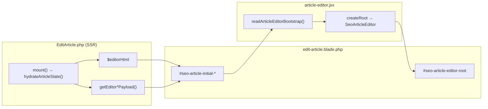
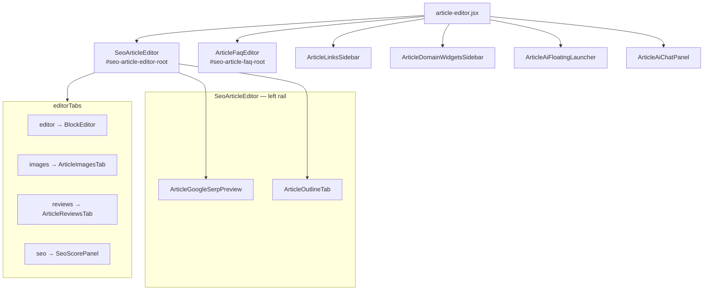
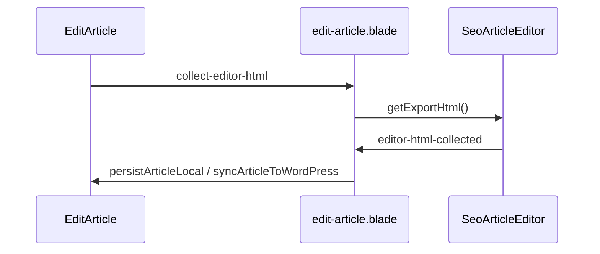
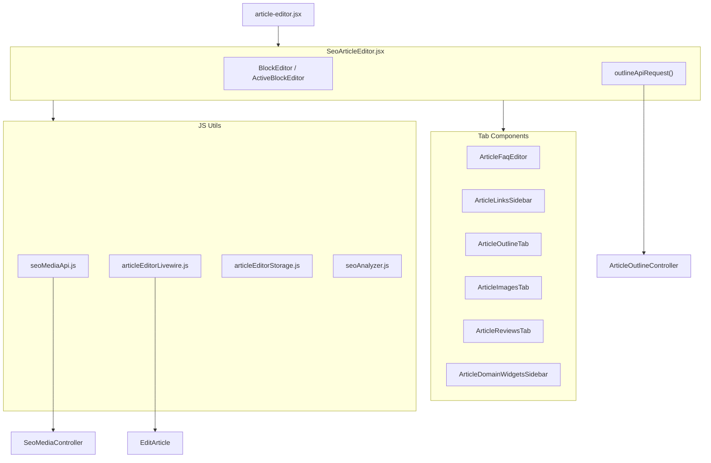

# SeoContentAi — React Editor & EditArticle

[← Quay lại Bản đồ tổng](SUPER_MAP_INDEX.md)

**Liên quan:** [Media / upload](MAP_SEO_MEDIA.md) · [WordPress sync](MAP_SEO_WP.md) · [Content Projects & Workflow](MAP_SEO_PROJECTS.md)

---

## 2.5 Cấu trúc chi tiết EditArticle (React Component Graph)

> MCP `search_graph` (`SeoArticleEditor`, out_degree **112**), `search_code` (`callEditArticleLivewire`). Files: `article-editor.jsx`, `edit-article.blade.php`, `EditArticle.php`.

### 2.5.1 Component React chính


| Vai trò          | File                                           | Ghi chú                                                                                          |
| ---------------- | ---------------------------------------------- | ------------------------------------------------------------------------------------------------ |
| **Vite entry**   | `resources/js/article-editor.jsx`              | Bundle `article-editor`. `mountArticleEditorPage()` mount nhiều React root.                      |
| **Editor chính** | `resources/js/components/SeoArticleEditor.jsx` | Hub ~8.3k dòng, `out_degree: 112`. Props từ bootstrap JSON.                                      |
| **Blade host**   | `resources/views/.../edit-article.blade.php`   | `#seo-article-editor-root` (`wire:ignore`) + JSON scripts initial data.                          |
| **Backend page** | `Filament/.../EditArticle.php`                 | Livewire `/seo/articles/{record}/edit`. SSR data + save qua `$wire` / `callEditArticleLivewire`. |


**Luồng bootstrap (không REST lúc mở trang):**




### 2.5.2 Cây component React (mount graph)

`article-editor.jsx` mount **6 React root**:




| Tab id    | Component                                                         | Điều kiện                    |
| --------- | ----------------------------------------------------------------- | ---------------------------- |
| `editor`  | `BlockEditor` / `ActiveBlockEditor` (TipTap) / `ImageBlockEditor` | Luôn có                      |
| `images`  | `ArticleImagesTab`                                                | Luôn có                      |
| `reviews` | `ArticleReviewsTab`                                               | product + `show_reviews_tab` |
| `seo`     | `SeoScorePanel`                                                   | Luôn có                      |


**Modal tạo ảnh AI (`.seo-generate-image-modal`):** `GenerateImageModal.jsx` — mở qua event `seo-open-generate-image-modal` (`target: 'product-gallery'` từ album sidebar). Chế độ product gallery: layout 2 cột (form + preview).

| Phần preview | Hành vi |
|--------------|---------|
| Image preview | Album hiện tại + ảnh AI đã kết nối bài (`connected`); ảnh kết nối không bị xóa khỏi preview |
| Split grid | Chọn thumbnail có `seo_media_id` → `ImageSplitterPanel` inline; sau split giữ ảnh gốc, append mảnh vào album |
| Prompt preview | Render prompt workflow qua `preview-generate-article-image-prompt` |

Split toàn trang (eraser/splitter tab): [MAP_SEO_MEDIA.md §2.2](MAP_SEO_MEDIA.md) — `/seo/media-image-editor`.

**FAQ:** `ArticleFaqEditor` mount riêng `#seo-article-faq-root` — `__seoCollectArticleFaqs`, events `save-article-faqs`, `generate-article-faqs`. Ngoài ra còn có `renewArticleFaq` (regenerate 1 item), `checkFaqQuestionDuplicate`, `extractFaqsFromSelection`, FAQ extract debug.

### 2.5.3 Backend phục vụ EditArticle

**A. Load (SSR)**


| Nguồn                        | Method                  | Dữ liệu                           |
| ---------------------------- | ----------------------- | --------------------------------- |
| `EditArticle::mount()`       | `hydrateArticleState()` | `$editorHtml`, slug, gallery, SEO |
| `getEditorSeoPayload()`      |                         | serp preview, focus keyword       |
| `getEditorImagesPayload()`   |                         | post images                       |
| `getEditorMetaPayload()`     |                         | articleId, siteId, supplemental   |
| `getEditorFaqsPayload()`     |                         | FAQ rows                          |
| `getEditorSettingsPayload()` |                         | autosave, permissions             |
| `getEditorAiDebugPayload()`  |                         | AI debug data (markdown import)   |


**B. Save — Livewire** (`articleEditorLivewire.js`)

| Trigger                          | Livewire method                                                       |
| -------------------------------- | --------------------------------------------------------------------- |
| `editor-html-collected`          | `persistArticleLocal`                                                 |
| `__seoExecuteHeavyArticleAction` | `executeHeavyArticleAction`                                           |
| Sync shortcut                    | `syncArticleToWordPress`                                              |
| SEO modal                        | `updateSeoMetaFromEditor`                                             |
| FAQ                              | `saveArticleFaqs`, `generateArticleFaqs`, `renewArticleFaq`, `checkFaqQuestionDuplicate`, `extractFaqsFromSelection` |
| AI image / snippet               | `generateArticleImageFromEditor`, `generateFeaturedSnippetFromEditor` |
| AI video                         | `generateArticleVideoFromEditor`                                      |
| Links                            | `searchInternalLinkArticles`                                          |
| Keyboard shortcuts               | `requestSaveArticle`, `requestSyncToWordPress` (bridge → collect HTML → action) |
| Polylang                         | `quickTranslateLinkedArticle`, `importMissingTranslation`, `requestTranslationGeneration` |
| WP Attachment meta               | `renameAttachmentSlugsOnWordPress`, `updateAttachmentMetaOnWordPress` |
| Gallery picker                   | `confirmGallerySelectionFromPicker` (multi-select → album)            |
| Outline                          | `rewriteOutlineFromWorkflow`                                          |
| AI Prompt preview                | `previewGenerateArticleImagePrompt`                                   |
| Debug                            | `importMarkdownDebug`, `importMarkdownFaqDebug`                       |
| Notification forwarding          | `handleEditorNotify` (Alpine → Filament notification)                 |
| Slug                             | `confirmArticleSlug`                                                  |
| SEO description                  | `updateSeoMetaDescriptionFromEditor`                                  |




**Dual save path:**
- **Path cũ:** Alpine event `editor-html-collected` → Livewire `persistArticleLocal` / `syncArticleToWordPress`
- **Path mới (keyboard shortcut):** JS function `__seoExecuteHeavyArticleAction` → `wire.executeHeavyArticleAction()` — dùng cho Ctrl+S / Ctrl+Shift+S

**Overlay system (JS):** Blade có `__seoArticleHeavyActionOverlay` (~130 dòng) với guard timer, keyboard blocker, `inert` management, `persistUntilUnload` flag. Khi save/sync, overlay khóa toàn bộ interaction.

**Autosave client:** `saveDraft()` → `sessionStorage` — không hit server mỗi keystroke.

**C. REST routes**

| Prefix                                | Controller                     | Client                               |
| ------------------------------------- | ------------------------------ | ------------------------------------ |
| `/api/seo/articles/{id}/outline*`     | `ArticleOutlineController`     | `ArticleOutlineTab`                  |
| `/api/seo/media/*`                    | `SeoMediaController`           | [MAP_SEO_MEDIA.md](MAP_SEO_MEDIA.md) |
| `/seo/articles/{article}/media-picker` | `ArticleMediaPickerController` | Alpine `fetchPickerImages`           |
| `/api/ai/chat`                        | `GlobalAiChatController`       | `ArticleAiChatPanel`                 |
| `/seo/articles/{article}/seo-preview` | `ArticleSeoPreviewController`  | `ArticleGoogleSerpPreview`           |
| `/seo/articles/{article}/preview`     | `ArticlePreviewController`     | Frontend preview                     |
| `/api/seo/articles/{article}/revisions` | `ArticleRevisionController` + `SeoArticleRevisionController` | Revision tab |
| `/seo/articles/{article}/revisions`   | `SeoArticleRevisionController` | Revision compare/restore             |

> **Lưu ý route change:**
> - Media picker: `/api/seo/articles/{id}/media-picker` → `/seo/articles/{article}/media-picker` (bỏ `api/` prefix)
> - AI chat: `/api/seo/global-ai/chat` → `/api/ai/chat` (bỏ segment `seo/`)

### 2.5.4 Media picker modal (`.seo-article-media-modal`)

Alpine `x-data` trong `edit-article.blade.php` (wrapper trang, không `wire:ignore`).


| Trigger              | Hàm                                                                                |
| -------------------- | ---------------------------------------------------------------------------------- |
| Ảnh đại diện / album | `openArticleMediaModal('featured'                                                  |
| Editor block         | `seo-open-article-media-picker` → `openArticleMediaModal('editor-block', blockId)` |


**Tabs:** `article` (catalog từ React), `original` / `local` (REST `GET .../media-picker?page&search=`).

**Giữ state khi đóng/mở (không refetch):**


| Hàm                      | Hành vi                                                                                                                                                 |
| ------------------------ | ------------------------------------------------------------------------------------------------------------------------------------------------------- |
| `openArticleMediaModal`  | Nếu `pickerWasOpened` hoặc `pickerImages.length > 0` → chỉ `mediaModalOpen = true`, **return** (không `fetchPickerImages` / `loadArticleTabFromEditor`) |
| `closeArticleMediaModal` | Chỉ `mediaModalOpen = false` — giữ `pickerImages`, `pickerSearchQuery`, `pickerPage`                                                                    |
| Lần mở đầu               | Fetch bình thường, set `pickerWasOpened = true`                                                                                                         |


Cache trang (không search): `articleMediaPickerCache.js` → `localStorage`. Bootstrap bundle: `article-media-picker-cache-bootstrap`.

`article-media-picker-loaded` chỉ apply khi `mediaModalOpen === true`.

**Đồng bộ tab WP → tab Hình ảnh (§2.5.2):**


| Bước                         | Hành vi                                                                                                                               |
| ---------------------------- | ------------------------------------------------------------------------------------------------------------------------------------- |
| Chọn ảnh tab `original` (WP) | `selectPickerImage` gửi `pickerTab: 'original'` trong `editor-block-image-selected` / `article-media-selected`                        |
| React                        | `SeoArticleEditor` cập nhật block/supplemental, `publishEditorImagesCatalog()` → event `seo-editor-images-catalog` (`autoSync: true`) |
| Tab Hình ảnh                 | `ArticleImagesTab` nhận `blocks` + `supplementalImages` mới; `imagesReloadKey++` khi nguồn WP                                         |
| Tab «Trong bài» (picker)     | Alpine lắng `seo-editor-images-catalog` → cập nhật `pickerCatalog` nếu modal đang mở                                                  |

**Product Album Gallery:** Blade có secondary Alpine component `seoProductAlbumBoxData` (drag-reorder album). Multi-select with shift+click range (`galleryPickerSelectedKeys`). `confirmGallerySelectionFromPicker` → save to album.

**Polylang Widget:** Blade include `seo-polylang-widget` (line 1145). Livewire methods: `quickTranslateLinkedArticle`, `importMissingTranslation`, `requestTranslationGeneration`.

**Video Generation:** Event `generate-article-video`, Livewire method `generateArticleVideoFromEditor`, setting flag `can_generate_video`.

---

## 5. Frontend cluster: React Editor


### 5.1 Cây component (cluster 528 members)




### 5.2 API surface từ frontend


| Module                           | Endpoints / bridge                   |
| -------------------------------- | ------------------------------------ |
| `seoMediaApi.js`                 | [MAP_SEO_MEDIA.md](MAP_SEO_MEDIA.md) |
| `outlineApiRequest`              | `GET/POST/PUT/DELETE .../outline*`   |
| `articleEditorLivewire.js`       | Livewire save/sync (không REST)      |
| `articleFeaturedImageStorage.js` | Livewire featured image              |
| `articleWpCategoriesStorage.js`  | Livewire categories                  |


**Hybrid:** REST cho media + outline; Livewire cho persist bài + sync WP.

### Hướng dẫn prompt — React Editor

```
Hub: resources/js/components/SeoArticleEditor.jsx
Entry: resources/js/article-editor.jsx
Livewire: resources/js/utils/articleEditorLivewire.js
Blade: edit-article.blade.php (Alpine media modal + $wire events)
Outline: ArticleOutlineTab.jsx → ArticleOutlineController
```
