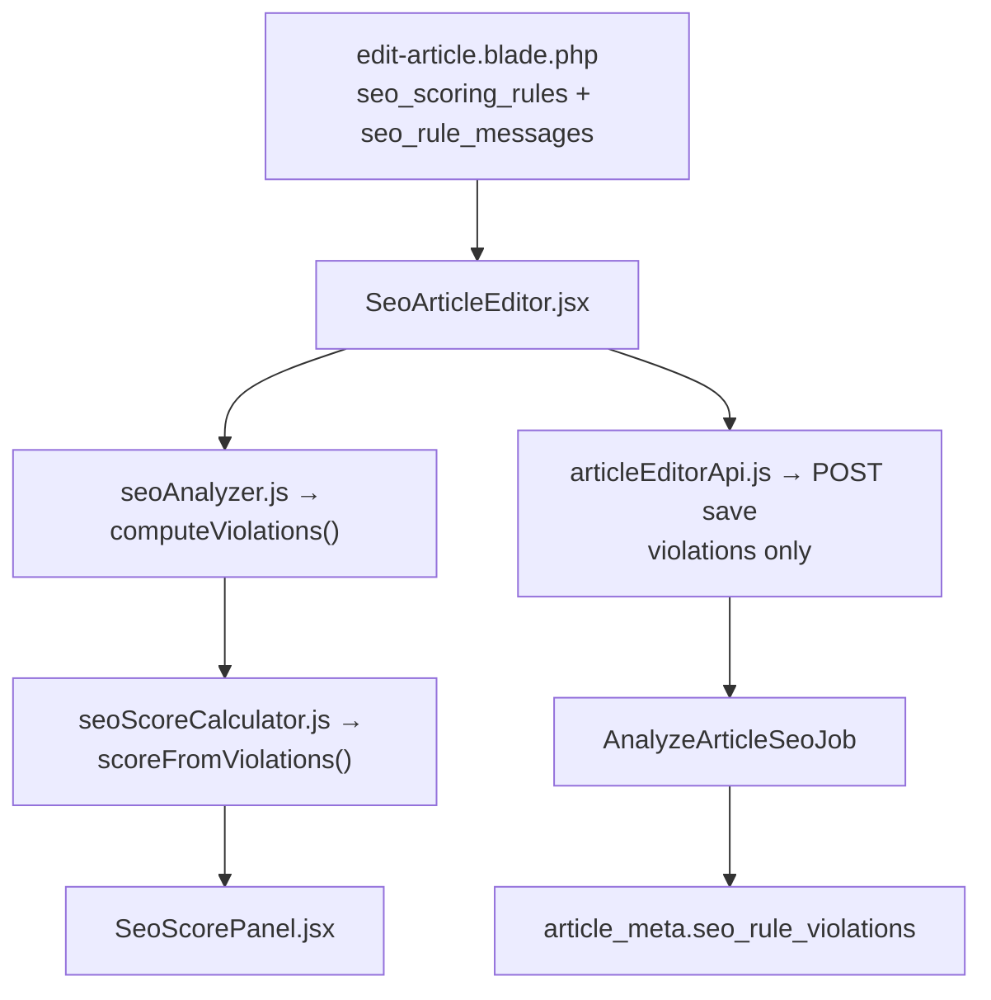

# SeoContentAi — SEO Scoring (Rules + Violations)

[← Quay lại MAP_SEO_EDITOR](MAP_SEO_EDITOR.md) · [Audit filters](MAP_SEO_AUDIT.md) · [Bản đồ tổng](SUPER_MAP_INDEX.md)

---

## 1. Tổng quan

Hệ thống chấm SEO dùng kiến trúc **deduction-based**:

| Thành phần | Vai trò |
|------------|---------|
| `SeoScoringRulesRegistry` | Danh sách rules cố định trong code (`key`, `deduction`, `locale_key`) |
| `SeoScoringEngine` | Phân tích HTML → `list<string>` violation keys |
| `SeoScoringCalculator` | `score = max(0, 100 - sum(deductions))` |
| `article_meta.seo_rule_violations` | JSON array phẳng các `rule_key` vi phạm |
| `articles.seo_score` | Cache denormalized khi persist (sort/filter SQL) |

**Điểm hiển thị** luôn tính động từ `violations` + rules hiện tại — đổi deduction trong code cập nhật điểm bài cũ mà không cần re-analyze job.

---

## 2. Luồng React Editor (client-side)



### Bootstrap JSON (`#seo-article-editor-settings`, `#seo-article-initial-seo`)

| Key | Mô tả |
|-----|--------|
| `seo_scoring_rules` | `[{key, deduction, locale_key}, ...]` |
| `seo_rule_messages` / `seo_scoring_messages` | Map `seo_rules.*` → text đã dịch |
| `featured_snippet_thresholds` | Ngưỡng bảng FS cho client analyzer |
| `violations` / `analysis.violations` | Violations đã lưu của bài |

### Files React

| File | Vai trò |
|------|---------|
| [`seoAnalyzer.js`](../app/Addons/SeoContentAi/resources/js/utils/seoAnalyzer.js) | `computeSeoAnalysis()` — mirror PHP checkers |
| [`seoScoreCalculator.js`](../app/Addons/SeoContentAi/resources/js/utils/seoScoreCalculator.js) | `scoreFromViolations()`, `formatViolationLine()` |
| [`SeoScorePanel.jsx`](../app/Addons/SeoContentAi/resources/js/components/SeoScorePanel.jsx) | Ring score + list `-{deduction}đ: {message}` |
| [`SeoArticleEditor.jsx`](../app/Addons/SeoContentAi/resources/js/components/SeoArticleEditor.jsx) | Debounce analyze on content change; tab badge score |

### Payload save

`buildSeoAnalysisPayload()` chỉ gửi:

```json
{
  "violations": ["h2_missing", "faq_missing"],
  "extracted_links": { "internal": [], "external": [] }
}
```

Không gửi `score`, `breakdown`, `good`, `errors` cố định.

---

## 3. Backend

| File | Vai trò |
|------|---------|
| [`SeoScoringRulesRegistry.php`](../app/Addons/SeoContentAi/Support/SeoScoringRulesRegistry.php) | Rules + i18n keys |
| [`SeoScoringEngine.php`](../app/Addons/SeoContentAi/Services/SeoScoringEngine.php) | Core analyzers + Featured Snippet tiers |
| [`SeoScoringCalculator.php`](../app/Addons/SeoContentAi/Services/SeoScoringCalculator.php) | Tính điểm từ violations |
| [`SeoRuleViolationsResolver.php`](../app/Addons/SeoContentAi/Support/SeoRuleViolationsResolver.php) | Đọc meta mới + convert legacy |
| [`SeoAnalyzerService.php`](../app/Addons/SeoContentAi/Services/SeoAnalyzerService.php) | Persist `seo_rule_violations` |
| [`SeoEngineService.php`](../app/Services/SeoEngineService.php) | Wrapper tương thích audit/API |

### Rules (tóm tắt)

| key | deduction |
|-----|-----------|
| `missing_focus_keyword` | 100 |
| `h2_missing` | 20 |
| `content_length_low` | 15 |
| `image_ratio_*` | 5–15 |
| `image_alt_missing` | 5 |
| `wiki_trust_missing` | 15 |
| `faq_missing` | 10 |
| `keyword_missing_in_*` | 3–4 |
| `featured_snippet_*` | 4–10 |

i18n: [`lang/en/seo_rules.php`](../lang/en/seo_rules.php), [`lang/vi/seo_rules.php`](../lang/vi/seo_rules.php).

---

## 4. Legacy compat

`SeoRuleViolationsResolver` đọc lazy:

1. `seo_rule_violations` (format mới — array phẳng)
2. Fallback `seo_rank_math_score` object → map `reason_keys` / breakdown
3. Fallback `seo_scoring_details` → FAQ + snippet tier keys

Bài được save/analyze lại sẽ ghi format mới.

---

## 5. Audit (`ArticlesOptimal`)

Filters map sang violation keys:

| Filter | Violation key |
|--------|---------------|
| Thin content | `content_length_low` |
| Poor image | `image_ratio_*`, `image_alt_missing` |
| Missing H2 | `h2_missing` |
| Missing FAQ | `faq_missing` |
| Low score | `score < 60` (từ engine runtime) |
