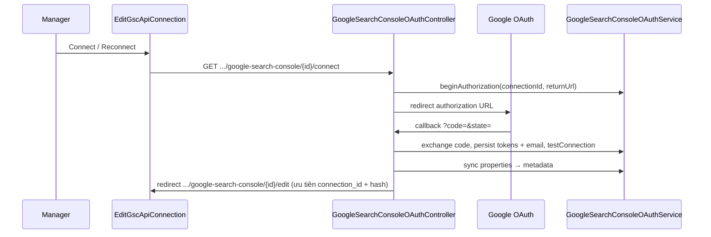

# Google Search Console — API Connections (tổng kết triển khai)

[← Quay lại Bản đồ tổng](SUPER_MAP_INDEX.md) · [Settings & API Connections](MAP_SEO_SETTINGS.md) · [Performance Hub](MAP_SEO_PERFORMANCE_HUB.md)

> Doc này tổng hợp **toàn bộ thay đổi GSC** trong batch API Connections (OAuth riêng, route `{id}`, UI edit/create). Đọc doc này trước khi debug “dữ liệu cũ mất” hoặc “UI sai”.

---

## 1. Bối cảnh & mục tiêu

| Trước | Sau (hiện tại) |
|-------|----------------|
| Edit GSC không có `{id}` trong URL | Mỗi connection có URL riêng `.../google-search-console/{id}/edit` |
| OAuth dùng chung Google Login (nếu có) | OAuth **riêng** `GOOGLE_SEARCH_CONSOLE_*` |
| Bar nút action bị render 2 lần (Filament header + blade) | Chỉ 1 bar (ẩn Filament header) |
| List GSC có thể chỉ 1 dòng | List hiện **mọi** row trong `seo_gsc_master_connections` |
| Form create vs edit khác nhau mạnh | Dùng chung `ApiConnectionFormSchema`, edit bổ sung status/email/property |

**Chưa hoàn thiện 100%:** UI/list/OAuth đã theo `{id}`, nhưng **một số luồng sync & Performance Hub vẫn lấy connection đầu tiên** (`resolveForUser()`). Xem §8.

---

## 2. Kiến trúc dữ liệu

### 2.1 Master + mapping (multi-domain)

```
seo_gsc_master_connections (1 row = 1 Google account / 1 credential set)
    └── seo_gsc_property_mappings (n row: gsc_connection_id + site_id → property_url)
```

| Bảng | Connection DB | Mô tả |
|------|---------------|-------|
| `seo_gsc_master_connections` | **`mysql` (core)** | name, status, `oauth_client_id`, `oauth_client_secret` (encrypted), `credentials` (encrypted JSON tokens), `account_email`, `metadata.properties` |
| `seo_gsc_property_mappings` | **`mysql` (core)** | map `site_id` (domain header) → GSC property URL |

**Lưu ý:** OAuth/master/mapping tables **không** nằm trên `omi_seo_ai`. Migration: `app/Addons/SeoContentAi/database/migrations/2026_07_11_100000_create_seo_external_api_connections_tables.php`.

### 2.2 Dữ liệu Performance Hub (legacy snapshot)

KPI/query **legacy** trên Performance Hub đọc **site meta** `gsc_query_snapshot` (bảng meta site core), **không** đọc trực tiếp `seo_gsc_master_connections`.

Luồng ghi snapshot: `GoogleSearchConsoleSyncService::syncSite()` → GSC API → `Site::setMeta('gsc_query_snapshot', ...)`.

Nếu API fail → fallback `syncFromLegacySnapshot()` (chỉ kiểm tra meta cũ còn hay không).

### 2.3 GSC Intelligence facts (Phase 5 — tách biệt)

Canonical Search Analytics facts / mappings / opportunities nằm trên connection **`omi_seo_ai`** (migration `2026_07_28_180000_create_gsc_intelligence_tables.php`). Không duplicate OAuth credential từ master connections.

Xem [GSC_INTELLIGENCE.md](GSC_INTELLIGENCE.md) + [GSC_DATA_MODEL.md](GSC_DATA_MODEL.md). Overlay UI additive trên Performance Hub — **chưa** thay snapshot legacy.

---

## 3. Routes & URL

Base: `/seo/{connection_hash}/settings/api/...`

| Mục đích | Route name | Path |
|----------|------------|------|
| List | `filament.seo.resources.settings.api.index` | `/` |
| Create | `...create` | `/create` |
| **Edit GSC** | `...edit-gsc` | `/google-search-console/{record}/edit` |
| **OAuth start** | `seo.gsc.oauth.redirect` | `/google-search-console/{record}/connect` |
| OAuth callback (global) | `seo.gsc.oauth.callback` | `/seo/oauth/google-search-console/callback` |
| Legacy redirect | `gsc-edit-legacy` | `/gsc/edit` → redirect có `{id}` |
| Legacy redirect | `gsc-edit-root-legacy` | `/google-search-console/edit` → redirect có `{id}` |
| Edit DataForSEO | `edit-dataforseo` | `/dataforseo/edit` |
| Edit AI | `edit` | `/{record}/edit` |

**Route conflict đã xử lý:** path `google-search-console/{record}/edit` đăng ký **trước** `/{record}/edit` để `gsc` không bị nuốt làm record AI.

Helper URL: `AiConnectionResource::gscEditUrl($id, ?$connectionHash)` — build path tường minh `/seo/{hash}/settings/api/google-search-console/{id}/edit` khi có hash (OAuth callback).

---

## 4. OAuth flow (tách Google Login)

### 4.1 Env & credential per connection

**Server (`.env` / `config/services.php`):** chỉ cần redirect URI global:

```env
GOOGLE_SEARCH_CONSOLE_REDIRECT_URI=https://<host>/seo/oauth/google-search-console/callback
```

**Per master connection (DB `seo_gsc_master_connections`):** Manager nhập **OAuth Client ID + Client secret** trên form create/edit. Runtime OAuth (`GoogleSearchConsoleOAuthService::resolveOAuthApp()`) đọc từ connection, **không** dùng `GOOGLE_SEARCH_CONSOLE_CLIENT_ID/SECRET` env.

Google Cloud Console: redirect URI phải khớp **chính xác** callback trên.

**OAuth scope:** `webmasters.readonly` + `userinfo.email` (`GoogleSearchConsoleOAuthService::SCOPE`).

### 4.2 Luồng



Session key: `gsc_oauth_pending` (state, user_id, connection_hash, **connection_id**, return_url).

**Callback redirect:** `GoogleSearchConsoleOAuthController::resolveTargetUrlFromContext()` — ưu tiên `connection_id` → `gscEditUrl()`; `SeoConnectionContext::rememberHash()` restore `seo_current_connection_hash` sau OAuth (tránh văng về list `/settings/api`).

**Status sau OAuth:** `GoogleSearchConsoleConnectionService::resolveEffectiveStatus()` — Connected khi có oauth app + access + refresh (email optional, chỉ hiển thị). `testConnection()` dùng `hasApiTokens()` / `canCallGscApi()`, không bắt email.

Files:
- `Http/Controllers/GoogleSearchConsoleOAuthController.php`
- `Services/GoogleSearchConsoleOAuthService.php`
- Route đăng ký: `Providers/SeoPanelProvider.php`

---

## 5. UI Filament

### 5.1 Trang & view

| Trang | Class | View |
|-------|-------|------|
| List | `ListAiConnections` | `seo-settings-api-list.blade.php` |
| Create (mọi provider) | `CreateAiConnection` | `seo-settings-ai-form.blade.php` |
| Edit GSC | `EditGscApiConnection` | `seo-settings-api-form.blade.php` |
| Edit DataForSEO | `EditDataForSeoApiConnection` | `seo-settings-api-form.blade.php` |

### 5.2 Form schema (`Support/ApiConnectionFormSchema.php`)

**Create (GSC):** Provider, Display name, OAuth Client ID/secret (required), callback URL (readonly+copy), hint “Save → redirect edit → Connect”.

**Edit (GSC)** — khi `gsc_has_saved_config = true` (luôn set trên mount edit):
- OAuth Client ID; Client secret (để trống = giữ cũ; hint `gsc_oauth_client_secret_saved` khi đã lưu)
- Connection status (`resolveEffectiveStatus`)
- Account email (readonly, `dehydrated(false)` — optional cho status Connected)
- Token expiration
- Property URL dropdown (`gsc_available_properties` + mapping hiện tại)
- **Không** nhập Access/Refresh token thủ công (OAuth-only)

### 5.3 Action bar (1 bar duy nhất)

- Blade render: `getCachedHeaderActions()` trong `seo-settings-api-form.blade.php`
- Filament header bị tắt: trait `Filament/Concerns/HidesFilamentPageHeader.php` (`getHeader(): null`)

Nút trên edit GSC: Connect / Reconnect, Disconnect, Sync properties, Test connection, Sync GSC for current domain.

### 5.4 List nhiều connection

`ApiConnectionsListService::recordsForUser()`:
- AI từ `api_connections`
- **Mỗi** GSC từ `GoogleSearchConsoleConnectionService::allForUser()`
- DataForSEO 1 row (vẫn single)

Row ảo: `Models/ApiConnectionListRow` — key `gsc:{id}`; status list = `resolveEffectiveStatus()` (không đọc cột `status` thô).

`ListAiConnections::notifyOAuthFlash()` — hiện toast `gsc_oauth_success` / `gsc_oauth_error` nếu callback redirect về list.

---

## 6. Services chính

| Service | Vai trò |
|---------|---------|
| `GoogleSearchConsoleConnectionService` | CRUD, mapping, `hasOAuthAppCredentials`, `hasApiTokens`, `canCallGscApi`, `hasUsableTokens`, `resolveEffectiveStatus`, `testConnection`, `resolveByIdForUser`, `allForUser` |
| `GoogleSearchConsoleOAuthService` | OAuth begin/callback, token refresh, disconnect |
| `GoogleSearchConsoleSyncService` | listProperties, `syncSiteWithDetails()` → `gsc_query_snapshot` (schema: `property_url`, `date_start`, `date_end`, `filters`, `kpis.total_queries`, `timeseries.current/previous`, `chart_status`; dimension `date` 28d + previous period); resolve connection qua `seo_gsc_property_mappings.gsc_connection_id` |
| `GoogleSearchConsoleDomainMatcherService` | Normalize host, exact match property, priority `sc-domain` > https root > https www |
| `GoogleSearchConsoleBulkSyncService` | `ensureSiteMapped()` (auto-map 1 domain), `autoMapAndSyncAll()`, `syncAllMappedSites($autoMapFirst=true)`, `formatSummaryMessage()` — summary rows unmatched/ambiguous/failed |
| `Jobs/SyncGscSiteSnapshotJob` | Queue sync 1 site |
| `ApiConnectionsListService` | Gộp list Filament |

Edit page actions (`EditGscApiConnection`):
- **Refresh properties** (`refreshProperties`) — chỉ gọi Sites API, cập nhật metadata
- **Auto-map & Sync all domains** (`autoMapAndSyncAll`) — refresh → auto-match → upsert mappings → sync từng site
- **Sync current domain** — giữ nguyên

---

## 7. Đã fix (theo feedback user)

| # | Vấn đề | Cách xử lý |
|---|--------|------------|
| 1 | Double action bar | `HidesFilamentPageHeader` + chỉ render actions trong blade |
| 2 | URL không có id | `google-search-console/{record}/edit` + OAuth `{record}/connect` |
| 3 | Create vs edit quá khác | Chung `ApiConnectionFormSchema`; edit mount fill đủ field |
| 4 | Property dropdown trống | Sync on mount + merge mapping hiện tại vào options |
| 5 | 404 khi edit GSC | Tách route khỏi `/{record}/edit`; legacy redirect |
| 6 | Toast “Thiếu credential” sau OAuth | Scope `userinfo.email`; `testConnection` dùng `hasApiTokens` thay vì bắt email |
| 7 | Callback văng về `/settings/api` | `rememberHash` + `gscEditUrl($id, $hash)` + ưu tiên `connection_id` trong redirect |
| 8 | Status Not configured dù có token | `hasUsableTokens` = access + refresh (email optional); list dùng `resolveEffectiveStatus` |
| 9 | Sync all báo OK nhưng domain chưa map thủ công không sync | Hub + bulk dùng `autoMapAndSyncAll` / `ensureSiteMapped()` trước sync; toast summary `newly_matched/synced/failed/unmatched`; không fallback legacy im lặng khi API fail |

Tests:
- `tests/Unit/GoogleSearchConsoleOAuthTest.php`
- `tests/Unit/AiConnectionResourceEditUrlTest.php`
- `tests/Unit/AiConnectionResourceRouteConflictTest.php`
- `tests/Unit/GoogleSearchConsoleSyncTest.php`
- `tests/Unit/GoogleSearchConsoleBulkSyncTest.php`

---

## 8. Chỗ có thể “sai sai” / gap cần biết

### 8.1 Multi-connection: sync đã theo mapping

`GoogleSearchConsoleSyncService::syncSite()` resolve connection qua `seo_gsc_property_mappings.gsc_connection_id`. Performance Hub GSC strip dùng mapping của domain hiện tại.

Gap còn lại: `LegacyGscEditRedirect` vẫn redirect về connection đầu tiên nếu URL cũ không có `{id}`.

### 8.2 “Dữ liệu cũ đâu?” — 3 khả năng

1. **Chưa migrate bảng**  
   Nếu `seo_gsc_master_connections` chưa tồn tại / trống → form edit trống.  
   Chạy migration addon trên **core mysql**.

2. **Dữ liệu cũ nằm chỗ khác**  
   Performance KPI có thể chỉ có trong **site meta** `gsc_query_snapshot` (sync WP/plugin/manual trước đây), **không** tự copy sang `seo_gsc_master_connections`.  
   → Hub vẫn có KPI cũ; form API Connections vẫn trống token/email.

3. **Save manual token trước đây**  
   - Token lưu trong `credentials` (encrypted) vẫn còn nếu đã insert vào bảng mới.  
   - UI **không hiển thị** token đã lưu (chỉ placeholder trống; field token chỉ khi `APP_DEBUG`).  
   - `account_email` điền qua OAuth (scope `userinfo.email`); **không bắt buộc** để status Connected nếu đã có access + refresh.

### 8.3 Không có script migrate dữ liệu legacy

Không có job/command copy credential từ storage cũ (wp_options, file, bảng khác) sang `seo_gsc_master_connections`. Nếu user save “GSC key” ở hệ thống cũ chưa map sang bảng mới → **phải Connect lại** hoặc insert thủ công DB.

### 8.4 OAuth app chưa lưu trên connection

`gsc_oauth_app_not_configured` / Connect disabled → chưa có Client ID + secret trong DB. Edit: nhập secret → **Save** trước khi Connect.

### 8.5 Create flow 2 bước

Create GSC **không** có nút Connect ngay. Flow: Create (name) → redirect edit `{id}` → Connect OAuth. Khác UX “paste token một lần” trước đây.

### 8.6 View create dùng `seo-settings-ai-form`

Create API connection dùng view AI form (không có header actions) — đúng cho create, nhưng tên file gây nhầm (không phải bug functional).

### 8.7 Property mapping gắn domain header

`gsc_property_url` lưu theo `SeoAccessControl::globalSiteId()` — đổi domain header trên top bar = mapping khác / dropdown khác.

### 8.8 Domain chưa map thủ công / Reauthorization

- **Chưa map:** dùng **Auto-map & Sync all** hoặc **Sync current domain** — `ensureSiteMapped()` match domain ↔ GSC property (`GoogleSearchConsoleDomainMatcherService`). Unmatched/ambiguous → map thủ công trên Edit GSC.
- **Reauthorization required:** token hết hạn — Reconnect OAuth trước khi sync; bulk summary hiện `failed` thay vì toast OK chung.

---

## 9. Checklist verify production

```bash
php artisan route:clear
php artisan optimize:clear
php artisan test app/Addons/SeoContentAi/tests/Unit/GoogleSearchConsoleOAuthTest.php
php artisan test app/Addons/SeoContentAi/tests/Unit/GoogleSearchConsoleOAuthCredentialsTest.php
php artisan test app/Addons/SeoContentAi/tests/Unit/GoogleSearchConsoleConnectionServiceTest.php
php artisan test app/Addons/SeoContentAi/tests/Unit/AiConnectionResourceEditUrlTest.php
php artisan test app/Addons/SeoContentAi/tests/Unit/AiConnectionResourceRouteConflictTest.php
```

**DB:**
```sql
SELECT id, user_id, name, status, account_email, last_error FROM seo_gsc_master_connections;
SELECT * FROM seo_gsc_property_mappings;
```

**UI:**
1. Settings → API Connections → Edit row GSC → URL có `/google-search-console/{số}/edit`
2. Sau Connect OAuth → redirect về **edit** (không list), toast success
3. Chỉ **một** hàng nút action phía trên form
4. Có access + refresh → status Connected (email có thể trống tạm thời)
5. Property trống → Sync properties hoặc Reconnect
6. Đổi domain header → chọn property → Save → mapping đúng `site_id`

**Env:** `GOOGLE_SEARCH_CONSOLE_REDIRECT_URI` khớp Google Cloud. Client ID/secret trên form connection.

---

## 10. Việc nên làm tiếp (nếu muốn đúng multi-GSC end-to-end)

| Ưu tiên | Việc |
|---------|------|
| P0 | `syncSite($siteId)` resolve connection qua **mapping** `seo_gsc_property_mappings.site_id`, không `resolveForUser()` |
| P0 | `statusForSite($siteId)` trả status connection **đã map** domain đó |
| P1 | Performance Hub connection strip: link edit đúng `gsc:{id}` |
| P1 | Command migrate/import credential legacy (nếu xác định được storage cũ) |
| P2 | Create form: optional “Connect ngay” sau create |
| P2 | Hiện indicator secret đã lưu | ✅ hint `gsc_oauth_client_secret_saved` trên edit |

---

## 11. File map nhanh

| File | Vai trò |
|------|---------|
| `Filament/Resources/AiConnectionResource.php` | Routes, `gscEditUrl`, list edit URL |
| `Filament/Resources/.../EditGscApiConnection.php` | Edit page, mount, actions, save |
| `Filament/Resources/.../CreateAiConnection.php` | Create GSC → redirect edit |
| `Filament/Resources/.../LegacyGsc*Redirect.php` | URL cũ → có id |
| `Filament/Concerns/HidesFilamentPageHeader.php` | Fix double bar |
| `Support/ApiConnectionFormSchema.php` | Form create/edit |
| `Services/GoogleSearchConsoleConnectionService.php` | Domain logic connection |
| `Services/GoogleSearchConsoleOAuthService.php` | OAuth |
| `Services/GoogleSearchConsoleSyncService.php` | API + snapshot |
| `Services/ApiConnectionsListService.php` | List merge |
| `Http/Controllers/GoogleSearchConsoleOAuthController.php` | HTTP OAuth |
| `Models/SeoGscMasterConnection.php` | Model master |
| `Models/SeoGscPropertyMapping.php` | Model mapping |
| `Models/ApiConnectionListRow.php` | Row ảo list |
| `Support/SeoConnectionContext.php` | `rememberHash()`, `panelPath`, merge route params |
| `Filament/Resources/.../ListAiConnections.php` | List + OAuth flash toast |
| `Providers/SeoPanelProvider.php` | OAuth route `{record}` + callback |
| `resources/views/filament/pages/seo-settings-api-form.blade.php` | Layout edit + action bar |

---

*Cập nhật: 2026-07-11 — OAuth per-connection credentials, callback redirect fix, status Connected không bắt email.*
