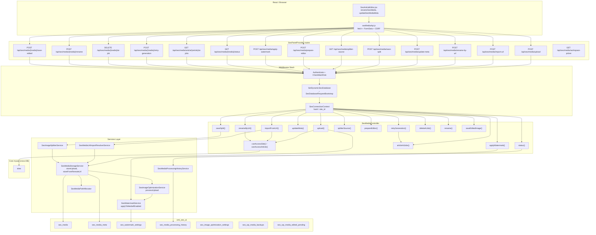
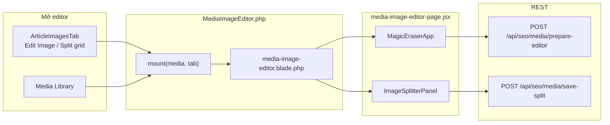

# SeoContentAi — Media API & Thư viện ảnh

[← Quay lại Bản đồ tổng](SUPER_MAP_INDEX.md)

**Liên quan:** [React Editor](MAP_SEO_EDITOR.md) · [Content Projects](MAP_SEO_PROJECTS.md)

---

## 2.1 Media API (`/api/seo/media/*`)



**Trace MCP (`upload` outbound, depth 4):** `SeoMediaController.upload` → `SeoMediaStorageService.storeUpload` → `SeoImageOptimizationService.processUpload` → `SeoWatermarkService.applyToMediaIfEnabled` → `SeoMedia::create` qua `SeoMediaBuilder.where/update`.

**Workspace Picker route** (`GET /api/seo/media/workspace-picker`): Xử lý bởi `WorkspaceMediaPickerController` riêng, không phải `SeoMediaController`.

### SeoMediaBuilder

`SeoMedia` override `newEloquentBuilder()` → `SeoMediaBuilder`. `where`/`update` trên field meta được route sang `seo_media_meta`.

---

## Hướng dẫn prompt Cursor — Upload / thư viện / watermark

```
Route: SeoPanelProvider.php prefix api/seo/media.
Controller: Http/Controllers/SeoMediaController.php.
Services: SeoMediaStorageService, SeoImageOptimizationService, SeoWatermarkService.
Model/Query: Models/SeoMedia.php + Models/SeoMediaBuilder.php (meta routing).
Frontend: seoMediaApi.js, components/ArticleImagesTab.jsx, ImageBlockEditor.jsx.
Watermark batch: POST /api/seo/watermark/* → SeoWatermarkController.
Image Optimization Settings: SeoImageOptimizationSetting model + services.
AI Image Processing: ImageProcessingPage.php + /api/seo/media/prepare-editor.
WP Media Backup: Models SeoWpMediaBackup, SeoWpMediaEditedPending.
```

### API surface (frontend)

| Client module | Endpoints |
|---------------|-----------|
| `seoMediaApi.js` | `POST upload`, `import-url`, `prepare-editor`, `apply-watermark`, `rename-by-url`, `update-meta`, `save-split`, `save-edited`, `rename`, `retry-generation`, `delete-ai-job`; `GET splitter-source`, `article/{id}/ai-jobs`, `{media}/status`, `workspace-picker` |
| `watermarkApi.js` | `POST /api/seo/watermark/*` (settings, batch, save, save-new) |

**Liên quan editor:** [MAP_SEO_EDITOR.md](MAP_SEO_EDITOR.md) — tab Images, media picker modal, video generation.

---

## 2.2 Trang chỉnh sửa ảnh (`/seo/media-image-editor`)

Filament page toàn màn hình cho magic eraser + image splitter. Không nằm trong menu; mở qua query `?media={seo_media_id}&tab=eraser|splitter`.



| Thành phần | File |
|------------|------|
| Filament page | `Filament/Pages/MediaImageEditor.php` — slug `media-image-editor` |
| Blade + Vite | `resources/views/filament/pages/media-image-editor.blade.php` → `media-image-editor-page.jsx` |
| URL builder | `seoMediaApi.js` → `buildMediaImageEditorUrl({ seoMediaId, tab })` |
| Multi-tenant hash | `/seo/{connectionHash}/media-image-editor?media=…` |
| Split lưới (product gallery) | Modal `.seo-generate-image-modal` — `GenerateImageModal.jsx` + `ImageSplitterPanel` (`canDeleteOriginal=false`, giữ ảnh gốc) |

**Product gallery:** split nhanh trên thumbnail sidebar đã bỏ; split album sản phẩm thực hiện trong modal tạo ảnh AI (chọn ảnh preview → panel Split grid).

---

## 2.3 Image Processing & AI Enhance

### ImageProcessingPage (`/seo/image-processing`)

Filament page riêng cho AI image enhancement (magic eraser, background removal, upscale). Entry từ Media Library hoặc Image Editor.

- **Page:** `Filament/Pages/ImageProcessingPage.php`
- **Entry:** Via `POST /api/seo/media/prepare-editor` để chuẩn bị ảnh cho AI processing
- **Jobs tracking:** `GET /api/seo/media/article/{article}/ai-jobs` trả về danh sách job AI của article
- **Retry:** `POST /api/seo/media/{media}/retry-generation` retry AI job failed
- **Delete:** `DELETE /api/seo/media/{media}/ai-job` xóa job

### ImageOptimizationSettings (`/seo/settings/image-optimization`)

- **Page:** `Filament/Pages/ImageOptimizationSettings.php`
- **Model:** `SeoImageOptimizationSetting` (table `seo_image_optimization_settings`)
- Cấu hình: format ảnh (WebP/AVIF), quality, kích thước tối đa, auto-compression

### Save Edited Image

`POST /api/seo/media/{media}/save-edited` → lưu ảnh đã chỉnh sửa (crop/resize/AI edit). Tạo bản backup trong `seo_wp_media_backups` trước khi ghi đè. Nếu bài đã sync WP → tạo pending record trong `seo_wp_media_edited_pending`.

**Models backup:**
- `SeoWpMediaBackup` (table `seo_wp_media_backups`) — backup ảnh gốc trước khi edit
- `SeoWpMediaEditedPending` (table `seo_wp_media_edited_pending`) — pending changes cần push lên WP

---

## 2.4 Watermark

### Route group (`/api/seo/watermark/*`)

| Method | Path | Controller Action |
|--------|------|-------------------|
| GET | `/api/seo/watermark/settings` | `SeoWatermarkController@showSettings` |
| POST | `/api/seo/watermark/settings` | `SeoWatermarkController@saveSettings` |
| POST | `/api/seo/watermark/batch` | `SeoWatermarkController@applyBatch` |
| POST | `/api/seo/watermark/media/{media}/save` | `SeoWatermarkController@saveMediaWatermark` |
| POST | `/api/seo/watermark/save-new` | `SeoWatermarkController@saveNewFromCanvas` |

**Controller:** `Http/Controllers/SeoWatermarkController.php` (riêng, không lẫn với SeoMediaController)

### Filament Pages

- `WatermarkSettingsPage.php` — cấu hình watermark mặc định (vị trí, opacity, size)
- `WatermarkEditor.php` — design suite cho watermark (canvas editor + preview)

### Watermark Service

`SeoWatermarkService` — `applyToMediaIfEnabled()` được gọi từ upload pipeline. Batch processing qua `applyBatch()`.

### Save New From Canvas

`POST /api/seo/watermark/save-new` → nhận canvas data URL từ WatermarkEditor → tạo watermark image mới → lưu vào storage.
