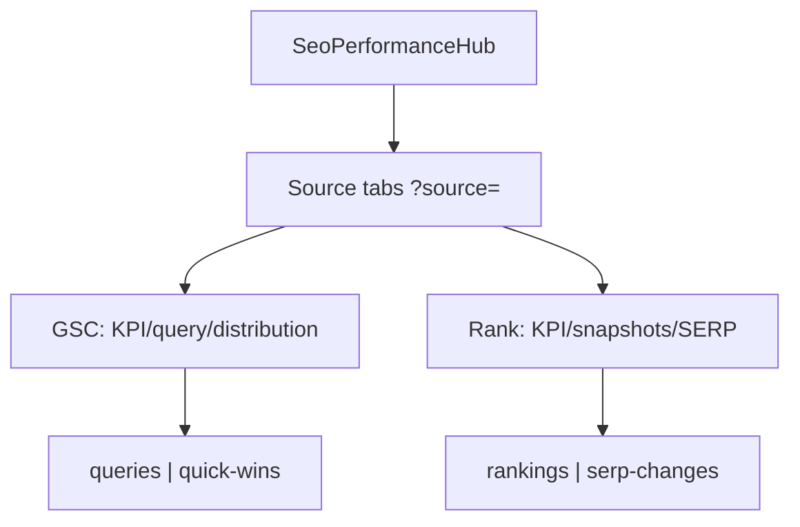

# SeoContentAi — Performance & R&D Hub

[← Quay lại Bản đồ tổng](SUPER_MAP_INDEX.md)

**Liên quan:** [Team & Phân quyền](MAP_SEO_TEAM.md) · [Content Projects & Workflow](MAP_SEO_PROJECTS.md) · [Settings, Prompts & AI Connections](MAP_SEO_SETTINGS.md) · [Domain Management](MAP_SEO_DOMAIN.md)

---

## 1. Tổng quan

**Performance Hub** là trang Filament Livewire phân tích SEO: GSC KPI, rankings, Quick Wins, SERP changes. **AI Keyword Discovery** và **Keyword Cannibalization** đã tách ra khỏi page này.

| Thông tin | Giá trị |
|-----------|---------|
| **URL panel** | `/seo/{connection_hash}/performance-hub` |
| **Route name** | `filament.seo.pages.performance-hub` |
| **Slug Filament** | `performance-hub` |
| **Livewire page** | `Filament/Pages/SeoPerformanceHub.php` |
| **View** | `resources/views/seo/performance-hub.blade.php` + partials `performance-hub/` |
| **CSS** | `resources/css/performance-hub.css` |
| **Navigation** | Ẩn Filament nav (`shouldRegisterNavigation = false`); sidebar **Keywords → SEO Performance** |
| **Quyền** | `SeoAccessControl::canAccessPlannerFeatures()` (Planner+) + `SeoPlannerPermissionMiddleware` |
| **Domain scope** | `SeoAccessControl::globalSiteId()` — domain header bar panel SEO |

**Trang liên quan (tách khỏi Performance Hub):**

| Feature | URL | Class |
|---------|-----|-------|
| AI Keyword Discovery | `/seo/{hash}/keywords/ai-discovery` | `Filament/Pages/AiKeywordDiscovery.php` |
| Keyword Cannibalization | `/seo/{hash}/keywords/cannibalization` | `KeywordResource/Pages/KeywordCannibalizationWorkspace.php` |

Trang **không** dùng React app full-page — UI chính là Blade + Livewire + Alpine. **GSC chart** mount **ApexCharts** qua Vite entry `resources/js/performance-hub-gsc-chart.js`.

---

## 2. Routing

### 2.1 Route chính (Filament auto-discover)

Filament panel `seo` mount tại `seo/{connection_hash}` (`SeoPanelProvider::panel()`). Page được discover từ `Filament/Pages/`:

```text
GET /seo/{connection_hash}/performance-hub
    → SeoPerformanceHub (Livewire)
    → route name: filament.seo.pages.performance-hub
```

`SeoPerformanceHub` extends `SeoPanelPage` → URL luôn merge `connection_hash` qua `InteractsWithSeoConnectionRoutes` / `SeoConnectionContext::mergePanelRouteParameters()`.

### 2.2 Legacy redirect (trong panel group)

Đăng ký trong `SeoPanelProvider` (prefix `seo/{connection_hash}`):

| Legacy path | Redirect |
|-------------|----------|
| `/seo/{hash}/keywords/workspace-3` | `../keywords/ai-discovery` (`seo.keywords.workspace-3-legacy`) |
| `/seo/{hash}/keywords/workspace-4` | `../keywords/cannibalization` (`seo.keywords.workspace-4-legacy`) |
| `/seo/{hash}/settings/ai` | `../settings/api` (`seo.settings.ai-legacy`) |

### 2.3 Controller stub (chưa mount route)

`Http/Controllers/SeoPerformanceHubController.php` — `__invoke()` redirect tới `SeoPerformanceHub::getUrl()`. **Hiện chưa được đăng ký** trong `routes` / `SeoPanelProvider`; entry thực tế là Filament page ở trên.

Middleware `SeoPlannerPermissionMiddleware` cũng khai báo pattern `seo.performance.*` (dự phòng route controller tương lai).

---

## 3. Kiến trúc UI (2 source tabs + sub-tabs)

**Source tabs** (URL `?source=`): sinh động từ `SeoProviderRegistry` + `SeoProviderConnectionStatusService::performanceTabsForUser()` — `gsc` | `serpapi` | `serper` | `searchapi` | `keywords_everywhere` (khi configured). **Không** tab `seranking` (settings only, `performanceTabSupported=false`). Order theo `priority`. Fallback: `SeoPerformanceDashboardService::resolveSourceOrFallback()`.

**Dashboard sections** theo registry `dashboardSections` / `PerformanceHubSectionKey` — Blade chỉ render section có trong allowlist (`rank_kpis`, `rankings_table`, `integration_state`, …). Keywords Everywhere: tab metrics riêng + `integration_state` khi chưa có adapter (`supported=true`, `implemented=false`).

**Rank keyword groups** (URL `?rank_group=`): entity global `SeoRankKeywordGroup` — dùng chung mọi SERP provider (không GSC). Không có `site_id`/`domain_id`. Scope theo `created_by` / account owner (`SeoAccessControl::accountSiteOwnerId()`). Snapshots/runs gắn `rank_group_id` + `rank_group_item_id` + `provider`.

**Global domain selector** (`GlobalSeoBar`): hiện khi `source=gsc` hoặc trang khác; ẩn khi `filament.seo.pages.performance-hub` + `source` là SERP provider (`SeoAccessControl::shouldShowGlobalSitePicker()`).

**Sub-tabs** (URL `?tab=`) theo source — không trộn metric GSC với rank tracker.



| Source | URL `source` | Sub-tab `tab` | Dữ liệu |
|--------|--------------|---------------|--------|
| **Google Search Console** | `gsc` | `queries`, `quick-wins` | **Legacy:** `gsc_query_snapshot` (site meta). **Additive:** GSC Intelligence overlay (`gsc-intelligence-panel`) — Sync CSV preview; Overview/Queries/Pages/Opportunities placeholder — facts trên `omi_seo_ai` khi import/sync via CommandBus (xem [GSC_INTELLIGENCE.md](GSC_INTELLIGENCE.md)) |
| **SERP providers** | `serpapi` / `serper` / `searchapi` | `rankings`, `serp-changes` | `KeywordRankSnapshot` + `SeoRankKeywordGroup` (không filter domain header) |

Partials: `source-tabs`, `gsc-connection-strip`, `gsc-kpi-cards`, `gsc-chart`, `gsc-distribution`, `gsc-queries-table`, `rank-connection-strip` (provider icon strip inline), `rank-kpi-cards`, `ranking-distribution`, `rank-toolbar` (Chạy nhóm + group selector, cạnh rank sub-tabs), `rankings-table`, `serp-changes-table`, `advanced-analysis` (toggle Alpine — chứa `visibility-chart` + `provider-comparison` khi eligible), `rank-group-modal`, `gsc-bulk-sync-summary`.

**Thứ tự rank provider tab (không scroll chart trắng):**

1. Source tabs  
2. Provider connection strip  
3. KPI cards (giữ card Visibility)  
4. Phân bố thứ hạng (`ranking-distribution`)  
5. Rank toolbar + sub-tabs (`rankings` \| `serp-changes`)  
6. Rankings table / SERP changes table  
7. Nút **Phân tích nâng cao** + nội dung collapsed (chỉ khi `advanced_analysis.has_any`)

**Phân tích nâng cao (`advanced_analysis` trong `buildRankState()`):**

| Key | Eligible khi | Render Blade |
|-----|--------------|--------------|
| `organic_visibility` | Nhóm + `target_domain` + ≥2 `keyword_rank_check_runs` `status=completed` có rank snapshot (đếm theo `run_id`, không đếm keyword rows) | Partial `visibility-chart` — không heading/chart/empty khi `eligible=false` |
| `provider_comparison` | ≥2 SERP provider configured + có rows comparison (`comparison_batch` URL) + `SeoAccessControl::canAccessManagerFeatures()` (debug/manager) | Partial `provider-comparison` — tiêu đề **So sánh nhà cung cấp** |
| `has_any` | Một trong hai trên eligible | Partial `advanced-analysis` — nút ghost **Hiện phân tích nâng cao**, mặc định `expanded: false` (Alpine) |

```php
advanced_analysis: [
    'has_any' => bool,
    'organic_visibility' => ['eligible', 'successful_run_count', 'data' => [...]],
    'provider_comparison' => ['eligible', 'provider_count', 'data' => [...]],
]
```

| Model / Service | Vai trò |
|-----------------|--------|
| `Models/SeoRankKeywordGroup` | Nhóm rank global: name, country/language/location/device, `target_domain` nullable |
| `Models/SeoRankKeywordGroupItem` | Keyword ↔ group (unique per group) |
| `Services/SeoRankKeywordGroupService` | CRUD, duplicate/archive, add keywords idempotent |
| `Services/KeywordRankCheckService::dispatchForGroup()` | Queue rank/allintitle/volume theo group + provider (queue `seo`, `metadata.metrics`) |
| `Services/KeywordRankCheckService::reconcileStaleRuns()` | Dọn run kẹt `pending`/`running` trước dispatch hoặc khi mount page |
| `Services/SeoProviderRegistry` | Provider definitions: capabilities, sections, actions, priority, `performanceSourceKey` |
| `Services/SeoProviderCapabilityResolver` | `supported` / `implemented` / `configured` / `available`; dispatch validation |
| `Services/SeoProviderConnectionStatusService` | Configured/active + dynamic performance tabs |
| `Services/SerpProviderCapabilityService` | Legacy toolbar caps + `filterDispatchableMetrics` (delegate resolver) |
| `Services/KeywordSearchVolumeService` | Search volume thật qua DataForSEO Google Ads API; `not_configured` khi chưa setup |
| `Services/KeywordSerpChangeAnalysisService` | Tab SERP changes: `entered` / `lost` / `rank_delta` / `url_changed` (cần ≥2 snapshot) |
| `Models/KeywordGroupMetricSnapshot` | Snapshot metric `allintitle` + `search_volume` tách khỏi rank snapshot |
| `Jobs/RunKeywordGroupMetricBatchJob` | Batch allintitle / search volume (queue `seo`) |
| `SeoPerformanceDashboardService::buildRankingRows()` | Merge rank snapshot + metric snapshots; status semantics đầy đủ |
| `SeoPerformanceDashboardService::buildRankKpiCards()` | KPI chỉ khi có position số; không có → label `empty_no_data` / `empty_no_target_domain` |

**Queue worker rank:** job `RunKeywordRankCheckBatchJob` / `RunSingleKeywordRankCheckJob` / `RunKeywordGroupMetricBatchJob` dùng `->onQueue('seo')`. Worker phải listen `seo` (ops CLI / Supervisor — không còn Queue Manager UI hay banner worker offline).

**Modal nhóm (`rank-group-modal`):** Alpine sở hữu `open` — bật/tắt khung **ngay** (`open = true/false`), không chờ Livewire round-trip. Livewire chỉ load/persist: `openGroupModal()`, `loadGroupModalData()`, `saveGroupModal()`, `closeGroupModal()`. Alpine state: `modalMode`, `localLoading`, title/submit label client-side. Edit: skeleton qua `localLoading || $wire.groupModalLoading`. Layout: Tên nhóm\|Thiết bị (gap `form-grid--name-device`), Mô tả textarea, Quốc gia\|Ngôn ngữ\|Vị trí, Target domain select + custom domain. Rule: `.cursor/rules/modal-alpine.mdc`.

**Run nhóm (`rank-toolbar`):** popover chọn metric (`rank`, `allintitle`, `search_volume`). Không dispatch metric không hỗ trợ.

**Metric availability (thực tế):**
- **Rank:** SerpApi / Serper / SearchApi (active provider).
- **Allintitle:** SerpApi + SearchApi (`search_information.total_results`); Serper → `not_supported`.
- **Search Volume:** DataForSEO Google Ads API khi connection configured; không suy từ GSC/Trends/total_results.

Lazy state: `#[Computed] gscDashboardState` / `rankDashboardState` — chỉ build khi source active.

### Sidebar navigation (Keywords submenu)

Hook `PanelsRenderHook::SIDEBAR_NAV_END` inject `filament/hooks/seo-sidebar-keywords-nav.blade.php`:

- **Content Editor** → `KeywordResource::getUrl('index')` — gồm workspace tabs (`/keywords`, `/focus`, `/anchor-audit`, `/workspace-2`, `/cannibalization`)
- **AI Keyword Discovery** → `AiKeywordDiscovery::getUrl()`
- **SEO Performance** → `SeoPerformanceHub::getUrl()`

Chỉ render khi `SeoAccessControl::canAccessPlannerFeatures()`.

### Keywords workspace tab — Cannibalization

| Thông tin | Giá trị |
|-----------|---------|
| **URL** | `/seo/{hash}/keywords/cannibalization` |
| **Route** | `filament.seo.resources.keywords.cannibalization` |
| **Page** | `KeywordResource/Pages/KeywordCannibalizationWorkspace.php` |
| **View** | `filament/resources/keywords/pages/keyword-cannibalization-workspace.blade.php` |
| **Nav trait** | `HasKeywordWorkspaceNavigation` — tab `cannibalization` trong workspace bar |
| **Service** | `KeywordCannibalizationService` → `SeoPerformanceHubService::detectCannibalization()` |

---

## 4. Backend — `SeoPerformanceHub.php`

### 4.1 URL query state (`#[Url]`)

| Property | URL key | Mặc định | Mô tả |
|----------|---------|----------|-------|
| `dataSource` | `source` | auto | `gsc` hoặc SERP provider key |
| `rankGroupId` | `rank_group` | auto first group | Nhóm từ khóa (provider tabs) |
| `activeTab` | `tab` | `queries` / `rankings` | Sub-tab theo source |
| `querySortBy` | `sort` | `impressions` | Cột sort bảng GSC |
| `querySortDir` | `dir` | `desc` | Hướng sort |
| `gscQuerySearch` | `gsc_q` | `''` | Search bảng Queries (tab GSC) |
| `positionBucket` | `position_bucket` | `null` | Filter distribution: `1-3` \| `4-10` \| `11-20` \| `21-50` \| `51-100` |
| `gscPage` | `gsc_page` | `1` | Trang pagination Queries |
| `gscPerPage` | `gsc_per_page` | `25` | Page size Queries (`10` \| `25` \| `50` \| `100`) |
| `gscChartMetric` | `gsc_metric` | `clicks` | Metric chart GSC: `clicks` \| `impressions` \| `ctr` \| `position` |
| `keywordSearch` | `q` | `''` | Filter keyword (rank tab) |

### 4.2 Computed properties (Livewire)

| Property | Service | Mô tả |
|----------|---------|-------|
| `gscDashboardState` | `SeoPerformanceDashboardService::buildGscState()` | Connection strip, GSC KPI, distribution, queries, quick wins |
| `rankDashboardState` | `SeoPerformanceDashboardService::buildRankState()` | Provider strip, rank KPI, distribution, rankings, SERP changes, `advanced_analysis` |

### 4.3 Livewire actions

| Method | Source | Mô tả |
|--------|--------|-------|
| `setDataSource($source)` | Hub | Đổi `?source=` + reset sub-tab |
| `setActiveTab($tab)` | Hub | Sub-tab queries/quick-wins hoặc rankings/serp-changes |
| `setPositionBucket($bucket)` | GSC | Toggle filter distribution → bảng Queries; reset `gsc_page` |
| `clearPositionBucket()` | GSC | Xóa filter position |
| `gotoGscPage($page)` | GSC | Pagination Queries |
| `setGscPerPage($perPage)` | GSC | Đổi page size; reset page 1 |
| `setGscChartMetric($metric)` | GSC | Đổi metric chart |
| `syncGscData()` | GSC | `ensureSiteMapped()` → `syncSiteWithDetails()` domain hiện tại |
| `syncAllMappedGscDomains()` | GSC | `autoMapAndSyncAll()` — auto-map mọi domain accessible rồi sync; panel `gsc-bulk-sync-summary` |
| `retryGscSyncForSite($siteId)` | GSC | Retry 1 domain failed |
| `runKeywordRankCheck()` | Rank | Popover chọn metrics → `dispatchForGroup(metrics)` |
| `prepareGroupModal()` / `loadGroupModalData()` / `retryLoadGroupModal()` | Rank | Modal create/edit + loading guard |
| `saveGroupModal()` / `duplicateRankGroup()` / … | Rank | CRUD nhóm qua `SeoRankKeywordGroupService` |

`/keywords` — row action `add_to_rank_group` + bulk `add_to_rank_group` (`KeywordResource`).

Domain resolve GSC: `resolveSiteId()` → `SeoAccessControl::globalSiteId()`. Provider rank: **không** dùng global domain; dùng `rankGroupId`.

---

## 5. Service — `SeoPerformanceHubService.php`

Business logic GSC / Quick Wins / Cannibalization / push keyword.

### 5.1 Nguồn dữ liệu GSC

Đọc snapshot JSON từ **core** `sites` meta key `gsc_query_snapshot` (không phải DB `omi_seo_ai`):

```json
{
  "property_url": "sc-domain:example.com",
  "date_start": "2026-06-01",
  "date_end": "2026-06-28",
  "synced_at": "2026-07-11T10:00:00Z",
  "chart_status": "ok",
  "kpis": {
    "total_clicks": 0,
    "total_impressions": 0,
    "avg_ctr": 0.0,
    "avg_position": null,
    "total_queries": 0
  },
  "queries": [
    {
      "query": "example keyword",
      "clicks": 10,
      "impressions": 100,
      "ctr": 10.0,
      "position": 12.5
    }
  ],
  "timeseries": {
    "period_days": 28,
    "current_start": "2026-06-01",
    "current_end": "2026-06-28",
    "previous_start": "2026-05-04",
    "previous_end": "2026-05-31",
    "current": [
      { "date": "2026-06-01", "clicks": 1, "impressions": 10, "ctr": 10.0, "position": 12.5 }
    ],
    "previous": []
  }
}
```

- Nếu `kpis` có sẵn → dùng trực tiếp.
- Nếu chỉ có `queries` → aggregate KPI runtime.
- `timeseries` (backward-compatible): sync GSC dimension `date` 28 ngày + previous period cùng độ dài; `chart_status`: `ok` \| `empty` \| `failed`.
- Không có snapshot → `has_data: false`, UI hiện message `performance_hub.gsc_empty`.

**Queries table:** `GscQueriesTableService` — distribution counts trên full dataset; filter `position_bucket` + search → sort → paginate (`LengthAwarePaginator` logic trên collection). Partial: `gsc-distribution`, `gsc-queries-table`, `gsc-queries-pagination`.

**GSC chart:** `SeoPerformanceHubService::getGscPerformanceChart()` → payload ApexCharts; JS `performance-hub-gsc-chart.js` (Livewire `commit` hook, destroy/recreate instance).

Scope: `Site::find($siteId)` + `SeoAccessControl::canAccessSite($siteId)`.

### 5.2 Quick Wins

Filter query GSC:

- `position` ∈ [11, 20]
- `impressions` > 0

Fallback khi không có GSC: lấy keyword site từ `Keyword` + search volume (`KeywordMetaRepository::getSiteSearchVolume`), giả position 15.

### 5.3 Cannibalization

Quét `SeoArticle` (+ eager `articleMetas` key `seo_focus_keyword`), normalize phrase qua `Keyword::normalizeFocusPhrase()`, group theo lowercase phrase, chỉ giữ group > 1 bài. Link edit qua `ArticleResource::getUrl('edit', ...)`.

### 5.4 Push keyword

`pushKeywordToEditor()` → `KeywordPersistenceService::upsert()` với metrics `performance_hub_source: quick_wins`.

---

## 6. AI Keyword Discovery (page riêng)

| Class | Vai trò |
|-------|---------|
| `Filament/Pages/AiKeywordDiscovery.php` | Page `/keywords/ai-discovery` |
| `Filament/Concerns/InteractsWithAiKeywordDiscovery.php` | Trait gom Livewire actions discovery |
| `AiKeywordDiscoveryService` | Prompt Gemini, parse gợi ý keyword |
| `KeywordPersistenceService` | Upsert keyword + discovery metrics |
| `CreateArticlesFromTaskService` | Batch tạo draft articles |

Model AI: `SeoAiModel` + `ApiConnection` (xem [MAP_SEO_SETTINGS.md](MAP_SEO_SETTINGS.md)).

---

## 7. Phân quyền & middleware

```text
Request → Filament panel middleware stack
       → authMiddleware: Authenticate, CheckMainRole, SeoPlannerPermissionMiddleware
```

`SeoPlannerPermissionMiddleware` chặn nếu role < Planner cho:

- Route `filament.seo.pages.performance-hub`
- Path `seo/*/performance-hub` (+ wildcard)
- (Dự phòng) `seo.performance.*`

Page-level: `SeoPerformanceHub::canAccess()` → `canAccessPlannerFeatures()`.

Mutations (push keyword, import, create draft): thêm `canMutateInSeoPanel()`.

---

## 8. File map nhanh

| File | Vai trò |
|------|---------|
| `Filament/Pages/SeoPerformanceHub.php` | Livewire page performance tabs |
| `Services/SeoPerformanceHubService.php` | GSC KPI/query/chart, quick wins, `detectCannibalization()` |
| `Services/GscQueriesTableService.php` | Distribution buckets, filter/sort/paginate Queries |
| `Services/SeoPerformanceDashboardService.php` | Dashboard state rankings/SERP/GSC connections |
| `Services/GoogleSearchConsoleBulkSyncService.php` | Auto-map + bulk sync GSC; `ensureSiteMapped()` |
| `Services/GoogleSearchConsoleSyncService.php` | GSC API → snapshot `gsc_query_snapshot` |
| `resources/js/performance-hub-gsc-chart.js` | ApexCharts GSC trend chart (Vite) |
| `Services/KeywordCannibalizationService.php` | Wrapper cannibalization cho keywords tab |
| `KeywordResource/Pages/KeywordCannibalizationWorkspace.php` | Tab Cannibalization trên `/keywords` |
| `Filament/Pages/AiKeywordDiscovery.php` | Page AI Discovery riêng |
| `Http/Middleware/SeoPlannerPermissionMiddleware.php` | RBAC Planner+ |
| `resources/views/seo/performance-hub.blade.php` | UI performance tabs + partials |
| `resources/views/seo/performance-hub/partials/advanced-analysis.blade.php` | Toggle Alpine phân tích nâng cao (collapsed mặc định) |
| `resources/views/seo/performance-hub/partials/visibility-chart.blade.php` | Biểu đồ Organic visibility — chỉ render khi eligible + `has_data` |
| `resources/views/seo/performance-hub/partials/provider-comparison.blade.php` | So sánh nhà cung cấp (manager/debug) |
| `resources/views/seo/performance-hub/partials/rank-toolbar.blade.php` | Toolbar rank inline cạnh sub-tabs |
| `resources/views/filament/hooks/seo-sidebar-keywords-nav.blade.php` | Sidebar Keywords dropdown |
| `Services/KeywordRankCheckService.php` | Dispatch + `reconcileStaleRuns()` cho group rank check |
| `Services/SeoRankKeywordGroupService.php` | CRUD nhóm keyword rank global |
| `Models/SeoRankKeywordGroup.php` / `SeoRankKeywordGroupItem.php` | Nhóm + item keyword rank |
| `Jobs/RunKeywordRankCheckBatchJob.php` | Batch rank check (queue `seo`) |
| `Jobs/RunKeywordGroupMetricBatchJob.php` | Batch allintitle / search volume |
| `Services/KeywordGroupMetricSnapshotWriter.php` | Persist metric snapshots |
| `Services/KeywordSearchVolumeService.php` | DataForSEO volume resolver |
| `Services/KeywordSerpChangeAnalysisService.php` | SERP change semantics |
| `Services/SeoProviderRegistry.php` | Provider definitions + capability matrix |
| `Services/SeoProviderCapabilityResolver.php` | Capability states + dispatch gate |
| `Services/SeoProviderConnectionStatusService.php` | Connection status + dynamic tabs |
| `Services/SeoExtendedProviderConnectionService.php` | Keywords Everywhere settings (data adapter chưa implement) |
| `Services/SerpProviderCapabilityService.php` | Toolbar/dispatch facade |
| `resources/views/seo/performance-hub/partials/integration-state.blade.php` | Partial implementation empty state |
| `resources/views/seo/performance-hub/partials/keyword-metrics-toolbar.blade.php` | Group selector tab keyword metrics |
| `Enums/KeywordGroupMetricType.php` / `KeywordMetricStatus.php` | Metric type + UI status |
| `database/migrations/2026_07_12_110000_create_keyword_group_metric_snapshots_table.php` | Bảng metric snapshots |
| `tests/Unit/SeoProviderRegistryTest.php` | Registry unique keys + capability semantics |
| `tests/Unit/SerpAllintitleQueryTest.php` | Allintitle query escape |
| `tests/Unit/SerpProviderCapabilityServiceTest.php` | Capability contract |
| `tests/Unit/KeywordSerpChangeAnalysisServiceTest.php` | SERP changes guard |
| `Providers/SeoPanelProvider.php` | Legacy redirects, sidebar hook |
| `tests/Unit/KeywordRankCheckServiceTest.php` | Test reconcile run kẹt |
| `tests/Unit/SeoRankKeywordGroupServiceTest.php` | Test CRUD / add keyword group |
| `tests/Unit/SeoPerformanceDashboardServiceTest.php` | GSC/rank state, `advanced_analysis` eligibility, layout blade order |
| `tests/Unit/SeoAccessControlDomainPickerTest.php` | Ẩn domain picker khi source SERP provider |

---

## 9. Query URL ví dụ

```text
/seo/abc123.../performance-hub
/seo/abc123.../performance-hub?source=gsc&tab=queries
/seo/abc123.../performance-hub?source=gsc&tab=queries&position_bucket=11-20&gsc_page=1&gsc_per_page=25&gsc_q=brand
/seo/abc123.../performance-hub?source=gsc&gsc_metric=impressions
/seo/abc123.../performance-hub?tab=quick-wins
/seo/abc123.../performance-hub?sort=clicks&dir=asc
/seo/abc123.../keywords/ai-discovery
/seo/abc123.../keywords/cannibalization
```

Legacy:

```text
/seo/abc123.../keywords/workspace-3  →  .../keywords/ai-discovery
/seo/abc123.../keywords/workspace-4  →  .../keywords/cannibalization
/seo/abc123.../performance-hub?tab=ai-discovery  →  .../keywords/ai-discovery
/seo/abc123.../performance-hub?tab=cannibalization  →  .../keywords/cannibalization
```
