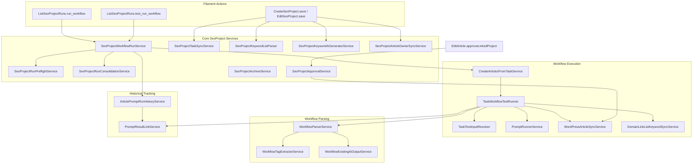
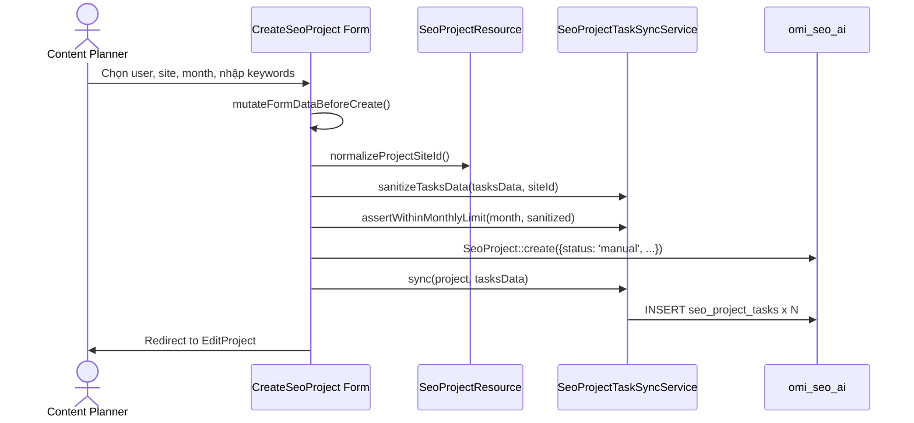

# SeoContentAi — Content Projects & Workflow Execution

[← Quay lại Bản đồ tổng](SUPER_MAP_INDEX.md)

**Liên quan:** [React Editor & EditArticle](MAP_SEO_EDITOR.md) · [Media / upload](MAP_SEO_MEDIA.md) · [WordPress sync](MAP_SEO_WP.md)

---

## 1. Tổng quan

Content Projects là module lập kế hoạch nội dung theo tháng. Mỗi `SeoProject` đại diện cho một tháng sản xuất content cho một site/domain cụ thể, chứa danh sách các `SeoProjectTask` (bài viết cần tạo/viết lại/tối ưu) và lịch sử các `SeoProjectRun` (các lần chạy workflow tự động để sinh nội dung).

### Vai trò trong hệ thống

```
SeoProject (kế hoạch tháng)
  ├── SeoProjectTask (từng bài viết / từ khóa)
  │     └── SeoArticle (bài viết được tạo ra)
  └── SeoProjectRun (lần chạy workflow)
        └── PromptResultLink (liên kết kết quả AI)
```

---

## 2. Models & Database

### 2.1 SeoProject

| Khoản mục | Giá trị |
|-----------|---------|
| **Table** | `seo_projects` (connection `omi_seo_ai`) |
| **File** | `Models/SeoProject.php` |
| **Trait** | `BelongsToOnDefaultConnection` (cross-DB relationships) |

**Casts:**
- `month` → `date`, `site_id` → `integer`, `total_tasks` → `integer`

**Status constants:**
- `pending` (Chờ duyệt), `manual` (Thủ công — mặc định khi tạo), `running` (Đang chạy), `completed` (Hoàn thành), `paused` (Tạm dừng), `approved` (Đã duyệt)

**Relationships:**
- `site()`: BelongsTo → `Site` (mysql, cross-DB qua trait)
- `user()`: BelongsTo → `User` (mysql, cross-DB)
- `tasks()`: HasMany → `SeoProjectTask`
- `runs()`: HasMany → `SeoProjectRun`

**Helper methods:**
- `isArchive()` / `KIND_MONTHLY` / `KIND_ARCHIVE`: project tháng vs kho lưu trữ domain
- `monthCarbon()`: parse month thành Carbon
- `maxTasksAllowed()`: archive = unlimited (`PHP_INT_MAX`); monthly = số ngày trong tháng
- `isExecutionMonthOpen()`: archive luôn mở; monthly kiểm tra hạn tháng
- `registeredTaskCount()` / `remainingTaskCapacity()` / `canRegisterMoreTasks()`: capacity (archive không giới hạn)
- `syncTotalTasksCounter()`: đồng bộ counter
- `defaultNameFromMonth($month)` / `archiveProjectName()` / `archiveSentinelMonth()`: tên + month sentinel `2000-01-01` cho archive

### 2.2 SeoProjectTask

| Khoản mục | Giá trị |
|-----------|---------|
| **Table** | `seo_project_tasks` (connection `omi_seo_ai`) |
| **File** | `Models/SeoProjectTask.php` |
| **Trait** | `BelongsToOnDefaultConnection` |

**Columns quan trọng:**
- `project_id` → FK `seo_projects` (CASCADE)
- `site_id` → nullable, index
- `article_id` → nullable, **UNIQUE** (1 task ↔ 1 article)
- `type` → ENUM: `rewrite`, `new_keyword`, `new_title`, `improve`
- `post_type` → nullable: `article`, `product`, `category`, `product_category`
- `source_content` → keyword hoặc title của bài cần xử lý
- `source_key` → SHA-256 identity (`project_id`+`type`+`post_type`+normalized source); **UNIQUE(`project_id`,`source_key`)** sau Phase 3C3
- `rewrite_mode` → `keyword` | `content` (chỉ khi type=rewrite)
- `rewrite_notes` → ghi chú khi rewrite theo content
- `description` → mô tả / gợi ý nội dung
- `loai_san_pham` → loại sản phẩm thủ công cho prompt ảnh
- `target_date` → ngày KPI
- `status` → `pending`, `writing`, `reviewing`, `completed`, `failed`, `cancelled` (+ SoftDeletes `deleted_at`)
- `archived_at` / `status_before_archive` → lifecycle archive trên cùng task row (không hard-delete)
- `connected_at` → thời điểm gắn bài / vào project (nullable datetime)
- `completed_at` → thời điểm hoàn thành xử lý (nullable datetime)
- `archived_from_project_id` → project tháng nguồn khi chuyển sang archive (nullable)

**Task types:**
| Type | Mô tả |
|------|-------|
| `new_keyword` | Viết bài mới từ keyword |
| `new_title` | Viết bài mới từ tiêu đề |
| `rewrite` | Viết lại bài cũ (keyword mode hoặc content mode) |
| `improve` | Tối ưu thủ công |

**Post types** (cho new article): `article`, `product`, `category`, `product_category`

**Relationships:**
- `site()`: BelongsTo → `Site` (cross-DB)
- `project()`: BelongsTo → `SeoProject`
- `article()`: BelongsTo → `SeoArticle`

### 2.3 SeoProjectRun

| Khoản mục | Giá trị |
|-----------|---------|
| **Table** | `seo_project_runs` (connection `omi_seo_ai`) |
| **File** | `Models/SeoProjectRun.php` |

**Columns:**
- `project_id` → FK `seo_projects` (CASCADE)
- `user_id` → người kick-off run
- `mode` → `full` | `test` (test giới hạn 1 task)
- `status` → `running`, `completed`, `failed`
- `total`, `succeeded`, `failed` → counters
- `items` → JSON (danh sách task identities)
- `error_message` → TEXT
- `started_at`, `finished_at` → TIMESTAMP

**Relationships:**
- `project()`: BelongsTo → `SeoProject`
- `user()`: BelongsTo → `User` (cross-DB)

### 2.4 SeoTask (Workflow template)

| Khoản mục | Giá trị |
|-----------|---------|
| **Table** | `seo_tasks` (connection `omi_seo_ai`) |
| **File** | `Models/SeoTask.php` |

**Columns:** `user_id`, `name`, `description`, `flow_data` (JSON — định nghĩa workflow steps), `is_active`

**Mối quan hệ:** SeoProjectTask không dùng SeoTask trực tiếp; CreateArticlesFromTaskService uses `SeoTask::find($taskId)` để lấy `flow_data` và chạy workflow cho từng task của project.

### 2.5 SeoPromptResultLink (cross-reference)

| Khoản mục | Giá trị |
|-----------|---------|
| **Table** | `seo_prompt_result_links` (connection `omi_seo_ai`) |
| **File** | `Models/SeoPromptResultLink.php` |

Đây là bảng liên kết giữa `PromptResult` (kết quả từ AI) với article, project run, project task. Cho phép truy xuất nguồn gốc của mỗi output AI.

**Columns quan trọng:** `prompt_result_id`, `article_id`, `project_run_id`, `project_task_id`, `source`, `workflow_node_id`, `workflow_step_title`, `meta` (JSON)

**UNIQUE constraint:** `(prompt_result_id, source, project_run_id, project_task_id, workflow_node_id)`

### 2.6 task_test_results

| Khoản mục | Giá trị |
|-----------|---------|
| **Table** | `task_test_results` (connection `omi_seo_ai`) |
| **File** | `Models/SeoTaskTestResult.php` |

Lưu kết quả test workflow cho một task. Columns: `task_id` (FK → `seo_tasks`), `input_snapshot` (JSON), `resolved_context` (JSON), `step_results` (JSON), `error_message`, `started_at`, `finished_at`.

**UI test:** `TaskResource/Pages/TestTask.php` + `test-task.blade.php` — `/tasks/{id}/test`; runner `TaskWorkflowTestRunner`; không chọn model per-step; preview ảnh ở bước prompt image (`stepMediaUrls`); «Chạy lại» ẩn trên node `end`.

---

## 3. Filament UI

### 3.1 Route structure

```
/seo/{connection_hash}/content-projects           → ListSeoProjects (index)
/seo/{connection_hash}/content-projects/create     → CreateSeoProject
/seo/{connection_hash}/content-projects/{record}   → ViewSeoProject (read-only)
/seo/{connection_hash}/content-projects/{record}/edit → EditSeoProject
/seo/{connection_hash}/content-projects/{record}/runs → ListSeoProjectRuns
/seo/{connection_hash}/content-projects/runs/{run}     → ViewSeoProjectRun
/seo/{connection_hash}/content-projects/runs/{run}/items/{article} → ViewSeoProjectRunStep
```

### 3.2 SeoProjectResource (`Filament/Resources/SeoProjectResource.php`)

- **Model:** `SeoProject`
- **Slug:** `content-projects`
- **Navigation:** "Content projects" → `SEO Workspace` group, sort 8
- **Permission gates:**
  - `canViewAny()`: `SeoAccessControl::canAccessContentFeatures()`
  - `canCreate()`: `canAccessPlannerFeatures()`
  - `canEdit()`: `SeoAccessControl::canMutateContentProjects()`
  - Content manager: chỉ xem project của mình (`user_id == auth()->id()`)

**Assign keyword từ editor / keyword list:** `KeywordResource::assignKeywordContentProjectFormSchema()`, `assignKeywordContentProjectFormSchemaForSite()` (editor), `assignKeywordsToContentProject()` → `SeoProjectTask::TYPE_NEW_KEYWORD`; form field `project_id_{siteId}`.

### 3.3 Form schema (create + edit)

**Section 1: Project Info** (2 columns)
- `user_id`: Select → chọn writer (Content Manager role)
- `site_id`: Select → chọn domain
- `month`: DatePicker → format `m/Y`, default today's month
- `status_display`: Placeholder (read-only)
- `description`: Textarea

**Section 2: Article / Keyword List** (full width)
- `import_keywords`: Action → modal nhập raw text (bullet/numbered/plain list) → parse bằng `SeoProjectKeywordListParser`
- `ai_generate_keywords`: Action → modal nhập số lượng + brief → sinh AI bằng `SeoProjectKeywordAiGeneratorService`
- `tasks_data`: Repeater → mỗi item là một task:
  - `type`: Select (new_keyword / new_title / rewrite / improve)
  - `source_content`: TextInput (cho new_keyword/new_title) hoặc SearchableSelect (cho rewrite/improve)
  - `post_type`: Select (article/product/category/product_category — chỉ visible khi type=isNewArticleType)
  - `rewrite_mode`: Select (keyword/content — chỉ visible khi type=rewrite)
  - `rewrite_notes`: Textarea (chỉ visible khi rewrite + content mode)
  - `loai_san_pham`: TextInput (chỉ visible khi type=new + post_type=product)
  - `description`: Textarea (gallery description — chỉ visible khi new + product)

### 3.4 Table columns (List page)

| Column | Source | Ghi chú |
|--------|--------|---------|
| `name` | `->name` | Bold, searchable, sortable, linked |
| `user.name` | Relationship | Sortable, searchable |
| `site.domain` | Relationship (cross-DB) | Placeholder "—" |
| `month` | `->month` | Date format `m/Y`, sortable |
| `total_tasks` | `->total_tasks` | Numeric, align center |
| `tasks_completed` | Computed: `tasks()->where('status','completed')->count()` | Align center |
| `status` | `->status` | Badge (color-coded) |
| `updated_at` | `->updated_at` | Toggleable, hidden by default |

**Filters:** status, user_id, site_id, month

**Row actions:** `ActionGroup (...)` chứa `view_runs`, `view_archives` (link Project Lưu trữ domain), `archive_project_articles`, `Delete` (rollback tháng trước); bên ngoài chỉ `Edit` (hoặc `View`)

**Bulk actions:** Delete — cùng logic rollback tháng trước (`SeoProjectTaskMoveService`)

**Header list:** `open_site_archive` → `findOrCreateArchiveProject` + edit archive; Create

**List query:** ẩn `kind=archive` (chỉ hiện project tháng)

### 3.5 ListSeoProjectRuns (`Filament/.../Pages/ListSeoProjectRuns.php`)

- Routes: `/{record}/runs`
- Custom view (không dùng table mặc định)
- Gọi `SeoProjectRunConsolidationService::maybeConsolidate()` khi mount
- Hiển thị lịch sử runs dạng danh sách, mỗi run hiển thị: user, mode (full/test), status, counters, started_at
- **Header actions:**
  - `run_workflow` → create run (mode=full) → mở tab mới `view-run?autorun=1`
  - `test_run_workflow` → create run (mode=test, limit=1) → mở tab mới
  - `back_to_project`

### 3.6 ViewSeoProjectRun (`Filament/.../Pages/ViewSeoProjectRun.php`)

- Routes: `/runs/{run}`
- Custom view với queue heading (partial Blade)
- Query param `?autorun=1` → tự động start workflow execution
- Hiển thị: stats (total/succeeded/failed/pending) từ `getRunStatsPayload()` + bảng `getAllItems()` (merge `run.items` + pending chưa có trong items → `SeoProjectRunItemsDisplayPresenter::consolidate()` → enrich → sort)
- **Display consolidate (view-only):** 1 article/task = 1 hàng; gom theo `task_id` → `article_id` → `retry_task_id` (nối pending shadow); không ghi đè raw `run.items`. Status/message/AI stats lấy attempt mới nhất; `retry_count` = số lần chạy lại thêm (badge `data-run-retry-badge` trên `...`, tooltip `run_item_rerun_badge_tooltip`; ghi chú chèn `run_item_rerun_count_inline`)
- Mount: `ensureFailedTasksQueued()` + `reconcileMissingCompletedItems()` (khôi phục hàng completed bị thiếu trên run cũ)
- Gọi `SeoProjectWorkflowRunService::retryTask()` qua Livewire `runItemQueued` / `completeRunQueue` — **chỉ** cho hàng `pending` (lần chạy đầu / «Chạy»)
- **Không** còn entry «Chạy lại toàn bộ» (`canRerunAllItems()` luôn false; button + modal rerun-all đã gỡ)
- **Chạy lại từng prompt:** menu hàng liệt kê node `prompt` từ workflow SeoTask (`SeoProjectWorkflowStepCatalogService` + `SeoProjectWorkflowStepRetryService`); Livewire `retryWorkflowStep` / `bulkRetryWorkflowSteps`; run item `action=step:{nodeId}`; không chạy lại full pipeline; duplicate guard `pending|processing`
- Bulk: checkbox hàng + select-all → chọn nhiều prompt → modal xác nhận → tạo task riêng từng bài×prompt; outline trước content khi cùng bulk
- Trước khi rerun full pending: `syncResolvedArticleIdForRunTask()` resolve `article_id` từ raw `run.items` (nếu > 0) rồi fallback `seo_project_tasks.article_id` — **không** fuzzy title/keyword; ghi lại cả `run.items` + task rồi truyền `forcedArticleId` vào `retryTask()`. `enrichItemArticleLink()` ưu tiên `task.article_id` trước khi resolve theo source content
- **Nhãn cột Từ khóa/title:** `itemKeywordLabel()` ưu tiên `articles.title` (`article_title` từ enrich) — không dùng `source_content` khi đã có bài (tránh lệch keyword task vs title editor)
- Cột bảng: Checkbox | # | Loại bài (task type) | Từ khóa/title | Trạng thái | **Lần cuối lưu** | Ghi chú (line-clamp) | **Ngày chạy** (`last_run_at`) | Thao tác — đã bỏ cột `post_type` trùng nhãn «Loại bài»
- **Lần cuối lưu:** `max(articles.last_manual_saved_at, articles.last_synced_at)` qua `ArticleLastSavedTimestampService` — không dùng `updated_at`; nhãn «Lưu thủ công» / «Đồng bộ» / `—`
- Row actions: nút `...`; menu = Archive, Xem runs, «Chạy» (pending only), submenu prompt rerun, đánh dấu đã fix — CSS `project-run-queue.css`
- `getAllItems()` sort theo `last_run_at` desc
- `archiveItem(taskId)` → `SeoProjectArchiveService::archiveTasks()` chuyển task có `article_id` sang Project Lưu trữ domain
- Frontend: `project-run-queue.js` — bulk select + `retryWorkflowStep` / `confirmBulkRetry`; không `$refresh` khi queue đang chạy; `runSingleTask()` vẫn dùng cho pending/autorun

### 3.7 ViewSeoProjectRunStep (`Filament/.../Pages/ViewSeoProjectRunStep.php`)

- Routes: `/runs/{run}/items/{article}`
- Custom view hiển thị run history cho một article cụ thể trong project run
- Gọi `ArticlePromptRunHistoryService::build()` để lấy timeline lịch sử run

---

## 4. Services Layer

### 4.0 Business Hook (WP không gọi trực tiếp từ workflow)

| Symbol | Vai trò |
|--------|---------|
| `MarkProjectTaskCompletedAction` / bridge | Emit `project.task_completed` → bridge map `content_project.task.completed` + `article.completed` nếu có `article_id` |
| `BusinessHookEmitter` | `taskFailed`, `runCompleted`, `taskArchived`, `articleArchived` / `articleRestored` |
| Rule `sync-article-to-wordpress` | Seed **enabled+published** (business) — `article.completed` → linear `wordpress.article.sync` → `product-review.create` → `product-review.sync-wp` on `automation-external` |
| `WordPressManualSyncService` | Manual only (`ManualSyncContext` + `ManualWordPressSyncJob` on `seo`); emit `wordpress.synced` origin=manual; không giả automation |
| `automation:audit-wordpress-coupling` / `automation:audit-coupling` | Audit automatic/manual callers + ownership collisions |

Invariant: `SeoProjectWorkflowRunService` / `CreateArticlesFromTaskService` / `ArticleScheduleReconcileService` **không** import WP outbound hub. Completion → business event only. Chi tiết: [AUTOMATION_CUTOVER_AUDIT.md](automation/AUTOMATION_CUTOVER_AUDIT.md).

**Release freeze (2026-07-20):** Task = business identity; run item = CP execution; Automation execution = workflow (immutable published version). Draft never executes. External WP side effect chỉ khi rule **enabled + published**. `ExecuteAutomationRuleJob` queue = `automation-critical` (không `default`).

### 4.1 Core process (diagram)



### 4.2 Service descriptions

#### Core Project services (9 files)

| Service | File | Mô tả |
|---------|------|-------|
| **SeoProjectWorkflowRunService** | `SeoProjectWorkflowRunService.php` | Điều phối run: `startRun()` (`items=null`) → `prepareRunQueue()` seed `seo_project_run_items` → autorun `retryTask()` (cùng task, không copy). Runtime SoT = run items; JSON `runs.items` chỉ legacy/debug. |
| **SeoProjectRunPreflightService** | `SeoProjectRunPreflightService.php` | Kiểm tra preflight trước khi chạy: tìm conflict keyword/title giữa các pending task. formatWarningsForModal() sinh HTML cảnh báo. |
| **SeoProjectRunConsolidationService** | `SeoProjectRunConsolidationService.php` | Phase 3C3: mark `consolidated_into_run_id`/`consolidated_at`, relink run items sang keeper — **không** hard-delete run. UI list `notConsolidated()`. |
| **SeoProjectRunItemService** | `SeoProjectRunItemService.php` | Claim/retry/counters trên `seo_project_run_items`; `mirrorJsonSafely()` no-op (Phase 3C3). |
| **SeoProjectRunItemsReader** | `SeoProjectRunItemsReader.php` | Đọc run: DB XOR legacy JSON — không merge dual-source. |
| **SeoProjectRunItemMergeService** | `SeoProjectRunItemMergeService.php` | Relink/merge khi collapse duplicate task hoặc consolidate run (`relinkTask` / `relinkRun`). |
| **SeoProjectRunItemsDisplayPresenter** | `Support/SeoProjectRunItemsDisplayPresenter.php` | Gom hàng bảng ViewSeoProjectRun: `consolidate()` — 1 task/article = 1 row (view layer); giữ raw history; badge/note `retry_count`. Test: `SeoProjectRunItemsDisplayPresenterTest`. |
| **SeoProjectWorkflowStepCatalogService** | `SeoProjectWorkflowStepCatalogService.php` | Liệt kê node `prompt` rerunnable từ SeoTask publish/rewrite; kind + label + order outline→content. |
| **SeoProjectWorkflowStepRetryService** | `SeoProjectWorkflowStepRetryService.php` | Queue/execute rerun từng prompt (`action=step:{nodeId}`); bulk; idempotent skip khi pending/processing; `TaskWorkflowTestRunner::runSingleStep`. |
| **ArticleLastSavedTimestampService** | `ArticleLastSavedTimestampService.php` | `last_manual_saved_at` / `last_synced_at` trên `articles`; resolve display cho cột «Lần cuối lưu». |
| **SeoProjectTaskSyncService** | `SeoProjectTaskSyncService.php` | Diff/upsert theo `task_id` → `source_key`; không delete-all/recreate; create qua `SeoProjectTaskUniqueWriter::createStrict()`. |
| **SeoProjectTaskLifecycleService** | `SeoProjectTaskLifecycleService.php` | Archive/restore/softDelete trên task row; mirror `seo_content_archive_items`. |
| **SeoProjectTaskRepairService** | `SeoProjectTaskRepairService.php` | Phase 3C3 repair: backfill `source_key`, merge duplicate groups, archive mirrors, purge sync orphans. |
| **SeoProjectTaskUniqueWriter** | `SeoProjectTaskUniqueWriter.php` | Create race-safe dưới UNIQUE(`project_id`,`source_key`); map conflict → `CONTENT_PROJECT_TASK_SOURCE_KEY_CONFLICT`. |
| **SeoProjectTaskCanonicalResolver** | `Support/SeoProjectTaskCanonicalResolver.php` | Repair-time pick canonical trong duplicate `source_key` group (class A–F). |
| **ProjectTaskSourceKeyGenerator** | `Support/ProjectTaskSourceKeyGenerator.php` | Generator chuẩn `source_key` (NFC + lowercase + collapse whitespace). |
| **SeoProjectApprovalService** | `SeoProjectApprovalService.php` | approveLinkedProject() → đánh dấu project là "approved", yêu cầu user là Content Manager. |
| **SeoProjectArchiveService** | `SeoProjectArchiveService.php` | Archive qua lifecycle; resolve article từ run items reader (không đọc JSON business). |
| **SeoProjectTaskMoveService** | `SeoProjectTaskMoveService.php` | `deleteProjectRollingBackToPreviousMonth()` — xóa project tháng, chuyển mọi task về tháng −1 (tạo nếu thiếu, chặn nếu đầy); `moveTasksToProject()` di chuyển item sang tháng/archive khác. |
| **SeoProjectKeywordListParser** | `SeoProjectKeywordListParser.php` | parse() → phân tích raw text (bullet, numbered, plain lines) thành mảng keyword. appendKeywordsToTasks() → gộp vào tasks_data hiện tại. |
| **SeoProjectKeywordAiGeneratorService** | `SeoProjectKeywordAiGeneratorService.php` | generate() → gọi AI sinh danh sách keyword cho tháng, dựa trên brief + description. |
| **SeoProjectArticleOwnerSyncService** | `SeoProjectArticleOwnerSyncService.php` | syncProjectArticles() → đồng bộ user_id từ project sang article liên kết. |

#### Workflow Execution services (4 files)

| Service | File | Mô tả |
|---------|------|-------|
| **CreateArticlesFromTaskService** | `CreateArticlesFromTaskService.php` | `runPublishWorkflowForContext()`: chạy workflow → resolve/create `SeoArticle` local; `ensureArticlePostType()` theo `TaskTestContext.postType` (skip REWRITE). Không gọi WP sync. |
| **TaskWorkflowTestRunner** | `TaskWorkflowTestRunner.php` | Engine workflow: AI → `PromptTestPublishService.publishArticle` (chỉ Laravel). Gallery product chỉ khi `isProductWorkflowContext`. Tạo bài qua `createArticleFromContext()` dùng `context.postType`. |
| **TaskTestInputResolver** | `TaskTestInputResolver.php` | `resolveForProjectTask()`: NEW → `contextForNewArticleOnSite` chỉ reuse bài **cùng** `post_type`; `applyProjectPostType()` ép `task.post_type` + `_project_post_type` + prompt vars. REWRITE: `article_id` > title > keyword; không thấy bài → **throw**, không tạo mới. |
| **PromptTestPublishService** | `PromptTestPublishService.php` | `publishArticle()` lưu title/body/meta Laravel + `markLocalEditPending` — **không** `WordPressArticleSyncService`. |
| **PromptRunnerService** | `PromptRunnerService.php` | Engine AI cấp thấp nhất: gửi request đến AI model, xử lý streaming, lưu PromptResult. |

#### Workflow Parser services (3 files)

| Service | File | Mô tả |
|---------|------|-------|
| **WorkflowParserService** | `WorkflowParserService.php` (2609 dòng) | Phân tích output workflow từ AI (Markdown outline, structured content) → cấu trúc dữ liệu article. FAQ parsing + shortcode. |
| **WorkflowTagExtractorService** | `WorkflowTagExtractorService.php` | Trích xuất tagged sections từ raw text output (VD: `<OUTLINE>`, `<CONTENT>`). |
| **WorkflowExistingAiOutputService** | `WorkflowExistingAiOutputService.php` | Xác định output AI có sẵn (outline/content) có thể tái sử dụng. Task REWRITE / có `rewriteMode` → không reuse (`TaskWorkflowTestRunner::shouldReuseExistingAiOutput()`). |
| **SimpleMarkdownHtmlConverter** | `Support/SimpleMarkdownHtmlConverter.php` | Markdown → HTML cho editor. `prepareImport()` ủy quyền `ArticleMarkdownImportParser`: tách `h1_title` / `seo_title` / `meta_description`, bỏ structural wrappers, giữ body sạch. |
| **ArticleMarkdownImportParser** | `Support/ArticleMarkdownImportParser.php` | Parser theo dòng + allowlist exact. Nhận `# Title`, `H1:`, `**Meta Description:**`, `### 1. Meta Description`, plain numbered `1. Meta Description:` / `2. SEO Title:` / `3. Introduction` / `4. Main Content:`; không xóa list số thường; HTML document trả nguyên; outer ` ```markdown ` fence gỡ khi bọc cả document. |
| **ArticlePostTypeResolver** | `Support/ArticlePostTypeResolver.php` | Resolve post type hiệu lực của article: ưu tiên `articles.type` local, `wp_post_type` meta chỉ fallback khi type trống (tránh meta WP stale ép nhầm product). Rewrite không ghi đè type bài (`CreateArticlesFromTaskService::ensureArticlePostType()` skip TYPE_REWRITE). |

#### Supporting services (4 files)

| Service | File | Mô tả |
|---------|------|-------|
| **SeoNotificationService** | `SeoNotificationService.php` | Gửi Filament notification cho các sự kiện project: gán owner, approved, task added. Dùng khi `KeywordResource::assignKeywordsToContentProject()` thêm task. |
| **ArticlePendingInternalLinkService** | `ArticlePendingInternalLinkService.php` | Gán keyword vào `SeoProjectTask` + tạo pending link `#hash` từ editor (`assignFromEditor`). |
| **PromptResultLinkService** | `PromptResultLinkService.php` | Liên kết PromptResult với task/article của project để truy xuất nguồn gốc output AI. |
| **ArticlePromptRunHistoryService** | `ArticlePromptRunHistoryService.php` | build() → xây dựng timeline lịch sử run cho một article (project runs đã ảnh hưởng). |
| **WorkflowKeywordResearchService** | `WorkflowKeywordResearchService.php` | `syncTopicCluster()` — lưu Topic Cluster từ action workflow `save_vocabulary_research`; không throw khi focus keyword khớp CTA blacklist. |
| **AllDomainsDashboardService** | `AllDomainsDashboardService.php` | Tổng hợp thống kê article/project/task trên tất cả sites cho All-Domains Dashboard. |

---

## 5. Luồng dữ liệu chi tiết

### 5.1 Tạo Project (Create/CreateSeoProject)



### 5.2 Chạy Workflow (Run → ViewSeoProjectRun)

```mermaid
sequenceDiagram
    actor Planner as Content Planner
    participant Runs as ListSeoProjectRuns
    participant RS as SeoProjectResource
    participant Pre as SeoProjectRunPreflightService
    participant Run as SeoProjectWorkflowRunService
    participant Consol as SeoProjectRunConsolidationService
    participant Create as CreateArticlesFromTaskService
    participant Runner as TaskWorkflowTestRunner
    participant Publish as PromptTestPublishService
    participant Prompt as PromptRunnerService
    participant AI as AI Model

    Planner->>Runs: Click "Run Workflow"
    Runs->>RS: createProjectWorkflowRun(project, 'full')
    RS->>Pre: findKeywordTitleConflicts(project)
    RS->>Run: startRun(project, 'full')
    Run->>DB: INSERT seo_project_run (status=running)
    RS->>Run: prepareRunQueue(project, run)
    Run->>Consol: syncObsoleteTaskStatuses(project)
    Run->>DB: UPDATE run (total=N, items=[...])
    Runs->>Planner: Open view-run tab

    Note over Create,AI: Autorun loop (trong ViewSeoProjectRun) — chỉ Laravel, không WP sync
    Run->>Create: runPublishWorkflowForContext(context, siteId)
    Create->>Runner: run(task, context)
    Runner->>Prompt: runPrompt(prompt, context)
    Prompt->>AI: Gửi request AI
    AI-->>Prompt: Response (outline + content)
    Prompt->>DB: INSERT prompt_result
    Runner->>Publish: publishArticle(article, markdown) — local only
    Runner->>DB: INSERT seo_prompt_result_link
    Run->>DB: UPDATE task (status=completed, article_id=X) + run.items[].article_id

    loop Mỗi task pending
        Run->>Create: runPublishWorkflowForContext()
    end

    Run->>DB: UPDATE run (status=completed, succeeded=N, failed=M)
```

### 5.3 Đồng bộ task type → bài viết

```
new_keyword  ───→ SeoArticle.create() với keyword làm title
new_title    ───→ SeoArticle.create() với title cụ thể
rewrite      ───→ SeoArticle.update() bài cũ (keyword mode hoặc content mode)
improve      ───→ SeoArticle cần tối ưu thủ công (không chạy AI tự động)
```

### 5.4 Archive project (Project Lưu trữ domain)

**Model:** `SeoProject` với `kind=archive` — 1 kho / `site_id`, không giới hạn số bài theo tháng.

**Migration:** `2026_07_16_120000_add_archive_project_kind_and_task_timestamps` — thêm `seo_projects.kind`, `seo_project_tasks.connected_at` / `completed_at` / `archived_from_project_id`; backfill + migrate batch legacy.

```
SeoProjectArchiveService.archiveProject(project, archivedByUserId, note?)
  1. DB::transaction + lockForUpdate
  2. findOrCreateArchiveProject(site_id)
  3. UPDATE seo_project_tasks (có article_id) → project_id = archive, set connected_at/completed_at
  4. DELETE task còn lại trên project tháng; total_tasks = 0
SeoProjectArchiveService.archiveTasks(project, taskIds, ...) — archive 1 hoặc nhiều task từ run UI
```

**UI:**
- List: nút **Mở kho lưu trữ**; row `Lưu trữ (n)` → edit archive project
- Edit archive: dashboard giống Articles Reviewed — `partials/archive-dashboard.blade.php`, group theo ngày hoàn tất, lọc tháng, mỗi item: tác giả + `connected_at`
- Project tháng: **không còn tab Lưu trữ**; form chỉ hạng mục hiện tại
- Không cho xóa Project Lưu trữ

**Legacy tables** `seo_project_archives` / `seo_project_archive_items`: giữ đọc; flow mới không tạo batch.

### 5.5 Xóa project tháng (rollback)

```
SeoProjectTaskMoveService.deleteProjectRollingBackToPreviousMonth(project)
  → chuyển mọi task về tháng trước cùng domain (tạo nếu chưa có)
  → nếu tháng trước đầy capacity → chặn xóa
```

Edit repeater: `extraItemActions` **Di chuyển** item sang project tháng/archive khác còn chỗ.

---

## 6. Authorization

| Permission | Method | Ghi chú |
|-----------|--------|---------|
| Xem danh sách project | `canAccessContentFeatures()` | User có SEO role cơ bản |
| Xem chi tiết project | `canAccessPlannerFeatures()` | Planner + |
| Tạo project | `canAccessPlannerFeatures()` | Planner |
| Sửa project | `canMutateContentProjects()` | Manager + (trừ Content Manager) |
| Xóa project | `canAccessPlannerFeatures()` | Planner |
| Duyệt project | `isContentManager()` | Chỉ Content Manager |
| Chạy workflow | `canAccessContentProjectRun()` | Kiểm tra quyền truy cập run |
| Content Manager scope | `isContentManager()` | Chỉ xem project của mình (`user_id == auth()->id()`) |
| Archive project / xem lịch sử | `canArchiveContentProjects()` / `canViewProjectArchives()` | Manager + Admin |

---

## Hướng dẫn prompt — Content Projects

```
Filament Resource: Filament/Resources/SeoProjectResource.php
Pages: ListSeoProjects, CreateSeoProject, EditSeoProject, ViewSeoProject,
       ListSeoProjectRuns, ViewSeoProjectRun, ViewSeoProjectRunStep
Models: SeoProject, SeoProjectTask, SeoProjectRun, SeoProjectRunItem, SeoProjectTaskEvent
Core Service: SeoProjectWorkflowRunService
Run items SoT: SeoProjectRunItemService + SeoProjectRunItemsReader (DB XOR JSON)
Task Execution: CreateArticlesFromTaskService → TaskWorkflowTestRunner
Preflight: SeoProjectRunPreflightService
Consolidation: SeoProjectRunConsolidationService (mark consolidated, không hard-delete)
Run table display: SeoProjectRunItemsDisplayPresenter (1 task = 1 row)
Task Sync: SeoProjectTaskSyncService + SeoProjectTaskUniqueWriter
Lifecycle: SeoProjectTaskLifecycleService
Repair/Diagnose: content-project:repair, content-project:diagnose, content-project:backfill-run-items
Identity: ProjectTaskSourceKeyGenerator + UNIQUE(project_id, source_key)
Move/Delete rollback: SeoProjectTaskMoveService
Archive: SeoProjectArchiveService (mirror seo_content_archive_items.task_id)
Keyword Parser: SeoProjectKeywordListParser
Keyword AI Gen: SeoProjectKeywordAiGeneratorService
Approval: SeoProjectApprovalService
Article Owner Sync: SeoProjectArticleOwnerSyncService
Link History: PromptResultLinkService, ArticlePromptRunHistoryService
```
