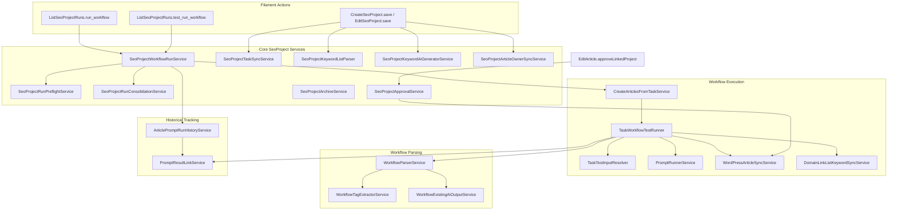
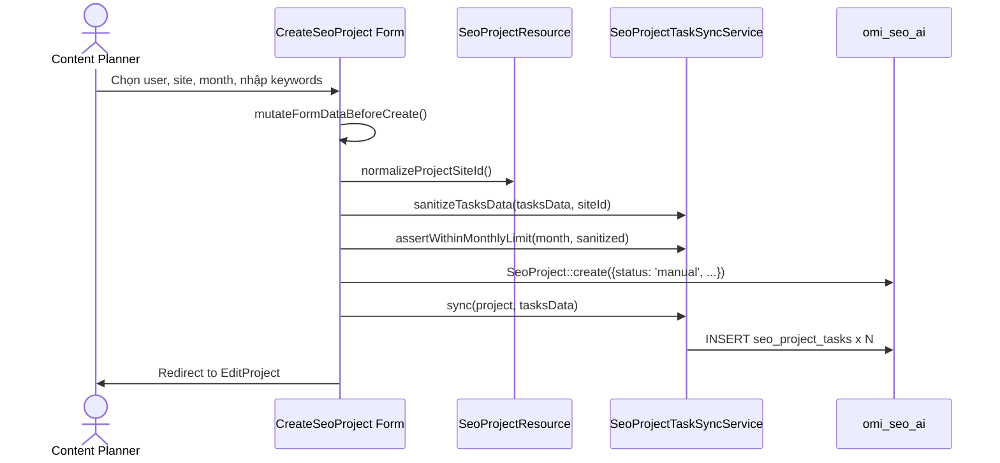

# SeoContentAi — Content Projects & Workflow Execution

[← Quay lại Bản đồ tổng](SUPER_MAP_INDEX.md)

**Liên quan:** [React Editor & EditArticle](MAP_SEO_EDITOR.md) · [Media / upload](MAP_SEO_MEDIA.md) · [WordPress sync](MAP_SEO_WP.md)

---

## 1. Tổng quan

Content Projects là module lập kế hoạch nội dung theo tháng. Mỗi `SeoProject` đại diện cho một tháng sản xuất content cho một site/domain cụ thể, chứa danh sách các `SeoProjectTask` (bài viết cần tạo/viết lại/tối ưu) và lịch sử các `SeoProjectRun` (các lần chạy workflow tự động để sinh nội dung).

### Vai trò trong hệ thống

```
SeoProject (kế hoạch tháng)
  ├── SeoProjectTask (từng bài viết / từ khóa)
  │     └── SeoArticle (bài viết được tạo ra)
  └── SeoProjectRun (lần chạy workflow)
        └── PromptResultLink (liên kết kết quả AI)
```

---

## 2. Models & Database

### 2.1 SeoProject

| Khoản mục | Giá trị |
|-----------|---------|
| **Table** | `seo_projects` (connection `omi_seo_ai`) |
| **File** | `Models/SeoProject.php` |
| **Trait** | `BelongsToOnDefaultConnection` (cross-DB relationships) |

**Casts:**
- `month` → `date`, `site_id` → `integer`, `total_tasks` → `integer`

**Status constants:**
- `pending` (Chờ duyệt), `manual` (Thủ công — mặc định khi tạo), `running` (Đang chạy), `completed` (Hoàn thành), `paused` (Tạm dừng), `approved` (Đã duyệt)

**Relationships:**
- `site()`: BelongsTo → `Site` (mysql, cross-DB qua trait)
- `user()`: BelongsTo → `User` (mysql, cross-DB)
- `tasks()`: HasMany → `SeoProjectTask`
- `runs()`: HasMany → `SeoProjectRun`

**Helper methods:**
- `monthCarbon()`: parse month thành Carbon
- `maxTasksAllowed()`: số ngày trong tháng (= số task tối đa)
- `isExecutionMonthOpen()`: kiểm tra tháng còn hạn chạy
- `registeredTaskCount()` / `remainingTaskCapacity()` / `canRegisterMoreTasks()`: capacity tracking
- `syncTotalTasksCounter()`: đồng bộ counter
- `defaultNameFromMonth($month)`: sinh tên mặc định `"project n/Y"`

### 2.2 SeoProjectTask

| Khoản mục | Giá trị |
|-----------|---------|
| **Table** | `seo_project_tasks` (connection `omi_seo_ai`) |
| **File** | `Models/SeoProjectTask.php` |
| **Trait** | `BelongsToOnDefaultConnection` |

**Columns quan trọng:**
- `project_id` → FK `seo_projects` (CASCADE)
- `site_id` → nullable, index
- `article_id` → nullable, **UNIQUE** (1 task ↔ 1 article)
- `type` → ENUM: `rewrite`, `new_keyword`, `new_title`, `improve`
- `post_type` → nullable: `article`, `product`, `category`, `product_category`
- `source_content` → keyword hoặc title của bài cần xử lý
- `rewrite_mode` → `keyword` | `content` (chỉ khi type=rewrite)
- `rewrite_notes` → ghi chú khi rewrite theo content
- `description` → mô tả / gợi ý nội dung
- `loai_san_pham` → loại sản phẩm thủ công cho prompt ảnh
- `target_date` → ngày KPI
- `status` → `pending`, `writing`, `reviewing`, `completed`, `failed`

**Task types:**
| Type | Mô tả |
|------|-------|
| `new_keyword` | Viết bài mới từ keyword |
| `new_title` | Viết bài mới từ tiêu đề |
| `rewrite` | Viết lại bài cũ (keyword mode hoặc content mode) |
| `improve` | Tối ưu thủ công |

**Post types** (cho new article): `article`, `product`, `category`, `product_category`

**Relationships:**
- `site()`: BelongsTo → `Site` (cross-DB)
- `project()`: BelongsTo → `SeoProject`
- `article()`: BelongsTo → `SeoArticle`

### 2.3 SeoProjectRun

| Khoản mục | Giá trị |
|-----------|---------|
| **Table** | `seo_project_runs` (connection `omi_seo_ai`) |
| **File** | `Models/SeoProjectRun.php` |

**Columns:**
- `project_id` → FK `seo_projects` (CASCADE)
- `user_id` → người kick-off run
- `mode` → `full` | `test` (test giới hạn 1 task)
- `status` → `running`, `completed`, `failed`
- `total`, `succeeded`, `failed` → counters
- `items` → JSON (danh sách task identities)
- `error_message` → TEXT
- `started_at`, `finished_at` → TIMESTAMP

**Relationships:**
- `project()`: BelongsTo → `SeoProject`
- `user()`: BelongsTo → `User` (cross-DB)

### 2.4 SeoTask (Workflow template)

| Khoản mục | Giá trị |
|-----------|---------|
| **Table** | `seo_tasks` (connection `omi_seo_ai`) |
| **File** | `Models/SeoTask.php` |

**Columns:** `user_id`, `name`, `description`, `flow_data` (JSON — định nghĩa workflow steps), `is_active`

**Mối quan hệ:** SeoProjectTask không dùng SeoTask trực tiếp; CreateArticlesFromTaskService uses `SeoTask::find($taskId)` để lấy `flow_data` và chạy workflow cho từng task của project.

### 2.5 SeoPromptResultLink (cross-reference)

| Khoản mục | Giá trị |
|-----------|---------|
| **Table** | `seo_prompt_result_links` (connection `omi_seo_ai`) |
| **File** | `Models/SeoPromptResultLink.php` |

Đây là bảng liên kết giữa `PromptResult` (kết quả từ AI) với article, project run, project task. Cho phép truy xuất nguồn gốc của mỗi output AI.

**Columns quan trọng:** `prompt_result_id`, `article_id`, `project_run_id`, `project_task_id`, `source`, `workflow_node_id`, `workflow_step_title`, `meta` (JSON)

**UNIQUE constraint:** `(prompt_result_id, source, project_run_id, project_task_id, workflow_node_id)`

### 2.6 task_test_results

| Khoản mục | Giá trị |
|-----------|---------|
| **Table** | `task_test_results` (connection `omi_seo_ai`) |
| **File** | `Models/SeoTaskTestResult.php` |

Lưu kết quả test workflow cho một task. Columns: `task_id` (FK → `seo_tasks`), `input_snapshot` (JSON), `resolved_context` (JSON), `step_results` (JSON), `error_message`, `started_at`, `finished_at`.

---

## 3. Filament UI

### 3.1 Route structure

```
/seo/{connection_hash}/content-projects           → ListSeoProjects (index)
/seo/{connection_hash}/content-projects/create     → CreateSeoProject
/seo/{connection_hash}/content-projects/{record}   → ViewSeoProject (read-only)
/seo/{connection_hash}/content-projects/{record}/edit → EditSeoProject
/seo/{connection_hash}/content-projects/{record}/runs → ListSeoProjectRuns
/seo/{connection_hash}/content-projects/runs/{run}     → ViewSeoProjectRun
/seo/{connection_hash}/content-projects/runs/{run}/items/{article} → ViewSeoProjectRunStep
```

### 3.2 SeoProjectResource (`Filament/Resources/SeoProjectResource.php`)

- **Model:** `SeoProject`
- **Slug:** `content-projects`
- **Navigation:** "Content projects" → `SEO Workspace` group, sort 8
- **Permission gates:**
  - `canViewAny()`: `SeoAccessControl::canAccessContentFeatures()`
  - `canCreate()`: `canAccessPlannerFeatures()`
  - `canEdit()`: `SeoAccessControl::canMutateContentProjects()`
  - Content manager: chỉ xem project của mình (`user_id == auth()->id()`)

**Assign keyword từ editor / keyword list:** `KeywordResource::assignKeywordContentProjectFormSchema()`, `assignKeywordContentProjectFormSchemaForSite()` (editor), `assignKeywordsToContentProject()` → `SeoProjectTask::TYPE_NEW_KEYWORD`; form field `project_id_{siteId}`.

### 3.3 Form schema (create + edit)

**Section 1: Project Info** (2 columns)
- `user_id`: Select → chọn writer (Content Manager role)
- `site_id`: Select → chọn domain
- `month`: DatePicker → format `m/Y`, default today's month
- `status_display`: Placeholder (read-only)
- `description`: Textarea

**Section 2: Article / Keyword List** (full width)
- `import_keywords`: Action → modal nhập raw text (bullet/numbered/plain list) → parse bằng `SeoProjectKeywordListParser`
- `ai_generate_keywords`: Action → modal nhập số lượng + brief → sinh AI bằng `SeoProjectKeywordAiGeneratorService`
- `tasks_data`: Repeater → mỗi item là một task:
  - `type`: Select (new_keyword / new_title / rewrite / improve)
  - `source_content`: TextInput (cho new_keyword/new_title) hoặc SearchableSelect (cho rewrite/improve)
  - `post_type`: Select (article/product/category/product_category — chỉ visible khi type=isNewArticleType)
  - `rewrite_mode`: Select (keyword/content — chỉ visible khi type=rewrite)
  - `rewrite_notes`: Textarea (chỉ visible khi rewrite + content mode)
  - `loai_san_pham`: TextInput (chỉ visible khi type=new + post_type=product)
  - `description`: Textarea (gallery description — chỉ visible khi new + product)

### 3.4 Table columns (List page)

| Column | Source | Ghi chú |
|--------|--------|---------|
| `name` | `->name` | Bold, searchable, sortable, linked |
| `user.name` | Relationship | Sortable, searchable |
| `site.domain` | Relationship (cross-DB) | Placeholder "—" |
| `month` | `->month` | Date format `m/Y`, sortable |
| `total_tasks` | `->total_tasks` | Numeric, align center |
| `tasks_completed` | Computed: `tasks()->where('status','completed')->count()` | Align center |
| `status` | `->status` | Badge (color-coded) |
| `updated_at` | `->updated_at` | Toggleable, hidden by default |

**Filters:** status, user_id, site_id, month

**Row actions:** `view_runs`, `view_archives` (khi có batch), `archive_project_articles` (Manager/Admin, chỉ khi có bài active), `view`, `edit`

**Bulk actions:** Delete (cần permission)

### 3.5 ListSeoProjectRuns (`Filament/.../Pages/ListSeoProjectRuns.php`)

- Routes: `/{record}/runs`
- Custom view (không dùng table mặc định)
- Gọi `SeoProjectRunConsolidationService::maybeConsolidate()` khi mount
- Hiển thị lịch sử runs dạng danh sách, mỗi run hiển thị: user, mode (full/test), status, counters, started_at
- **Header actions:**
  - `run_workflow` → create run (mode=full) → mở tab mới `view-run?autorun=1`
  - `test_run_workflow` → create run (mode=test, limit=1) → mở tab mới
  - `back_to_project`

### 3.6 ViewSeoProjectRun (`Filament/.../Pages/ViewSeoProjectRun.php`)

- Routes: `/runs/{run}`
- Custom view với queue heading (partial Blade)
- Query param `?autorun=1` → tự động start workflow execution
- Hiển thị: project info + task queue (pending/running/succeeded/failed)
- Gọi `SeoProjectWorkflowRunService::ensureFailedTasksQueued()` để đưa failed tasks về queue

### 3.7 ViewSeoProjectRunStep (`Filament/.../Pages/ViewSeoProjectRunStep.php`)

- Routes: `/runs/{run}/items/{article}`
- Custom view hiển thị run history cho một article cụ thể trong project run
- Gọi `ArticlePromptRunHistoryService::build()` để lấy timeline lịch sử run

---

## 4. Services Layer

### 4.1 Core process (diagram)



### 4.2 Service descriptions

#### Core Project services (9 files)

| Service | File | Mô tả |
|---------|------|-------|
| **SeoProjectWorkflowRunService** | `SeoProjectWorkflowRunService.php` (825 dòng) | Điều phối toàn bộ run: startRun() → prepareRunQueue() → executeBatchTasks() → completeRunQueue(). Gọi CreateArticlesFromTaskService cho mỗi task pending. |
| **SeoProjectRunPreflightService** | `SeoProjectRunPreflightService.php` | Kiểm tra preflight trước khi chạy: tìm conflict keyword/title giữa các pending task. formatWarningsForModal() sinh HTML cảnh báo. |
| **SeoProjectRunConsolidationService** | `SeoProjectRunConsolidationService.php` | Hợp nhất sau run. Các method: hasRunnablePendingTasks(), isProjectFullyCompleted(), syncObsoleteTaskStatuses(), maybeConsolidate(). |
| **SeoProjectTaskSyncService** | `SeoProjectTaskSyncService.php` (310 dòng) | Đồng bộ task vào project: sync(), sanitizeTasksData(), tasksDataFromProject(). assertWithinMonthlyLimit() kiểm tra giới hạn tháng. tasksSignature() chống save trùng. |
| **SeoProjectApprovalService** | `SeoProjectApprovalService.php` | approveLinkedProject() → đánh dấu project là "approved", yêu cầu user là Content Manager. |
| **SeoProjectArchiveService** | `SeoProjectArchiveService.php` | `archiveProject()` tạo batch + items; `batchesForProject()` load lịch sử. Không ghi `articles.*`. |
| **SeoProjectKeywordListParser** | `SeoProjectKeywordListParser.php` | parse() → phân tích raw text (bullet, numbered, plain lines) thành mảng keyword. appendKeywordsToTasks() → gộp vào tasks_data hiện tại. |
| **SeoProjectKeywordAiGeneratorService** | `SeoProjectKeywordAiGeneratorService.php` | generate() → gọi AI sinh danh sách keyword cho tháng, dựa trên brief + description. |
| **SeoProjectArticleOwnerSyncService** | `SeoProjectArticleOwnerSyncService.php` | syncProjectArticles() → đồng bộ user_id từ project sang article liên kết. |

#### Workflow Execution services (4 files)

| Service | File | Mô tả |
|---------|------|-------|
| **CreateArticlesFromTaskService** | `CreateArticlesFromTaskService.php` (377 dòng) | Điều phối tạo article từ task: resolve input, chạy workflow (TaskWorkflowTestRunner), gán writer, sync link list. Method: runFromKeywords(), runFromKeywordsForSite(), runFromProjectTask(). |
| **TaskWorkflowTestRunner** | `TaskWorkflowTestRunner.php` (2077 dòng) | Engine chạy workflow cho 1 task: thực thi prompt AI, xử lý output, tạo article, attach SEO/tags/FAQs/media. |
| **TaskTestInputResolver** | `TaskTestInputResolver.php` | Chuẩn bị input cho workflow run: SEO analyzer data, prompt settings, WordPress content. |
| **PromptRunnerService** | `PromptRunnerService.php` | Engine AI cấp thấp nhất: gửi request đến AI model, xử lý streaming, lưu PromptResult. |

#### Workflow Parser services (3 files)

| Service | File | Mô tả |
|---------|------|-------|
| **WorkflowParserService** | `WorkflowParserService.php` (2609 dòng) | Phân tích output workflow từ AI (Markdown outline, structured content) → cấu trúc dữ liệu article. FAQ parsing + shortcode. |
| **WorkflowTagExtractorService** | `WorkflowTagExtractorService.php` | Trích xuất tagged sections từ raw text output (VD: `<OUTLINE>`, `<CONTENT>`). |
| **WorkflowExistingAiOutputService** | `WorkflowExistingAiOutputService.php` | Xác định output AI có sẵn (outline/content) có thể tái sử dụng. |

#### Supporting services (4 files)

| Service | File | Mô tả |
|---------|------|-------|
| **SeoNotificationService** | `SeoNotificationService.php` | Gửi Filament notification cho các sự kiện project: gán owner, approved, task added. Dùng khi `KeywordResource::assignKeywordsToContentProject()` thêm task. |
| **ArticlePendingInternalLinkService** | `ArticlePendingInternalLinkService.php` | Gán keyword vào `SeoProjectTask` + tạo pending link `#hash` từ editor (`assignFromEditor`). |
| **PromptResultLinkService** | `PromptResultLinkService.php` | Liên kết PromptResult với task/article của project để truy xuất nguồn gốc output AI. |
| **ArticlePromptRunHistoryService** | `ArticlePromptRunHistoryService.php` | build() → xây dựng timeline lịch sử run cho một article (project runs đã ảnh hưởng). |
| **AllDomainsDashboardService** | `AllDomainsDashboardService.php` | Tổng hợp thống kê article/project/task trên tất cả sites cho All-Domains Dashboard. |

---

## 5. Luồng dữ liệu chi tiết

### 5.1 Tạo Project (Create/CreateSeoProject)



### 5.2 Chạy Workflow (Run → ViewSeoProjectRun)

```mermaid
sequenceDiagram
    actor Planner as Content Planner
    participant Runs as ListSeoProjectRuns
    participant RS as SeoProjectResource
    participant Pre as SeoProjectRunPreflightService
    participant Run as SeoProjectWorkflowRunService
    participant Consol as SeoProjectRunConsolidationService
    participant Create as CreateArticlesFromTaskService
    participant Runner as TaskWorkflowTestRunner
    participant Prompt as PromptRunnerService
    participant WP as WordPressArticleSyncService
    participant AI as AI Model

    Planner->>Runs: Click "Run Workflow"
    Runs->>RS: createProjectWorkflowRun(project, 'full')
    RS->>Pre: findKeywordTitleConflicts(project)
    RS->>Run: startRun(project, 'full')
    Run->>DB: INSERT seo_project_run (status=running)
    RS->>Run: prepareRunQueue(project, run)
    Run->>Consol: syncObsoleteTaskStatuses(project)
    Run->>DB: UPDATE run (total=N, items=[...])
    Runs->>Planner: Open view-run tab

    Note over Create,AI: Autorun loop (trong ViewSeoProjectRun)
    Run->>Create: runFromProjectTask(project, task, run)
    Create->>Runner: executeWorkflow(task, input)
    Runner->>Prompt: runPrompt(prompt, context)
    Prompt->>AI: Gửi request AI
    AI-->>Prompt: Response (outline + content)
    Prompt->>DB: INSERT prompt_result
    Runner->>Runner: Parse output → tạo/update SeoArticle
    Runner->>WP: syncArticleToWordPress(article)
    Runner->>DB: INSERT seo_prompt_result_link
    Create->>DB: UPDATE task (status=completed, article_id=X)

    loop Mỗi task pending
        Run->>Create: runFromProjectTask()
    end

    Run->>DB: UPDATE run (status=completed, succeeded=N, failed=M)
```

### 5.3 Đồng bộ task type → bài viết

```
new_keyword  ───→ SeoArticle.create() với keyword làm title
new_title    ───→ SeoArticle.create() với title cụ thể
rewrite      ───→ SeoArticle.update() bài cũ (keyword mode hoặc content mode)
improve      ───→ SeoArticle cần tối ưu thủ công (không chạy AI tự động)
```

### 5.4 Archive project (batch thuộc project)

**Tables:** `seo_project_archives`, `seo_project_archive_items` (connection `omi_seo_ai`)

**Models:** `SeoProjectArchive`, `SeoProjectArchiveItem`

```
SeoProjectArchiveService.archiveProject(project, archivedByUserId, note?)
  1. DB::transaction + lockForUpdate
  2. INSERT seo_project_archives (project_id, archived_by, note, articles_count)
  3. INSERT seo_project_archive_items cho mỗi article_id đang active trong seo_project_tasks
  4. DELETE active seo_project_tasks (không sửa articles.*)
  5. UPDATE seo_projects SET total_tasks = 0, status = manual
```

**UI:**
- List: counters `active_tasks_count`, `active_completed_count` (withCount, không tính archive batches)
- Detail: tabs `Bài viết hiện tại` / `Lưu trữ` trong `SeoProjectResource::form()` — tab Lưu trữ chỉ `canViewProjectArchives()`
- Blade: `resources/views/filament/resources/seo-project-resource/partials/archives-tab.blade.php`

**Article module:** không đổi — bài archive vẫn mở qua `ArticleResource`.

---

## 6. Authorization

| Permission | Method | Ghi chú |
|-----------|--------|---------|
| Xem danh sách project | `canAccessContentFeatures()` | User có SEO role cơ bản |
| Xem chi tiết project | `canAccessPlannerFeatures()` | Planner + |
| Tạo project | `canAccessPlannerFeatures()` | Planner |
| Sửa project | `canMutateContentProjects()` | Manager + (trừ Content Manager) |
| Xóa project | `canAccessPlannerFeatures()` | Planner |
| Duyệt project | `isContentManager()` | Chỉ Content Manager |
| Chạy workflow | `canAccessContentProjectRun()` | Kiểm tra quyền truy cập run |
| Content Manager scope | `isContentManager()` | Chỉ xem project của mình (`user_id == auth()->id()`) |
| Archive project / xem lịch sử | `canArchiveContentProjects()` / `canViewProjectArchives()` | Manager + Admin |

---

## Hướng dẫn prompt — Content Projects

```
Filament Resource: Filament/Resources/SeoProjectResource.php
Pages: ListSeoProjects, CreateSeoProject, EditSeoProject, ViewSeoProject,
       ListSeoProjectRuns, ViewSeoProjectRun, ViewSeoProjectRunStep
Models: SeoProject, SeoProjectTask, SeoProjectRun
Core Service: SeoProjectWorkflowRunService
Task Execution: CreateArticlesFromTaskService → TaskWorkflowTestRunner
Preflight: SeoProjectRunPreflightService
Consolidation: SeoProjectRunConsolidationService
Task Sync: SeoProjectTaskSyncService
Archive: SeoProjectArchiveService + models SeoProjectArchive/SeoProjectArchiveItem + tab Lưu trữ trong SeoProjectResource
Keyword Parser: SeoProjectKeywordListParser
Keyword AI Gen: SeoProjectKeywordAiGeneratorService
Approval: SeoProjectApprovalService
Article Owner Sync: SeoProjectArticleOwnerSyncService
Link History: PromptResultLinkService, ArticlePromptRunHistoryService
```
