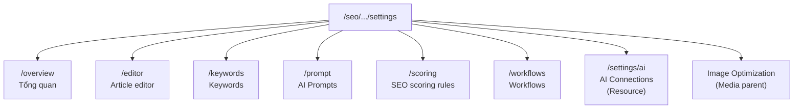
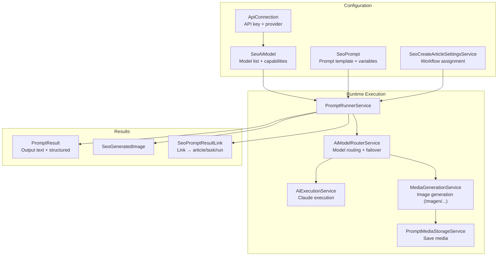

# SeoContentAi — Settings, Prompts & AI Connections

[← Quay lại Bản đồ tổng](SUPER_MAP_INDEX.md)

**Liên quan:** [React Editor & EditArticle](MAP_SEO_EDITOR.md) · [WordPress sync](MAP_SEO_WP.md) · [Team & Phân quyền](MAP_SEO_TEAM.md)

---

## 1. Hệ thống Settings

### 1.1 Tổng quan

Settings được tổ chức thành các page Filament dưới nhánh `/seo/{connection_hash}/settings/`. Tất cả đều yêu cầu **Manager role** (`SeoAccessControl::canAccessManagerFeatures()`).

### 1.2 Sơ đồ điều hướng



`SeoSettings.php` (slug `/settings`) là page redirect, `mount()` chuyển hướng sang `SeoSettingsOverview`.

### 1.3 Settings Pages

| Page | Slug | File | Mô tả |
|------|------|------|-------|
| **SeoSettingsOverview** | `settings/overview` | `Filament/Pages/SeoSettingsOverview.php` | Tổng quan: chọn default article workflow, SEO analyzer API key, WP REST API key |
| **SeoSettingsEditor** | `settings/editor` | `Filament/Pages/SeoSettingsEditor.php` | Cấu hình Editor: auto-save interval, editor height, publish behavior |
| **SeoSettingsKeywords** | `settings/keywords` | `Filament/Pages/SeoSettingsKeywords.php` | Cấu hình keywords: cluster settings, suggestion sources |
| **SeoSettingsPrompt** | `settings/prompt` | `Filament/Pages/SeoSettingsPrompt.php` | Cấu hình prompt mặc định, model selection, system prompts |
| **SeoSettingsScoring** | `settings/scoring` | `Filament/Pages/SeoSettingsScoring.php` | **Quy tắc chấm điểm SEO** — bật/tắt từng rule, chỉnh điểm trừ (lưu `wp_options.seo_scoring_rules_settings`) |
| **SeoSettingsWorkflows** | `settings/workflows` | `Filament/Pages/SeoSettingsWorkflows.php` | **Cấu hình workflow quan trọng nhất** — gán task cho từng bước |
| **SeoSettings** | `settings` | `Filament/Pages/SeoSettings.php` | Redirect → overview |

### 1.4 Image Optimization Settings

| Page | Slug | File | Mô tả |
|------|------|------|-------|
| **ImageOptimizationSettings** | `image-optimization` | `Filament/Pages/ImageOptimizationSettings.php` | WebP/AVIF, quality %, dimension limits, alt tag pattern |

**Site-aware:** Dùng `#[Url] $siteId` để lưu setting theo từng site. Nếu không có global site scope, hiển thị dropdown chọn site.

**Các setting lưu vào model** `SeoImageOptimizationSetting` (table `seo_image_optimization_settings`):
- `auto_convert_webp` (bool)
- `quality` (int 10-100)
- `limit_dimensions` (bool), `max_width`, `max_height`
- `clean_filename` (bool)
- `auto_alt_tag` (bool), `alt_tag_pattern` (string — mẫu như `{post_title} - {focus_keyword}`)

---

## 1.5 SEO Scoring Rules (`SeoSettingsScoring`)

Page quản lý **quy tắc trừ điểm** khi chấm SEO on-page. Rules cố định trong `SeoScoringRulesRegistry`; override bật/tắt và điểm trừ lưu `wp_options` key `seo_scoring_rules_settings` qua `SeoScoringSettingsService`.

| Thành phần | File | Mô tả |
|------------|------|-------|
| Page | `Filament/Pages/SeoSettingsScoring.php` | Repeater: label, toggle enabled, deduction |
| Service | `Services/SeoScoringSettingsService.php` | Đọc/ghi override, `effectiveRules()` merge default |
| Registry | `Support/SeoScoringRulesRegistry.php` | `defaultRules()` + `rules()` đọc settings runtime |
| Messages | `Support/SeoScoringRuleMessageResolver.php` | Map legacy `seo.*` → `seo_rules.*` cho hiển thị |

**Hành vi quan trọng:** Lưu settings **không** bulk cập nhật `article_meta.seo_rule_violations`. Điểm hiển thị tính động từ violations đã lưu + rules hiện tại. Violations trong DB chỉ đổi khi analyze/save bài hoặc **Refresh article metadata (domain)**.

Điểm: `100 - sum(deduction)` với rule disabled → deduction = 0.

---

## 2. Workflow Settings (`SeoSettingsWorkflows`)

Page cấu hình workflow quan trọng nhất — cho phép Manager **gán từng workflow (SeoTask) cho từng bước xử lý**. Dùng service `SeoCreateArticleSettingsService` để lưu.

### 2.1 Form Schema

| Section | Field | Key (SeoCreateArticleSettingsService) | Mô tả |
|---------|-------|---------------------------------------|-------|
| **Task Workflows** | Publish article | `KEY_PUBLISH_ARTICLE` | Workflow chạy khi publish bài mới từ keyword |
| | Rewrite article | `KEY_REWRITE_ARTICLE` | Workflow chạy khi viết lại bài |
| | Post review | `KEY_POST_REVIEW` | Workflow chạy sau khi review |
| **Editor Media** | Image generation workflow | `KEY_CREATE_IMAGE` (`create_image_task_id`) | Quy trình (SeoTask) sinh ảnh AI — widget **Input ({{input}})** + Prompt Hình ảnh |
| | Product gallery prompt | `KEY_CREATE_PRODUCT_GALLERY_IMAGE` | Prompt sinh ảnh gallery sản phẩm |
| | Image model priority | `KEY_IMAGE_MODEL_PRIORITY` | Rules: bảng + repeater cho model priority |
| | Video prompt | `KEY_CREATE_VIDEO` | Prompt sinh video |
| **Project Keywords** | Project keywords prompt | `KEY_PROJECT_KEYWORDS_PROMPT_ID` | Prompt sinh keyword cho project |
| **FAQ** | Renew FAQ prompt | `KEY_RENEW_FAQ_PROMPT_ID` | Prompt tạo FAQ |
| **Featured Snippet** | Featured snippet prompt | `KEY_FEATURED_SNIPPET_PROMPT_ID` | Prompt sinh featured snippet |
| **Outline** | Outline heading regenerator | `KEY_OUTLINE_HEADING_REGENERATOR_PROMPT_ID` | Prompt tạo lại heading |
| **Translate** | Translate article prompt | `KEY_TRANSLATE_ARTICLE_PROMPT_ID` | Prompt dịch bài viết |

### 2.2 Service: `SeoCreateArticleSettingsService`

```php
// Lưu và đọc settings cho workflows
SeoCreateArticleSettingsService::KEY_PUBLISH_ARTICLE  // => trả về task_id
SeoCreateArticleSettingsService::getPublishArticleTaskId()
```

Dùng trong:
- `CreateArticlesFromTaskService.runFromKeywords()` — lấy task_id để chạy workflow tạo bài từ keyword
- `TaskWorkflowTestRunner` — resolve task/workflow cho từng action node

---

## 3. Prompt Management (`PromptResource`)

### 3.1 Tổng quan

- **Resource:** `Filament/Resources/PromptResource.php`
- **Model:** `SeoPrompt` (table `prompts`, connection `omi_seo_ai`)
- **Slug:** `prompts` → `/seo/{connection_hash}/prompts`
- **Navigation:** "Prompt management" → SEO Workspace
- **Permission:** `canAccessPlannerFeatures()` để view, `allowsSeoPanelMutation() && canAccessPlannerFeatures()` để create/edit/delete

### 3.2 Form Schema

Layout 2 cột (4 + 8):

**Cột trái (4): Thông tin chung**
- `name` (TextInput, required)
- `description` (Textarea)
- `ai_connection_id` (Select: chọn API connection) + nút "Sync models"
- `model_category` (Select: model category từ connection — gemini_pro, gemini_flash, ...)
- `tool` (Radio: `text` | `image`) — quyết định hiển thị post-processing section
- `is_active` (Toggle)
- `variables` (Repeater: key + label + required + type) — **auto-sync từ nội dung markdown**

**Cột phải (8): Nội dung**
- `content` (MarkdownEditor) — nội dung prompt, có thể chứa biến `{{variable_name}}`
- **Post-Processing** (chỉ visible khi tool=image):
  - Quick split: enabled + rows + columns
  - Quick resize: enabled + width + height

### 3.3 Variables System

Prompt hỗ trợ biến động `{{variable_name}}` trong nội dung markdown:
- **`extractVariableNamesFromMarkdown()`** — tự động trích xuất biến từ markdown
- **`mergeVariablesFromMarkdown()`** — gộp biến đã khai báo với biến mới phát hiện
- **`variableDefinitionsForPrompt()`** — trả về định nghĩa biến cho runtime
- **`defaultVariableLabels()`** — nhãn mặc định: article_title, focus_keyword, language,...
- **`defaultRuntimeVariableNames()`** — tên biến runtime: content, seo_data, ...

### 3.4 Query Scope

```php
getEloquentQuery() {
    if (shouldScopeToAccountOwner()) {
        $query->where('user_id', accountSiteOwnerId());
    }
}
```

### 3.5 Model: `SeoPrompt`

| Thuộc tính | Kiểu |
|-----------|------|
| `$connection` | `omi_seo_ai` |
| `$table` | `prompts` |
| `$casts` | `content` → json, `schema` → json, `is_active` → boolean |
| Relations | `aiConnection()` → `ApiConnection`, `user()` → `User` (cross-db via trait) |

---

## 4. AI Connections (`AiConnectionResource`)

### 4.1 Tổng quan

- **Resource:** `Filament/Resources/AiConnectionResource.php`
- **Model:** `ApiConnection` (table `api_connections`, connection `mysql`)
- **Slug:** `settings/ai` → `/seo/.../settings/ai`
- **Navigation:** Không register navigation (chỉ accessible từ settings page)
- **Permission:** `canAccessManagerFeatures()` để view; thêm `allowsSeoPanelMutation()` để create/edit/delete

### 4.2 Form Schema

- `provider` (Select: `gemini` | `claude`) — hiển thị link hướng dẫn lấy API key tương ứng
- `name` (TextInput)
- `api_key` (PasswordInput, revealable) — chỉ required khi create, có thể bỏ trống khi edit
- `status` (Select: `active` | `inactive`)

### 4.3 Query Scope

```php
getEloquentQuery() {
    where('user_id', auth()->id())->orWhere('is_global', true);
}
```

### 4.4 Model: `ApiConnection`

| Thuộc tính | Kiểu |
|-----------|------|
| `$connection` | `mysql` |
| `$table` | `api_connections` |
| `$casts` | `metadata` → json, `is_global` → boolean |
| Relations | `aiModels()` → HasMany → `SeoAiModel` |

### 4.5 SeoAiModel (Model phụ thuộc)

- **Table:** `seo_ai_models` (connection `mysql`)
- Lưu danh sách model từ API provider (Gemini models), sync qua `AiModelsSyncService`
- **Columns:** `api_connection_id`, `category` (gemini_pro, gemini_flash,...), `raw_model_name`, `display_name`, `priority`, `status`, `capabilities` (JSON)

---

## 5. AI Execution Pipeline



### 5.1 PromptRunnerService (`Services/PromptRunnerService.php`)

Engine AI trung tâm, 1181 dòng. **Dependencies:**
- `AiExecutionService` — gọi Claude
- `MediaGenerationService` — pipeline sinh ảnh (Imagen/Nano Banana)
- `PromptMediaStorageService` — lưu media từ remote
- `AiModelRouterService` — router model với failover
- `AiModelsReadinessService` — kiểm tra kết nối AI sẵn sàng

**Methods chính:**

| Method | Mô tả |
|--------|-------|
| `run(prompt, variables, ...)` | Entry point: compile prompt → route provider → xử lý chain |
| `runWithCompiledPrompt()` | Chạy với prompt đã compile sẵn |
| `runChainStepOutput()` | Chạy 1 bước trong chain (dùng cho ImageGenerationChainService) |
| `compilePrompt()` | Compile prompt từ parts + variables |
| `callProvider()` | Router cuối: gemini → `callGemini()`, claude → `callClaude()`, image → `MediaGenerationService` |
| `callGemini()` | Gọi Gemini API với retry model/version |
| `callClaude()` | Delegate sang `AiExecutionService::executeClaude()` |
| `executeWithModelRouting()` | Gọi `AiModelRouterService::executeWithFailover()` |

### 5.2 AiModelRouterService

Router model với failover mechanism:
- Thử model theo priority
- Nếu model bị `exhausted` hoặc lỗi → fallback sang model tiếp theo
- Lưu trạng thái `last_error` vào `SeoAiModel`

### 5.3 PromptResult

**Table:** `prompt_results` (connection `omi_seo_ai`)

| Column | Type | Mô tả |
|--------|------|-------|
| `prompt_id` | FK nullable | Prompt gốc |
| `user_id` | FK nullable | Người chạy |
| `article_id` | FK nullable | Article liên kết |
| `status` | varchar | pending, running, completed, failed |
| `input_snapshot` | JSON | Input variables snapshot |
| `output_text` | longText | Output text từ AI |
| `output_structured` | JSON | Output structured (nếu có) |
| `error_message` | text | Lỗi nếu failed |

### 5.4 SeoPromptResultLink

**Table:** `seo_prompt_result_links` — cross-reference giữa PromptResult, article, project run, project task.

Cho phép truy xuất nguồn gốc của mỗi output AI (prompt result nào sinh ra article nào, thuộc project run/task nào).

---

## Hướng dẫn prompt — Settings, Prompts, AI

```
Settings Pages: Filament/Pages/SeoSettings*.php, ImageOptimizationSettings.php
Workflows Settings: Filament/Pages/SeoSettingsWorkflows.php → SeoCreateArticleSettingsService
AI Connections: Filament/Resources/AiConnectionResource.php → ApiConnection model (mysql)
Prompt Management: Filament/Resources/PromptResource.php → SeoPrompt model (omi_seo_ai)
Prompt Engine: Services/PromptRunnerService.php (1181 dòng)
Model Router: Services/AiModelRouterService.php → SeoAiModel (mysql)
Image Gen: Services/MediaGenerationService.php
Claude Exec: Services/AiExecutionService.php
```
