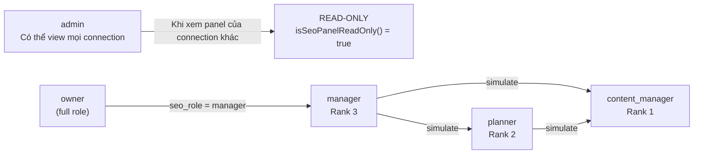
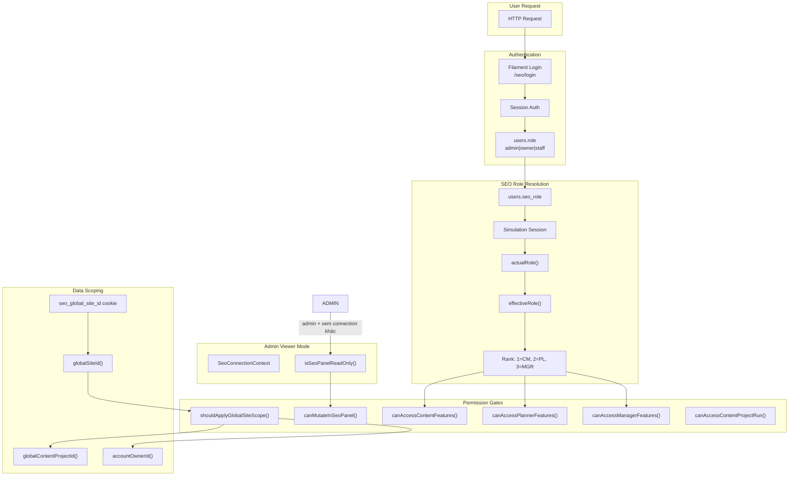

# SeoContentAi — Team & Authorization

[← Quay lại Bản đồ tổng](SUPER_MAP_INDEX.md)

**Liên quan:** [React Editor & EditArticle](MAP_SEO_EDITOR.md) · [Settings & Prompt](MAP_SEO_SETTINGS.md) · [Content Projects](MAP_SEO_PROJECTS.md)

---

## 1. Hệ thống phân quyền (RBAC)

### 1.1 User Model Roles

User Laravel core (`App\Models\User`) có 2 lớp role:

**Role hệ thống** (`users.role`):
| Role | Constant | Mô tả |
|------|----------|-------|
| `admin` | `User::ROLE_ADMIN` | Super admin — toàn quyền, có thể view panel của mọi connection (read-only) |
| `owner` | `User::ROLE_OWNER` | Chủ tài khoản — full quyền trên account và team của mình |
| `staff` | `User::ROLE_STAFF` | Thành viên team — bị ràng buộc bởi `parent_id` |

**Role SEO** (`users.seo_role`):
| Role | Constant | Rank | Mô tả |
|------|----------|------|-------|
| `content_manager` | `SeoAccessControl::ROLE_CONTENT_MANAGER` | 1 | Viết bài, view project của mình, không dùng AI, không chọn global site |
| `planner` | `SeoAccessControl::ROLE_PLANNER` | 2 | Lập kế hoạch, chọn global site/project, có thể sim xuống content_manager |
| `manager` | `SeoAccessControl::ROLE_MANAGER` | 3 | Full quyền, cấu hình settings, quản lý team, có thể sim xuống planner hoặc content_manager |

### 1.2 Role Simulation

Manager/Planner có thể **simulate** role thấp hơn qua session:



- **`allowedSimulationTargets()`**: Manager → [manager, planner, content_manager]; Planner → [planner, content_manager]; Content Manager → [content_manager]
- **`SeoAccessControl::effectiveRole()`**: trả về role hiệu dụng (có tính simulation)
- **`SeoAccessControl::isSeoPanelReadOnly()`**: Admin xem panel của connection khác

### 1.3 Permission Matrix

| Permission Method | content_manager | planner | manager | admin (panel viewer) |
|---|---|---|---|---|
| `canAccessContentFeatures()` | ✅ | ✅ | ✅ | ✅ |
| `canAccessPlannerFeatures()` | ❌ | ✅ | ✅ | ✅ |
| `canAccessManagerFeatures()` | ❌ | ❌ | ✅ | ❌ |
| `canMutateInSeoPanel()` | ✅ | ✅ | ✅ | ❌ (read-only) |
| `canMutateContentProjects()` | ❌ | ✅ | ✅ | ❌ |
| `canSyncArticlesToWordPress()` | ❌ | ✅ | ✅ | ❌ |
| `canDeleteSeoMedia()` | ❌ | ✅ | ✅ | ❌ |
| `isContentManager()` | ✅ | ❌ | ❌ | ❌ |
| `shouldShowGlobalSeoBar()` | ❌ | ✅ | ✅ | ✅ |
| `canUseGlobalContentProjectPicker()` | ❌ | ✅ | ❌ | ❌ |
| `canManageWordPressPlugin()` | ❌ | ❌ | ❌ | ❌ (chỉ Admin core) |

### 1.4 Site & Data Scoping

**Global Site Scope:**
- `shouldApplyGlobalSiteScope()`: true với Planner/Manager đã chọn global site
- Content Manager KHÔNG được chọn global site — chỉ thấy data gán trực tiếp
- Cookie/session lưu dưới key `seo_global_site_id`

**Account Owner Scoping:**
- `shouldScopeToAccountOwner()`: luôn true, trừ khi Admin đang xem panel của connection khác
- `accountOwnerId()`: Admin viewer → `panelOwnerId()`, Staff → `parent_id`, Owner → `auth()->id()`
- `accountSiteOwnerId()`: fallback về `accountOwnerId()`

**Content Project Scoping:**
- Content Manager: chỉ thấy project của mình (`user_id == auth()->id()`)
- Planner/Manager: scope theo global site
- Cookie/session: `seo_global_content_project_id` + `seo_global_content_project_site_id`

### 1.5 SeoAccessControl Support Class

**File:** `app/Addons/SeoContentAi/Support/SeoAccessControl.php` (570 dòng)

Đây là class trung tâm cho toàn bộ phân quyền SEO. Các method chính:

**Role check:**
```php
actualRole()           // seo_role thực tế
effectiveRole()        // seo_role sau simulation
isContentManager()     // effectiveRole === content_manager
isPlanner()            // effectiveRole === planner
canAccessManagerFeatures()   // rank >= manager
canAccessPlannerFeatures()   // rank >= planner
canAccessContentFeatures()   // rank >= content_manager
```

**Site/Data scope:**
```php
globalSiteId()               // Từ cookie/session
setGlobalSiteId(?int)        // Set cookie + session
accountOwnerId()             // Resolve owner
accessibleSiteIds()          // Danh sách site IDs
canAccessSite(int)           // Kiểm tra site accessible
shouldApplyGlobalSiteScope() // Có đang global site scope không
```

**Panel access:**
```php
canAccessSeoPanel(?User)     // Kiểm tra user được vào SEO panel
isSeoPanelReadOnly()         // Admin viewer mode
guardSeoPanelMutation()      // abort_if read-only
canMutateInSeoPanel()        // !isSeoPanelReadOnly()
```

**Project-specific:**
```php
canAccessContentProjectRun(?SeoProject)  // Kiểm tra quyền xem run
canMutateContentProjects()               // canMutateInSeoPanel() + planner features
canRetryProjectRunItem(?SeoProject)      // Planner luôn true; CM chỉ project của mình
```

---

## 2. Team Management

### 2.1 SeoTeam Page (`Filament/Pages/SeoTeam.php`)

- **Slug:** `/seo/{connection_hash}/seo/team`
- **Navigation:** "Team members" → SEO Workspace
- **Permission:** `SeoAccessControl::canAccessManagerFeatures()` — chỉ Manager

**Table:**
| Column | Type | Tính năng |
|--------|------|-----------|
| `display_name` | TextColumn | Searchable, sortable, double-click edit nickname |
| `email` | TextColumn | Searchable, sortable, copyable |
| `seo_role` | SelectColumn | Dropdown: content_manager, planner, manager |
| `status` | TextColumn | Badge (banned/pending/normal) |
| `is_banned` | ToggleColumn | Block/unblock user |

**Actions:**
- **addMember** (header): Modal form → email, pick existing user, name, password, seo_role
- **editNickname** (row): Sửa nickname qua `User::setMeta()`
- **removeFromTeam** (row): Xoá khỏi team (set parent_id=null, role=owner, seo_role=null, status=normal)

**Logic team:**
```php
teamMembersQuery(): User::where('parent_id', ownerId)->where('role', ROLE_STAFF)
assertCanManageMember(User $member): Guard mutation + kiểm tra member thuộc team
persistTeamMember(array $data): Tạo mới hoặc attach existing user
attachExistingMember(int $ownerId, User $existing): Kiểm tra conflict rồi update
```

### 2.2 Team Messages (`TeamMessageController`)

- **Route:** `/api/seo/team/*` — middleware `$seoTeamApiMiddleware` (giống web API middleware nhưng **bỏ CheckMainRole**)
- **Controller:** `Http/Controllers/TeamMessageController.php`

**Endpoints:**
| Method | Path | Mô tả |
|--------|------|-------|
| GET | `/api/seo/team/config` | Config upload + `can_use_ai` |
| GET | `/api/seo/team/messages` | Danh sách messages (có hỗ trợ unread_summary, after_id pagination) |
| POST | `/api/seo/team/messages` | Tạo message mới (text + file đính kèm) |

**File model:** `App\Models\TeamMessage` (table `team_messages`, connection `mysql`)
- Columns: `owner_id`, `user_id`, `message`, `attachment_path/name/mime/size`, timestamps
- Owner scope: lọc theo `accountOwnerId()`

**Attachments:** Xử lý qua `TeamChatAttachmentService`, validation errors → 422

**Notifications:** `TeamChatNotificationService::notifyWorkspaceMembers()` sau khi tạo message

### 2.3 User Meta (`user_meta` table)

User có EAV meta table để lưu thông tin mở rộng:
- `display_name` (nickname) → lưu qua `User::setMeta('nickname', ...)`
- Các meta key khác có thể mở rộng

---

## 3. Sơ đồ luồng phân quyền



---

## Hướng dẫn prompt — Team & Authorization

```
Access Control: Support/SeoAccessControl.php (570 dòng)
User Model: app/Models/User.php (constants: ROLE_*, SEO_ROLE_*, STATUS_*)
Team Page: Filament/Pages/SeoTeam.php
Team Messages: Http/Controllers/TeamMessageController.php
Team Message Model: app/Models/TeamMessage.php (mysql)
User Meta Model: app/Models/UserMeta.php (mysql)
```
