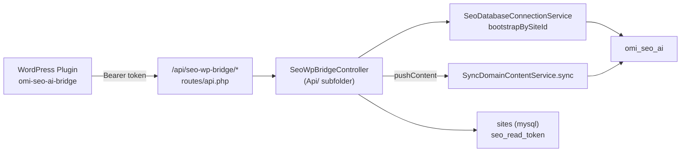
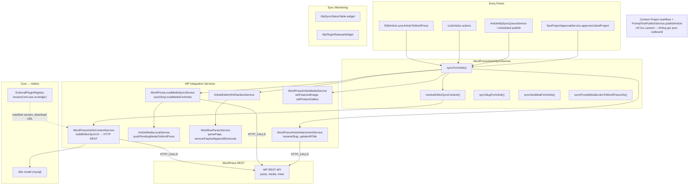
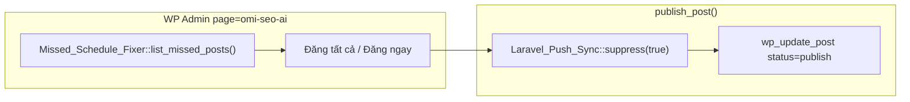
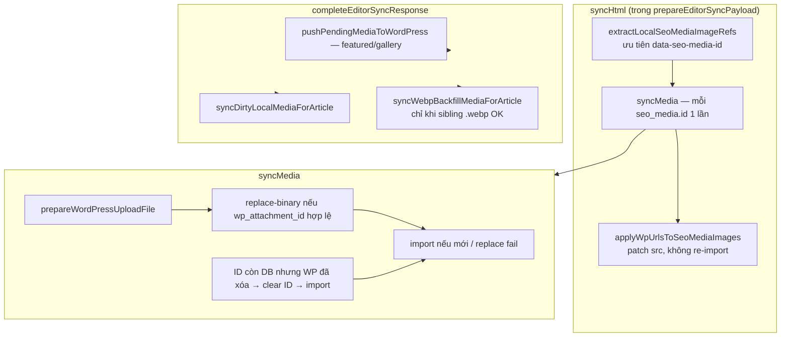

# SeoContentAi — WordPress Bridge & Sync

[← Quay lại Bản đồ tổng](SUPER_MAP_INDEX.md)

**Liên quan:** [React Editor](MAP_SEO_EDITOR.md) · [Content Projects & Workflow](MAP_SEO_PROJECTS.md)

### Nguyên tắc: Laravel bản tạm ↔ WordPress nguồn sống

- Bài trên Laravel = bản tạm: **được** sync nội dung/SEO/media, sửa local, trash/xóa **chỉ trên Laravel**.
- Outbound Laravel → WP **không** xóa / trash WP. Sync status **chỉ** gửi `publish` (+ `post_date` clamp ≤ now) — `WordPressArticleSyncService::resolveWordPressStatusPayload()`.
- Lịch đăng (`scheduled`) sống **chỉ trên Laravel**; cron tới giờ mới sync. **Không** gửi `draft` / WP `future` khi đồng bộ.
- Plugin `omi-seo-ai-bridge` ≥ **1.0.57**: chặn demote `publish/private/future` → `draft`; elevate admin + `force_post_status`; clamp `post_date` tương lai khi publish.
- Inbound WP → Laravel (push trash / force_delete) vẫn phản ánh trạng thái WP — xem bridge bên dưới.

---

## 2.3 WordPress Bridge (inbound từ plugin WP)



**Endpoints:**
| Method | Path | Action |
|--------|------|--------|
| GET | `/api/seo-wp-bridge/ping` | Kiểm tra token + domain |
| POST | `/api/seo-wp-bridge/push-content` | Đồng bộ nội dung bài viết từ WP |

**Middleware:** `api` (không auth, không session) — authentication dùng Bearer token từ `sites.seo_read_token`.

---

## 2.4 WordPress Sync (outbound Laravel → WP)



**Trace MCP (`syncForArticle` outbound):** 30+ callees — `ArticleEditorHtmlSanitizeService`, `WorkflowParserService`, `WordPressLocalMediaSyncService`, `ArticleMediaLocalService`, `SeoMediaBuilder`, `ExternalPluginRegistry`.

**Trace MCP (inbound callers):** `EditArticle.syncArticleToWordPress`, ListArticles sync actions, `ArticleWpSyncQueueService` / scheduled publish, `SeoProjectApprovalService.approveLinkedProject`. **Không** từ Content Project run / `PromptTestPublishService.publishArticle` (local-only).

### Đăng bài mới — tránh bài trùng / `post_content` trắng

Luồng cũ (trước fix): `createForArticle` → `POST /posts` (chỉ title/slug/status) tạo bài **rỗng**, sau đó `syncForArticle` → `editor-sync` đẩy nội dung. Nếu hai request song song (double-click, workflow + editor) hoặc `editor-sync` lỗi trước khi `wp_post_id` kịp lưu → **hai bài WP** (một trống, một đầy đủ).

| Thành phần | Hành vi sau fix |
|------------|-----------------|
| `WordPressArticleSyncService::publishForArticle()` | Cache lock theo `article_id`; gọi `createForArticle` + `syncForArticle` tuần tự |
| `createForArticle()` | Gửi kèm `post_content`, `faqs`, `seo`, `category_ids` (plugin **≥ 1.0.49**) |
| Plugin `handle_create_post` | Ghi `post_content` ngay `wp_insert_post`; FAQ/SEO/category qua `apply_supplementary_sync_fields` |
| Plugin **&lt; 1.0.49** | Vẫn tạo bài rỗng nếu chưa nâng cấp — **nên đồng bộ plugin** trên mọi site |

`EditArticle.syncArticleToWordPress` gọi `publishForArticle()` thay vì tách `create` + `sync`.

### Lên lịch đăng bài (Laravel cron, không WP `future` / `draft`)

Outbound sync **luôn** `status=publish` (kể cả Laravel `draft` / `scheduled`). `post_date` tương lai bị clamp về now — tránh WP đổi thành `future`. Lịch chờ ngày X: Laravel giữ `articles.status=scheduled` + `published_at`; cron `seo:publish-scheduled-articles` (mỗi phút) → `ScheduledArticlePublishRunner` → `publishScheduledArticle()` → editor-sync publish. Queue: `ArticleWpSyncQueueService::applyPublishImmediatelyToBundle()` ép `publish_box.status=published` trước persist/worker. Chi tiết editor: [MAP_SEO_EDITOR.md §2.6](MAP_SEO_EDITOR.md).

### Plugin WP — tắt WP-Cron & sửa «Lịch trình bị bỏ lỡ»

Repo: `wp-seo-ai` (`omi-seo-ai-bridge.php`). Trang admin: `/wp-admin/admin.php?page=omi-seo-ai`.

| Thành phần | File | Vai trò |
|------------|------|---------|
| Tắt WP-Cron | `includes/class-wp-cron-disabler.php` | `remove_action('init','wp_cron')` + chặn `pre_schedule_event` / `pre_reschedule_event` — lịch mới do Laravel, không spawn cron trên request |
| Sửa lỡ lịch | `includes/class-missed-schedule-fixer.php` | Query `post_status=future` + `post_date_gmt <= now` (post/product) → `wp_update_post(status=publish)` |
| UI | `views/welcome.php` | Bảng **Bài viết (link) \| Trạng thái \| Giờ lên lịch**; nút «Đăng tất cả» / «Đăng ngay» từng dòng |

**Luồng xử lý bài cũ bị `future` trên WP:**



- Khi đăng thủ công trên WP, `Laravel_Push_Sync` bị suppress để tránh push ngược không cần thiết.
- Bài mới từ Laravel **không** tạo `future` trên WP nữa — chỉ còn legacy `future` cần dọn qua UI này.

**Lưu ý hosting:** Server vẫn cần `php artisan schedule:run` (Laravel) để đăng bài theo lịch SEO. WP-Cron tắt không thay thế cron hệ thống Laravel.

### ExternalPluginRegistry

Core hub đọc `services.config.external_plugins`. Trong addon: `GeneralDomain.php`, `WordPressPluginWidget.php`, `WordPressPluginDomainsOverviewService.php` — slug `omi-seo-ai-bridge`.

---

## 2.5 Attachment Management

**Service:** `WordPressArticleAttachmentService.php`

Các Livewire methods trong `EditArticle`:
- `renameAttachmentSlugsOnWordPress(array)` — `WordPressAttachmentRenameService::renameBatch` → WP `POST …/attachments/rename`; response `renamed[]` gồm `attachment_id`, `old_url`, `new_url`, `new_slug` (slug thực tế trên đĩa, có thể ≠ `new_slug` request nếu WP dedupe). Livewire enrich `block_id` từ request trước event `seo-attachment-slugs-rename-finished`.
- **Plugin ≥ 1.0.54** — `includes/class-attachment-renamer.php` `resolve_attachment_id()`: nếu `attachment_id` request stale (post đã xóa/reimport) → tìm lại theo `old_url` (`attachment_url_to_postid`) hoặc basename `_wp_attached_file` trước khi rename.
- `updateAttachmentMetaOnWordPress(array)` — cập nhật alt text + title của WP media

Luồng editor: `callEditArticleLivewire('renameAttachmentSlugsOnWordPress')` → `WordPressAttachmentRenameService` → WP REST. Legacy Alpine `seo-rename-attachment-slugs` vẫn có cho flow khác. Ảnh local chưa sync không gọi endpoint này; editor rename local trước, rồi `syncHtml` import ảnh lên WP bằng slug đã chuẩn hóa.

---

## 2.5.1 Đồng bộ media local → WordPress

**Hub:** `WordPressLocalMediaSyncService.php` · Chi tiết encode/WebP: [MAP_SEO_MEDIA.md §Trace đồng bộ WP](MAP_SEO_MEDIA.md)



| REST endpoint (plugin) | Khi dùng |
|------------------------|----------|
| `POST …/attachments/import` | Ảnh chưa có trên WP, hoặc attachment cũ đã mất |
| `POST …/attachments/{id}/replace-binary` | Đã có `wp_attachment_id` + URL WP còn sống |
| `POST …/attachments/{id}/delete` | Sau `reimportWebpRetiringOldAttachment` (replace giữ URL JPG) |

**Plugin `omi-seo-ai-bridge` ≥ 1.0.51:** `GET /omi-seo-ai/v1/posts/{id}/comment-reviews` đọc `_omi_seo_virtual_comments` (meta) + merge `wp_comments` — editor Reviews tab dùng endpoint này khi bấm **Làm mới**.

**Plugin `omi-seo-ai-bridge` ≥ 1.0.54:** `class-attachment-renamer.php` — rename resolve attachment theo URL khi ID stale.

**Plugin `omi-seo-ai-bridge` ≥ 1.0.50:** `class-attachment-binary-replacer.php` đổi extension file sang `.webp` khi mime `image/webp`.

**Tránh file WP thừa:** Không backfill WebP khi upload thực tế là JPEG `-wp-upload.jpg` (`needsWordPressWebpBackfill` = false). Mỗi lượt `syncHtml` dedupe theo `seo_media.id`. Xem log: `WordPress attachment đã bị xóa trên WP — import mới`, `WordPress upload fallback: ảnh đã nén dưới ngưỡng`.

**Tối ưu ảnh trước upload:** `SyncArticleToWordPressFromQueueJob` đi qua `SeoImageOptimizationService.prepareWordPressUploadFile` → `SeoImagePipeline`; pixel alpha dùng `ImagickPixelColor::normalized()` để tránh `ImagickPixel::getColor(true)` fail trên Imagick mới và làm sync chậm do fallback/retry.

**Ảnh local:** Sync **không** chuyển `seo_media.status` sang `trash`. Xóa disk chỉ khi duyệt bài (Reviewed).

---

## 2.6 Sync Monitoring Widgets

### WpSyncStatusTable

**File:** `Filament/Widgets/WpSyncStatusTable.php`

Widget hiển thị bảng trạng thái đồng bộ WP của articles. Cho biết:
- Article đã sync chưa
- WP post ID
- WP permalink
- Trạng thái đồng bộ gần nhất

### WpPluginReleaseWidget

**File:** `Filament/Widgets/WpPluginReleaseWidget.php`

Widget quản lý release của WP plugin `omi-seo-ai-bridge`:
- Hiển thị version hiện tại
- Check for updates từ Update Server
- Download/manifest URL từ `ExternalPluginRegistry`

---

## Hướng dẫn prompt Cursor — Sync WordPress

### Push bài / media lên WP

```
Hub: Services/WordPressArticleSyncService.php → syncForArticle().
Queue enqueue: Services/ArticleWpSyncQueueService.php (`QUEUE_NAME=seo`, dispatchWpSyncJob purge+verify).
Jobs: Jobs/SyncArticleToWordPressFromQueueJob.php, Jobs/SyncArticleBodyMediaToWordPressJob.php (queue `seo`).
HTTP: Services/WordPressArticleContentService.php (buildEditorSyncUrl).
Media: Services/WordPressLocalMediaSyncService.php, ArticleMediaLocalService.php.
Upload encode: Services/SeoImageOptimizationService.php (prepareWordPressUploadFile, fallback 100KB).
Plugin binary replace: wp-seo-ai/includes/class-attachment-binary-replacer.php (≥ 1.0.50).
Attachment: Services/WordPressArticleAttachmentService.php.
Entry UI: Filament/Resources/ArticleResource/Pages/EditArticle.php.
Plugin manifest: app/Services/ExternalPlugin/ExternalPluginRegistry.php (omi-seo-ai-bridge).
WP plugin repo: wp-seo-ai (omi-seo-ai-bridge.php).
```

### Pull từ WP → Laravel

```
Inbound API: routes/api.php → SeoWpBridgeController (Api/ subfolder).
Service: SyncDomainContentService.php.
Sau `importSingleSyncItem`, dispatch `AnalyzeArticleSeoJob` qua `SeoArticleScoringQueueService::dispatchIfSyncItemChanged()` (fingerprint sync payload) — không còn `analyzeFromSyncItem()` đồng bộ trong HTTP.
Auth: site seo_read_token (mysql.sites).
DB bootstrap: SeoDatabaseConnectionService.bootstrapBySiteId().
```

### Sync Monitoring

```
Sync status widget: Filament/Widgets/WpSyncStatusTable.php.
Plugin release widget: Filament/Widgets/WpPluginReleaseWidget.php.
```

### Plugin WP — cron & missed schedule

```
WP-Cron off: wp-seo-ai/includes/class-wp-cron-disabler.php.
Missed schedule UI: views/welcome.php + includes/class-missed-schedule-fixer.php.
Admin: /wp-admin/admin.php?page=omi-seo-ai.
```

**Liên quan editor:** [MAP_SEO_EDITOR.md](MAP_SEO_EDITOR.md) — `executeHeavyArticleAction`, `syncArticleToWordPress`, `renameAttachmentSlugsOnWordPress`, `updateAttachmentMetaOnWordPress`, Livewire collect HTML.
