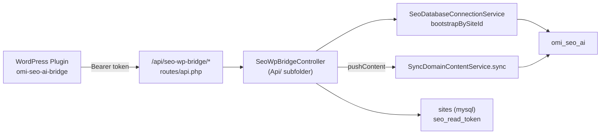
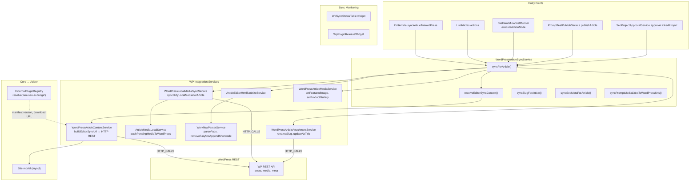

# SeoContentAi — WordPress Bridge & Sync

[← Quay lại Bản đồ tổng](SUPER_MAP_INDEX.md)

**Liên quan:** [React Editor](MAP_SEO_EDITOR.md) · [Content Projects & Workflow](MAP_SEO_PROJECTS.md)

---

## 2.3 WordPress Bridge (inbound từ plugin WP)



**Endpoints:**
| Method | Path | Action |
|--------|------|--------|
| GET | `/api/seo-wp-bridge/ping` | Kiểm tra token + domain |
| POST | `/api/seo-wp-bridge/push-content` | Đồng bộ nội dung bài viết từ WP |

**Middleware:** `api` (không auth, không session) — authentication dùng Bearer token từ `sites.seo_read_token`.

---

## 2.4 WordPress Sync (outbound Laravel → WP)



**Trace MCP (`syncForArticle` outbound):** 30+ callees — `ArticleEditorHtmlSanitizeService`, `WorkflowParserService`, `WordPressLocalMediaSyncService`, `ArticleMediaLocalService`, `SeoMediaBuilder`, `ExternalPluginRegistry`.

**Trace MCP (inbound callers):** `EditArticle.syncArticleToWordPress`, `TaskWorkflowTestRunner`, `PromptTestPublishService`, `ArticlesOptimal.demoteToDraft`, `SeoProjectApprovalService.approveLinkedProject`.

### ExternalPluginRegistry

Core hub đọc `services.config.external_plugins`. Trong addon: `GeneralDomain.php`, `WordPressPluginWidget.php`, `WordPressPluginDomainsOverviewService.php` — slug `omi-seo-ai-bridge`.

---

## 2.5 Attachment Management

**Service:** `WordPressArticleAttachmentService.php`

Các Livewire methods trong `EditArticle`:
- `renameAttachmentSlugsOnWordPress(array)` — đổi slug của WP attachment (dùng cho SEO URL)
- `updateAttachmentMetaOnWordPress(array)` — cập nhật alt text + title của WP media

Luồng: Alpine event `seo-rename-attachment-slugs` / `seo-update-attachment-meta` → Livewire → `WordPressArticleAttachmentService` → WP REST API.

---

## 2.6 Sync Monitoring Widgets

### WpSyncStatusTable

**File:** `Filament/Widgets/WpSyncStatusTable.php`

Widget hiển thị bảng trạng thái đồng bộ WP của articles. Cho biết:
- Article đã sync chưa
- WP post ID
- WP permalink
- Trạng thái đồng bộ gần nhất

### WpPluginReleaseWidget

**File:** `Filament/Widgets/WpPluginReleaseWidget.php`

Widget quản lý release của WP plugin `omi-seo-ai-bridge`:
- Hiển thị version hiện tại
- Check for updates từ Update Server
- Download/manifest URL từ `ExternalPluginRegistry`

---

## Hướng dẫn prompt Cursor — Sync WordPress

### Push bài / media lên WP

```
Hub: Services/WordPressArticleSyncService.php → syncForArticle().
HTTP: Services/WordPressArticleContentService.php (buildEditorSyncUrl).
Media: Services/WordPressLocalMediaSyncService.php, ArticleMediaLocalService.php.
Attachment: Services/WordPressArticleAttachmentService.php.
Entry UI: Filament/Resources/ArticleResource/Pages/EditArticle.php.
Plugin manifest: app/Services/ExternalPlugin/ExternalPluginRegistry.php (omi-seo-ai-bridge).
WP plugin repo: wp-seo-ai (omi-seo-ai-bridge.php).
```

### Pull từ WP → Laravel

```
Inbound API: routes/api.php → SeoWpBridgeController (Api/ subfolder).
Service: SyncDomainContentService.php.
Auth: site seo_read_token (mysql.sites).
DB bootstrap: SeoDatabaseConnectionService.bootstrapBySiteId().
```

### Sync Monitoring

```
Sync status widget: Filament/Widgets/WpSyncStatusTable.php.
Plugin release widget: Filament/Widgets/WpPluginReleaseWidget.php.
```

**Liên quan editor:** [MAP_SEO_EDITOR.md](MAP_SEO_EDITOR.md) — `executeHeavyArticleAction`, `syncArticleToWordPress`, `renameAttachmentSlugsOnWordPress`, `updateAttachmentMetaOnWordPress`, Livewire collect HTML.
