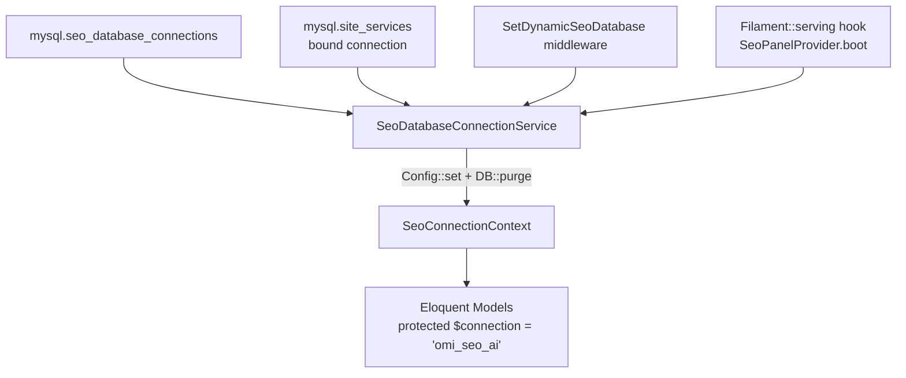

# SeoContentAi — Bản đồ tổng (Index)

[← Quay lại README addon](../app/Addons/SeoContentAi/README_ADDON_SEOCONTENTAI.md)

> Knowledge graph `D-work-omnichannel-backend` (full index). MCP: `get_architecture`, `search_graph`, `trace_path`, `search_code`.

## Menu

| Tài liệu | Nội dung |
|----------|----------|
| **[Bản đồ Frontend React/Vite](MAP_SEO_FRONTEND.md)** | **Vite entries, component hierarchy, API clients, Alpine bridge** |
| [Domain Management](MAP_SEO_DOMAIN.md) | Menu Domain, 14 services, settings CTA/tone/links, sync cache, queue jobs |
| [Chỉnh sửa Giao diện & React Editor](MAP_SEO_EDITOR.md) | EditArticle, SeoArticleEditor, Livewire bridge, media picker; draft auto + nút `!`; Fix slug all ([image-slug-rename.md](article-editor/image-slug-rename.md)); Sync enqueue đóng tab |
| [Article SEO Audit](MAP_SEO_AUDIT.md) | ArticlesOptimal — optimistic skip/assign (Alpine hide row + `skipRender`); project capacity ≤2 toast, 0 ẩn select |
| [Xử lý Thư viện ảnh, Upload & Watermark](MAP_SEO_MEDIA.md) | `/api/seo/media/*`, SeoMediaController, upload pipeline |
| [Cơ chế Đồng bộ & Cầu nối WordPress](MAP_SEO_WP.md) | WP bridge inbound, sync outbound, plugin `omi-seo-ai-bridge` ≥1.0.61 (`clear_faqs`) |
| [Content Projects & Workflow](MAP_SEO_PROJECTS.md) | Archive preview; Operation Center `/seo/{hash}/content-operations`; CommandBus cutover |
| [Content Project Operations](CONTENT_PROJECT_OPERATIONS.md) | Ops dashboard, metrics, replay, health, daily report (admin only) |
| [Agent Gateway](CONTENT_PROJECT_AGENT_GATEWAY.md) | Agent/MCP → Gateway → Capability → CommandBus |
| [Extension SDK](EXTENSION_SDK.md) | Plugin platform: registries, manifest, discovery, health |
| [Publisher SDK](PUBLISHER_SDK.md) | PublisherDriver; WordPress builtin |
| [AI Provider SDK](AI_PROVIDER_SDK.md) | AiProviderDriver scaffold |
| [Capability SDK](CAPABILITY_SDK.md) | Extension capability contributors |
| [Pipeline SDK](PIPELINE_SDK.md) | Pipeline step drivers |
| [Architecture Decisions](ARCHITECTURE_DECISIONS.md) | ADR-001..017 — Content Project aggregate, CommandBus, Agent capability boundary, Archive/Restore, publish ownership, Extension Cutover |
| [Architecture Freeze v1.0](ARCHITECTURE_FREEZE_V1.md) | Freeze date 2026-07-27, SDK v1; Allowed-without-ADR / Requires-ADR; public contracts |
| [Builtin WordPress Extension](BUILTIN_WORDPRESS_EXTENSION.md) | `WordPressPublisher` dưới `Extension/Builtin/Wordpress`, Application chỉ dùng `PublisherResolver` |
| [Extension Security Boundary](EXTENSION_SECURITY_BOUNDARY.md) | Whitelist discovery, id pattern, `extensions.{id}.*` namespace, event isolation, no credentials |
| [Agent Planner](CONTENT_PROJECT_AGENT_PLANNER.md) | Plan/Step/Executor; wait_operation; templates |
| [Automation Policy](CONTENT_PROJECT_AUTOMATION_POLICY.md) | Levels, hard gates, budget, triggers |
| [Agent Approvals](CONTENT_PROJECT_AGENT_APPROVALS.md) | Human approval gates + Destroy Workspace preview |
| [Plan Lifecycle](CONTENT_PROJECT_AGENT_PLAN_LIFECYCLE.md) | Status, retry, cancel, retention |
| [MCP Tools](CONTENT_PROJECT_MCP_TOOLS.md) | content_project.* + keyword/serp/gsc **read** tools (+ CP write/plan); schemas from registry/catalog |
| [Agent Security](CONTENT_PROJECT_AGENT_SECURITY.md) | Scopes, policy, rate limit, error codes |
| [Agent Workflows](CONTENT_PROJECT_AGENT_WORKFLOWS.md) | Create/Generate/Schedule/Archive flows |
| [Settings, Prompts & AI Connections](MAP_SEO_SETTINGS.md) | Settings, PromptResource, PromptRunnerService, API Connections |
| [Prompt Hooks](prompt-hooks/README.md) | Contract từng Hook (title / meta description) — Phase 1 (**EXPERIMENTAL** tới khi Spec khóa) |
| [Prompt Hook / Workflow Audit (5A)](automation/prompt/PROMPT_WORKFLOW_INVENTORY.md) | Inventory + Spec v0.1 |
| [Prompt Hook Runtime (5B)](automation/prompt/PROMPT_HOOK_RUNTIME.md) | Loader/Registry/Engine/Bridge; [registry](automation/prompt/PROMPT_HOOK_REGISTRY.md), [capabilities](automation/prompt/PROMPT_HOOK_PROVIDER_CAPABILITIES.md), [output](automation/prompt/PROMPT_HOOK_OUTPUT_VALIDATION.md), [rollout](automation/prompt/PROMPT_HOOK_ROLLOUT.md), [PromptResult boundary](automation/prompt/PROMPT_RESULT_BOUNDARY.md), [versioning](automation/prompt/PROMPT_HOOK_VERSIONING.md) |
| [Prompt Hook Phase 5C](automation/prompt/PROMPT_HOOK_PROVIDER_ADAPTER_PRODUCTION.md) | Production adapter, [usage metering](automation/prompt/PROMPT_HOOK_USAGE_METERING.md), [hosting validation](automation/prompt/PROMPT_HOOK_PHASE5C_HOSTING_VALIDATION.md), [migration plan](automation/prompt/PROMPT_HOOK_MIGRATION_PLAN.md) |
| [Prompt Hook Phase 5D1](automation/prompt/PROMPT_HOOK_PHASE5D1_ROLLOUT_REPORT.md) | Hosting rollout report template + [runbook](automation/prompt/PROMPT_HOOK_PHASE5C_HOSTING_VALIDATION.md) |
| [Outline Hook Vertical Slice](automation/prompt/OUTLINE_HOOK_VERTICAL_SLICE_TEST.md) | `article.outline.generate@0.1.0` — `markdown_sections` + legacy Prompt template; editor binding + explicit execution |
| [Article Generate/Rewrite Hooks](automation/prompt/ARTICLE_GENERATE_REWRITE_HOOK_TEST.md) | `article.content.generate` + `article.content.rewrite` @0.1.0 — legacy Prompt template, markdown output |
| **[Google Search Console — API Connections](MAP_SEO_GSC_API_CONNECTIONS.md)** | **OAuth GSC riêng, route `{id}`, master/mapping, gap multi-connection, checklist debug** |
| [Team & Phân quyền](MAP_SEO_TEAM.md) | SeoAccessControl, RBAC, SEO roles, Team management |
| [Performance & R&D Hub](MAP_SEO_PERFORMANCE_HUB.md) | `/performance-hub` — legacy GSC snapshot KPI + additive GSC Intelligence overlay; rank keyword groups + SERP providers; Cannibalization tab |
| [Business Automation](automation/AUTOMATION_SERVICE_INVENTORY.md) | Tables `automation_*` + `business_events` trên **core** (`config/automation.php` / `AUTOMATION_DB_CONNECTION`); `automation:migrate-to-core`; [Cutover audit](automation/AUTOMATION_CUTOVER_AUDIT.md) |
| [Database cleanup misplaced tables](DATABASE_CLEANUP_MISPLACED_TABLES.md) | `database:cleanup-misplaced-tables` — ownership registry; `automation_*` owner = core |
| [Testing / PHPUnit discovery](TESTING.md) | Convention `*Test.php`, `phpunit.xml` suites (core + SeoContentAi), `php artisan test:doctor`, `composer test:ci` |
| [Keyword Intelligence](KEYWORD_INTELLIGENCE.md) | Workspace/Keyword/Cluster pipeline, CommandBus + Agent Gateway `keyword_intelligence.*`, Filament `/seo/{hash}/keyword-intelligence` |
| [Keyword Analysis Ops](KEYWORD_ANALYSIS_OPERATIONS.md) | Phase 2 analysis stages, lock, idempotency, manual override, missing metrics |
| [Keyword Clustering](KEYWORD_CLUSTERING.md) | `KeywordClusterService` — strategy strict/balanced/broad, merge/split/move, approved protection |
| [Topical Map](TOPICAL_MAP.md) | Phase 3 builder modes, hierarchy/coverage/conflicts, approve version, convert |
| [Topical Map Build Ops](TOPICAL_MAP_BUILD_OPERATIONS.md) | Lock `keyword-topical-map-build`, stages, result codes |
| [Topical Map Versions](TOPICAL_MAP_VERSIONS.md) | Draft/reviewed/approved/superseded + compact snapshot/diff |
| [Topical Link Suggestions](TOPICAL_INTERNAL_LINK_SUGGESTIONS.md) | `seo_topical_link_suggestions` — suggest only |
| [Keyword → Content Project](KEYWORD_TO_CONTENT_PROJECT.md) | Approved map version → preview/convert + cluster convert |
| [Keyword Cannibalization](KEYWORD_CANNIBALIZATION.md) | `KeywordCannibalizationService` — keyword/cluster multi-article risk, risk_level, recommended_action |
| [SERP Intelligence](SERP_INTELLIGENCE.md) | Phase 4 — snapshots, intent evidence, overlap validation, content gaps, provider contract. Satellites: [provider](SERP_PROVIDER_CONTRACT.md), [snapshot](SERP_SNAPSHOT_MODEL.md), [intent](SERP_INTENT_EVIDENCE.md), [cluster](SERP_CLUSTER_VALIDATION.md), [gaps](SERP_CONTENT_GAPS.md), [page fetch](SERP_PAGE_FETCH_SECURITY.md). GSC reconcile: [GSC_INTELLIGENCE.md](GSC_INTELLIGENCE.md) |
| [GSC Intelligence](GSC_INTELLIGENCE.md) | Phase 5 — PARTIAL: facts/`omi_seo_ai`, CommandBus, providers `manual_import`+`fake_local`, agent/MCP **read** catalog, Performance Hub overlay (Sync CSV preview; other tabs placeholder). Satellites: [data model](GSC_DATA_MODEL.md), [provider](GSC_PROVIDER_CONTRACT.md), [sync](GSC_SYNC_OPERATIONS.md), [mapping](GSC_QUERY_PAGE_MAPPING.md), [opportunities](GSC_OPPORTUNITY_ENGINE.md), [cannibalization](GSC_CANNIBALIZATION.md), [CP performance](GSC_CONTENT_PROJECT_PERFORMANCE.md). OAuth core: [MAP_SEO_GSC_API_CONNECTIONS.md](MAP_SEO_GSC_API_CONNECTIONS.md) |
| [Legacy test audit](testing/LEGACY_TEST_AUDIT.md) | Inventory fail buckets (ENV/CONFIG/FINAL/STALE), infra fixes, server runbook 512M |

**Luồng chia:** UI editor (React + Alpine) → REST media/outline hoặc Livewire save → `omi_seo_ai` → sync WP qua `WordPressArticleSyncService`.

**Docs policy:** chỉ giữ MAP vệ tinh + catalog living (`automation/*`, `prompt-hooks/*`). Không tạo `CHANGELOG_*` / `AUDIT_*` one-shot — ghi fact bền vào đúng MAP. Phase report rollout (`AUTOMATION_PHASE*`, `PROMPT_HOOK_PHASE*`) chỉ giữ khi còn gate chưa đóng.

---

## 1. Tổng quan addon

| Thông tin | Giá trị |
|-----------|---------|
| **Đường dẫn** | `app/Addons/SeoContentAi/` |
| **Panel Filament** | `/seo` (provider: `SeoPanelProvider`) |
| **DB runtime** | Connection `omi_seo_ai` (bootstrap động) |
| **DB credential core** | Bảng `seo_database_connections` (mysql) |
| **Services** | ~150 class trong `Services/` |
| **HTTP Controllers** | 15 class trong `Http/Controllers/` |
| **Frontend map** | [MAP_SEO_FRONTEND.md](MAP_SEO_FRONTEND.md) — 7 React entry + 4 JS/Alpine bridge |
| **Frontend entry chính** | `article-editor.jsx` → Vite bundle `article-editor` |

**Middleware chuỗi API SEO** (`$seoWebApiMiddleware` trong `SeoPanelProvider`):

`web` session stack → `Authenticate` → `CheckMainRole` → **`SetDynamicSeoDatabase`** → `SubstituteBindings`

Mọi request `/api/seo/*` đều bootstrap connection `omi_seo_ai` trước khi Eloquent query.

---

## 3. Database bootstrap (`omi_seo_ai`)

**Models chính trên `omi_seo_ai`:** `SeoArticle`, `SeoMedia`, `Keyword`, `Prompt`, `SeoProject`, `SeoArticleHeading`, `ArticleMeta`, `SeoFaq`, `SeoMediaProcessingHistory`, `SeoProjectRun`, `SeoProjectTask`, `SeoTask`, `SeoGeneratedImage`, `SeoArticleRevision`, `SeoArticleLink`, `SeoImageOptimizationSetting`, `SeoWpMediaBackup`, `SeoWpMediaEditedPending`, `Tag`, `KeywordTag`, `KeywordSiteMeta`, `SeoLinkMap`, `SeoLinkAudit`, `SeoPendingInternalLink`, `AiConnection`, `SeoTaskTestResult`, `SeoPromptResultLink`, …

**Cross-DB:** `Site`, `User`, `Service` trên `mysql`; addon dùng scalar `site_id` — không FK xuyên DB.

---

## 4. Controllers

| # | File | Class | Ghi chú |
|---|------|-------|---------|
| 1 | `SeoMediaController.php` | `SeoMediaController` | Media API chính (~15 endpoints) |
| 2 | `SeoWatermarkController.php` | `SeoWatermarkController` | Settings + batch watermark |
| 3 | `ArticleOutlineController.php` | `ArticleOutlineController` | Outline CRUD + generate heading |
| 4 | `ArticleMediaPickerController.php` | `ArticleMediaPickerController` | Pick media cho article (web route) |
| 5 | `WorkspaceMediaPickerController.php` | `WorkspaceMediaPickerController` | Pick media cấp workspace |
| 6 | `ArticlePreviewController.php` | `ArticlePreviewController` | Xem trước bài viết (frontend render) |
| 7 | `ArticleSeoPreviewController.php` | `ArticleSeoPreviewController` | SEO preview JSON cho editor |
| 8 | `ArticleRevisionController.php` | `ArticleRevisionController` | Danh sách revision đơn giản |
| 9 | `SeoArticleRevisionController.php` | `SeoArticleRevisionController` | Compare + restore revision |
| 10 | `ArticleWpEditRedirectController.php` | `ArticleWpEditRedirectController` | Redirect wp_id → editor |
| 11 | `GlobalAiChatController.php` | `GlobalAiChatController` | AI chat global (đa model) |
| 12 | `TeamMessageController.php` | `TeamMessageController` | Chat nội bộ team |
| 13 | `SeoPanelRedirectController.php` | `SeoPanelRedirectController` | Redirect `/seo` → panel |
| 14 | `SeoPerformanceHubController.php` | `SeoPerformanceHubController` | Redirect → Performance Hub Filament page |
| 15 | `Api/SeoWpBridgeController.php` | `SeoWpBridgeController` | Inbound WP bridge (ping, push-content) |

---

## 5. Route groups

| Nhóm | Prefix | Middleware | Controllers |
|------|--------|-----------|-------------|
| (A) Bridge inbound | `/api/seo-wp-bridge` | `api` (không auth) | `SeoWpBridgeController` |
| (B) Media API | `/api/seo/media` | `$seoWebApiMiddleware` | `SeoMediaController`, `WorkspaceMediaPickerController` |
| (C) Article API | `/api/seo/articles` | `$seoWebApiMiddleware` | `ArticleOutlineController`, `ArticleRevisionController`, `SeoArticleRevisionController` |
| (D) Watermark API | `/api/seo/watermark` | `$seoWebApiMiddleware` | `SeoWatermarkController` |
| (E) Team chat API | `/api/seo/team` | `$seoTeamApiMiddleware` (bỏ CheckMainRole) | `TeamMessageController` |
| (F) AI Chat | `/api/ai` | `$seoWebApiMiddleware` | `GlobalAiChatController` |
| (G) Web routes | `/seo/{connection_hash}` | `$seoWebApiMiddleware` | `ArticleWpEditRedirectController` |
| (H) Web routes | `/seo` | `$seoWebApiMiddleware` | `ArticleMediaPickerController`, `ArticleSeoPreviewController`, `ArticlePreviewController`, `SeoArticleRevisionController` |

---

## Tham chiếu nhanh (không chi tiết)

| Chủ đề | Xem |
|--------|-----|
| Core System (Controllers, Middleware, Auth, Plugin Distribution) | [MAP_CORE.md](MAP_CORE.md) |
| Domain Management (14 services, settings, sync, queue) | [MAP_SEO_DOMAIN.md](MAP_SEO_DOMAIN.md) |
| Article list (`/seo/{connection_hash}/articles`) | [MAP_SEO_EDITOR.md](MAP_SEO_EDITOR.md) §2.4 — tab Bỏ qua (`skip_seo_audit`); filter mặc định `language=vi` + `post_type=post` |
| Article Outline API (`/api/seo/articles/{id}/outline*`) | [MAP_SEO_EDITOR.md](MAP_SEO_EDITOR.md) §2.5 + §5 |
| Article SEO Audit (`/seo/{connection_hash}/articles/optimal`) | [MAP_SEO_AUDIT.md](MAP_SEO_AUDIT.md) |
| Content Projects (`/seo/content-projects`) | [MAP_SEO_PROJECTS.md](MAP_SEO_PROJECTS.md) |
| Queue Jobs (dispatch/worker; Queue Manager UI đã gỡ) | [FEATURE_MAP_FULL.md](FEATURE_MAP_FULL.md) §Queue Jobs / §Queue Manager UI |
| Hotspots (`SeoMediaBuilder`, `WordPressArticleSyncService`, …) | MCP `search_graph min_degree=20` |
| Thư mục addon | `app/Addons/SeoContentAi/{Filament,Http,Models,Services,resources}` |
| MCP trace | `trace_path function_name="syncForArticle" direction=both depth=5` |

*Không thay `app/Addons/SeoContentAi/README_ADDON_SEOCONTENTAI.md` — dùng bộ map trong `docs/` khi onboard / prompt AI.*
