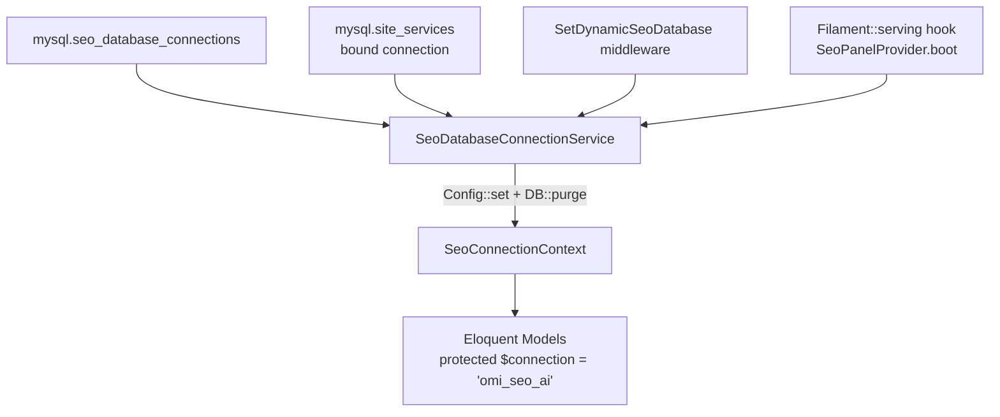

# SeoContentAi — Bản đồ tổng (Index)

[← Quay lại README addon](../app/Addons/SeoContentAi/README_ADDON_SEOCONTENTAI.md)

> Knowledge graph `D-work-omnichannel-backend` (full index). MCP: `get_architecture`, `search_graph`, `trace_path`, `search_code`.

## Menu

| Tài liệu | Nội dung |
|----------|----------|
| **[Bản đồ Frontend React/Vite](MAP_SEO_FRONTEND.md)** | **Vite entries, component hierarchy, API clients, Alpine bridge** |
| [Domain Management](MAP_SEO_DOMAIN.md) | Menu Domain, 14 services, settings CTA/tone/links, sync cache, queue jobs |
| [Chỉnh sửa Giao diện & React Editor](MAP_SEO_EDITOR.md) | EditArticle, SeoArticleEditor, Livewire bridge, media picker modal |
| [Article SEO Audit](MAP_SEO_AUDIT.md) | ArticlesOptimal — optimistic skip/assign (Alpine hide row + `skipRender`); project capacity ≤2 toast, 0 ẩn select |
| [Xử lý Thư viện ảnh, Upload & Watermark](MAP_SEO_MEDIA.md) | `/api/seo/media/*`, SeoMediaController, upload pipeline |
| [Cơ chế Đồng bộ & Cầu nối WordPress](MAP_SEO_WP.md) | WP bridge inbound, sync outbound, plugin `omi-seo-ai-bridge` |
| [Content Projects & Workflow](MAP_SEO_PROJECTS.md) | SeoProject, SeoProjectRun, SeoProjectTask, workflow execution |
| [Settings, Prompts & AI Connections](MAP_SEO_SETTINGS.md) | Settings, PromptResource, PromptRunnerService, API Connections |
| **[Google Search Console — API Connections](MAP_SEO_GSC_API_CONNECTIONS.md)** | **OAuth GSC riêng, route `{id}`, master/mapping, gap multi-connection, checklist debug** |
| [Team & Phân quyền](MAP_SEO_TEAM.md) | SeoAccessControl, RBAC, SEO roles, Team management |
| [Performance & R&D Hub](MAP_SEO_PERFORMANCE_HUB.md) | `/performance-hub` (submenu Keywords), GSC KPI, rank keyword groups + SERP providers (queue `seo`), Quick Wins; Cannibalization tab `/keywords/cannibalization` |

**Luồng chia:** UI editor (React + Alpine) → REST media/outline hoặc Livewire save → `omi_seo_ai` → sync WP qua `WordPressArticleSyncService`.

---

## 1. Tổng quan addon

| Thông tin | Giá trị |
|-----------|---------|
| **Đường dẫn** | `app/Addons/SeoContentAi/` |
| **Panel Filament** | `/seo` (provider: `SeoPanelProvider`) |
| **DB runtime** | Connection `omi_seo_ai` (bootstrap động) |
| **DB credential core** | Bảng `seo_database_connections` (mysql) |
| **Services** | ~150 class trong `Services/` |
| **HTTP Controllers** | 15 class trong `Http/Controllers/` |
| **Frontend map** | [MAP_SEO_FRONTEND.md](MAP_SEO_FRONTEND.md) — 7 React entry + 4 JS/Alpine bridge |
| **Frontend entry chính** | `article-editor.jsx` → Vite bundle `article-editor` |

**Middleware chuỗi API SEO** (`$seoWebApiMiddleware` trong `SeoPanelProvider`):

`web` session stack → `Authenticate` → `CheckMainRole` → **`SetDynamicSeoDatabase`** → `SubstituteBindings`

Mọi request `/api/seo/*` đều bootstrap connection `omi_seo_ai` trước khi Eloquent query.

---

## 3. Database bootstrap (`omi_seo_ai`)

**Models chính trên `omi_seo_ai`:** `SeoArticle`, `SeoMedia`, `Keyword`, `Prompt`, `SeoProject`, `SeoArticleHeading`, `ArticleMeta`, `SeoFaq`, `SeoMediaProcessingHistory`, `SeoProjectRun`, `SeoProjectTask`, `SeoTask`, `SeoGeneratedImage`, `SeoArticleRevision`, `SeoArticleLink`, `SeoImageOptimizationSetting`, `SeoWpMediaBackup`, `SeoWpMediaEditedPending`, `Tag`, `KeywordTag`, `KeywordSiteMeta`, `SeoLinkMap`, `SeoLinkAudit`, `SeoPendingInternalLink`, `AiConnection`, `SeoTaskTestResult`, `SeoPromptResultLink`, …

**Cross-DB:** `Site`, `User`, `Service` trên `mysql`; addon dùng scalar `site_id` — không FK xuyên DB.

---

## 4. Controllers

| # | File | Class | Ghi chú |
|---|------|-------|---------|
| 1 | `SeoMediaController.php` | `SeoMediaController` | Media API chính (~15 endpoints) |
| 2 | `SeoWatermarkController.php` | `SeoWatermarkController` | Settings + batch watermark |
| 3 | `ArticleOutlineController.php` | `ArticleOutlineController` | Outline CRUD + generate heading |
| 4 | `ArticleMediaPickerController.php` | `ArticleMediaPickerController` | Pick media cho article (web route) |
| 5 | `WorkspaceMediaPickerController.php` | `WorkspaceMediaPickerController` | Pick media cấp workspace |
| 6 | `ArticlePreviewController.php` | `ArticlePreviewController` | Xem trước bài viết (frontend render) |
| 7 | `ArticleSeoPreviewController.php` | `ArticleSeoPreviewController` | SEO preview JSON cho editor |
| 8 | `ArticleRevisionController.php` | `ArticleRevisionController` | Danh sách revision đơn giản |
| 9 | `SeoArticleRevisionController.php` | `SeoArticleRevisionController` | Compare + restore revision |
| 10 | `ArticleWpEditRedirectController.php` | `ArticleWpEditRedirectController` | Redirect wp_id → editor |
| 11 | `GlobalAiChatController.php` | `GlobalAiChatController` | AI chat global (đa model) |
| 12 | `TeamMessageController.php` | `TeamMessageController` | Chat nội bộ team |
| 13 | `SeoPanelRedirectController.php` | `SeoPanelRedirectController` | Redirect `/seo` → panel |
| 14 | `SeoPerformanceHubController.php` | `SeoPerformanceHubController` | Redirect → Performance Hub Filament page |
| 15 | `Api/SeoWpBridgeController.php` | `SeoWpBridgeController` | Inbound WP bridge (ping, push-content) |

---

## 5. Route groups

| Nhóm | Prefix | Middleware | Controllers |
|------|--------|-----------|-------------|
| (A) Bridge inbound | `/api/seo-wp-bridge` | `api` (không auth) | `SeoWpBridgeController` |
| (B) Media API | `/api/seo/media` | `$seoWebApiMiddleware` | `SeoMediaController`, `WorkspaceMediaPickerController` |
| (C) Article API | `/api/seo/articles` | `$seoWebApiMiddleware` | `ArticleOutlineController`, `ArticleRevisionController`, `SeoArticleRevisionController` |
| (D) Watermark API | `/api/seo/watermark` | `$seoWebApiMiddleware` | `SeoWatermarkController` |
| (E) Team chat API | `/api/seo/team` | `$seoTeamApiMiddleware` (bỏ CheckMainRole) | `TeamMessageController` |
| (F) AI Chat | `/api/ai` | `$seoWebApiMiddleware` | `GlobalAiChatController` |
| (G) Web routes | `/seo/{connection_hash}` | `$seoWebApiMiddleware` | `ArticleWpEditRedirectController` |
| (H) Web routes | `/seo` | `$seoWebApiMiddleware` | `ArticleMediaPickerController`, `ArticleSeoPreviewController`, `ArticlePreviewController`, `SeoArticleRevisionController` |

---

## Tham chiếu nhanh (không chi tiết)

| Chủ đề | Xem |
|--------|-----|
| Core System (Controllers, Middleware, Auth, Plugin Distribution) | [MAP_CORE.md](MAP_CORE.md) |
| Domain Management (14 services, settings, sync, queue) | [MAP_SEO_DOMAIN.md](MAP_SEO_DOMAIN.md) |
| Article list (`/seo/{connection_hash}/articles`) | [MAP_SEO_EDITOR.md](MAP_SEO_EDITOR.md) §2.4 — tab Bỏ qua (`skip_seo_audit`); filter mặc định `language=vi` + `post_type=post` |
| Article Outline API (`/api/seo/articles/{id}/outline*`) | [MAP_SEO_EDITOR.md](MAP_SEO_EDITOR.md) §2.5 + §5 |
| Article SEO Audit (`/seo/{connection_hash}/articles/optimal`) | [MAP_SEO_AUDIT.md](MAP_SEO_AUDIT.md) |
| Content Projects (`/seo/content-projects`) | [MAP_SEO_PROJECTS.md](MAP_SEO_PROJECTS.md) |
| Queue Jobs (7 jobs, timeout, dispatch) | [FEATURE_MAP_FULL.md](FEATURE_MAP_FULL.md) §Queue Jobs |
| Hotspots (`SeoMediaBuilder`, `WordPressArticleSyncService`, …) | MCP `search_graph min_degree=20` |
| Thư mục addon | `app/Addons/SeoContentAi/{Filament,Http,Models,Services,resources}` |
| MCP trace | `trace_path function_name="syncForArticle" direction=both depth=5` |

*Không thay `app/Addons/SeoContentAi/README_ADDON_SEOCONTENTAI.md` — dùng bộ map trong `docs/` khi onboard / prompt AI.*
