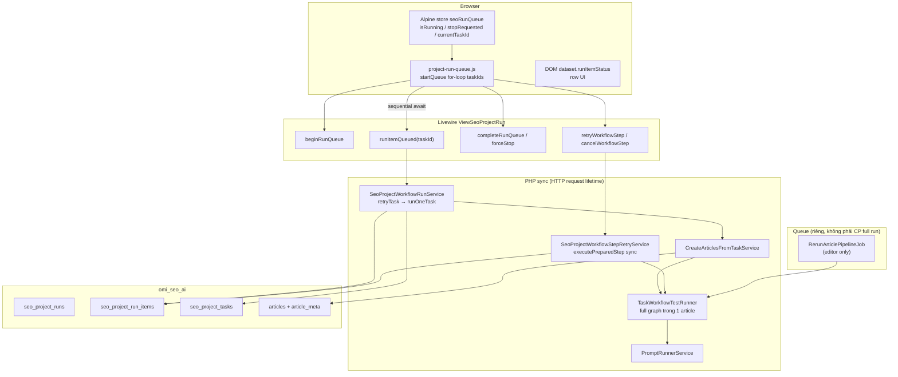
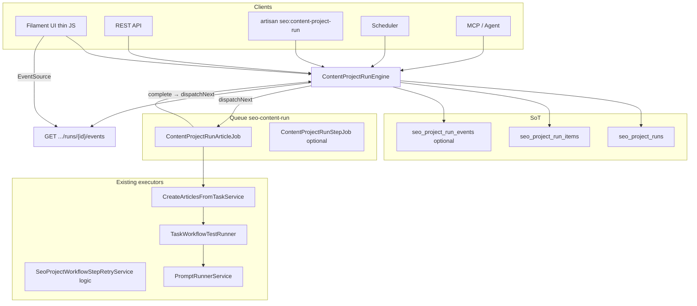
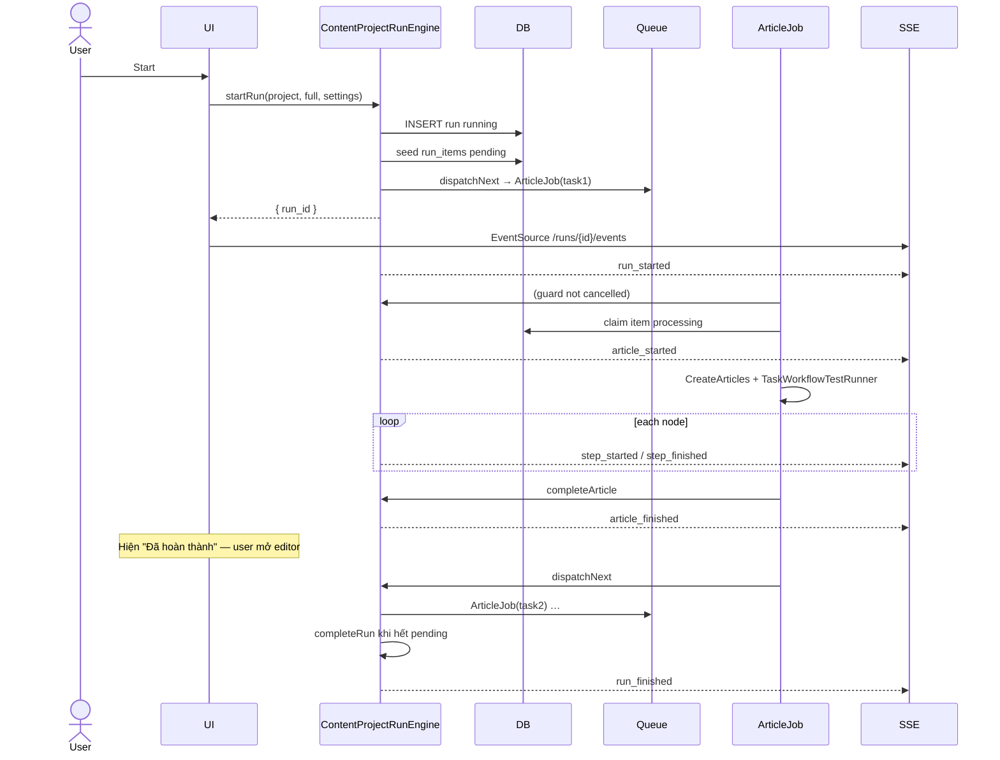
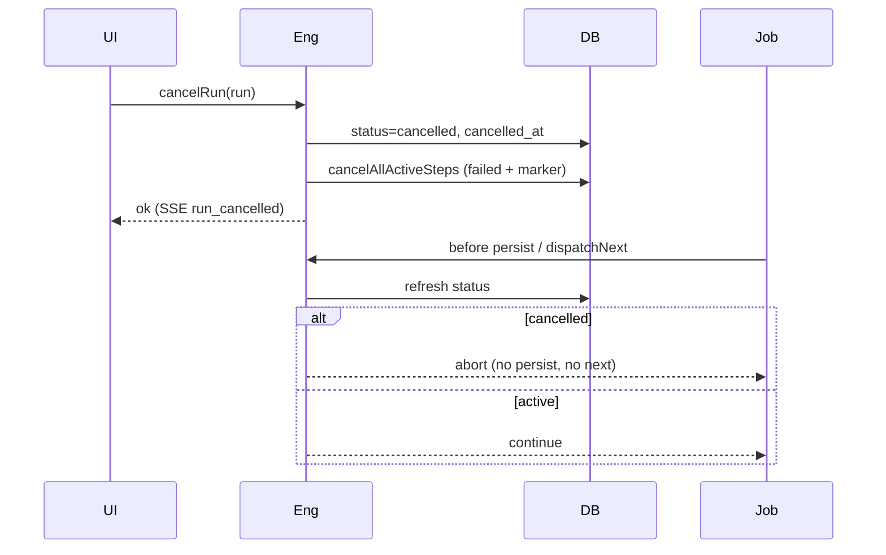
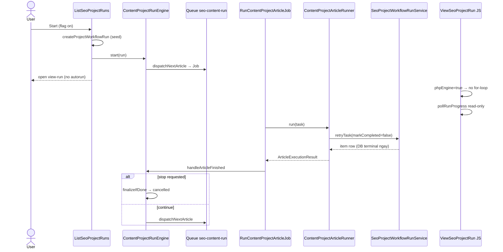

# Content Project Run Engine — Architecture Refactor

**Status:** PHASE 1 SKELETON LANDED — flag `CONTENT_PROJECT_PHP_ENGINE` default **false**  
**Date:** 2026-07-25  
**Scope:** Content Project Run orchestration (UI / API / CLI / Scheduler / MCP / Agent)  
**Constraint:** Không vá thêm orchestration vào `project-run-queue.js`. Loại bỏ dual orchestration (JS + PHP) khi flag on.

---

## 0. Mục tiêu

Content Project Run trở thành **Workflow Engine chạy hoàn toàn bằng PHP**.

| Frontend được phép | Frontend bị cấm |
|---|---|
| Start / Stop / Retry (HTTP) | Chạy prompt / step tiếp theo |
| Subscribe progress (SSE) | Quyết định workflow / dependency |
| Render UI + toast | Resume / loop / dispatchNext |
| | Polling điều khiển orchestration |

Một engine dùng chung cho: Content Project UI, API, CLI, Scheduler, MCP, Agent.

---

## 1. Audit — Kiến trúc hiện tại (AS-IS)

### 1.1 Nguồn đã đọc

| Nguồn | Vai trò audit |
|---|---|
| `docs/audits/PROMPT_EXECUTION_AND_ARTICLE_RERUN_HANDOFF.md` | Cancel race, step terminal, article pipeline rerun node resolve |
| `docs/audits/PROJECT_RUN_RETRY_OUTLINE_DEPENDENCY_HANDOFF.md` | Outline persist gap, step dependency |
| `docs/MAP_SEO_PROJECTS.md` | Service map, sequence (một phần lệch code thực) |
| `resources/js/project-run-queue.js` | JS queue loop = article orchestrator |
| `ViewSeoProjectRun.php` | Livewire bridge: start/stop/retry/complete |
| `SeoProjectWorkflowRunService.php` | Seed run + `retryTask` / `runOneTask` |
| `SeoProjectWorkflowStepRetryService.php` | Step retry sync + cancel markers |
| `TaskWorkflowTestRunner.php` | Node graph executor (trong 1 article) |
| `PromptRunnerService.php` | AI call thấp nhất |
| `RerunArticlePipelineJob.php` | Queue path riêng (editor article rerun) |
| `ArticlePipelineRerunService.php` | Editor rerun orchestration (đã queue) |
| Automation `ExecuteAutomationNodeJob` | Pattern queue-per-node (tham chiếu, khác domain) |

### 1.2 Sơ đồ AS-IS



### 1.3 JS đang làm gì

File: `app/Addons/SeoContentAi/resources/js/project-run-queue.js`

| Trách nhiệm | Chi tiết |
|---|---|
| **Article-level orchestrator** | `startQueue()` `for (taskId of taskIds)` — quyết định thứ tự, khi nào gọi item tiếp |
| Autorun | `?autorun=1` → `processQueue()` khi mount |
| Stop flag | Alpine `stopRequested` — dừng **giữa** các item; item đang Livewire vẫn chạy tới hết request |
| Force stop | `forceStopRunQueue()` → Livewire cancel steps + completed + reload |
| Single / bulk | `runSingleTask`, `handleStartQueue`, `confirmBulkRetry` |
| Step retry UI | `retryWorkflowStep` / `cancelWorkflowStep` → Livewire sync |
| DOM state | `dataset.runItemStatus`, stats DOM, badge, scroll, bump row |
| Editor ready poll | `pollArticleEditorReady` — poll Livewire mỗi 3s (không phải orchestration workflow, nhưng là polling) |
| Gate concurrent | `store.isRunning` chặn queue thứ 2 |

**Kết luận:** JS = **dispatcher vòng lặp article**. PHP chỉ execute **một** article/task mỗi Livewire call.

### 1.4 PHP đang làm gì

| Layer | Class | Việc |
|---|---|---|
| Entry UI | `ListSeoProjectRuns` | Preflight → `createProjectWorkflowRun` → redirect `view-run?autorun=1` |
| Seed | `SeoProjectWorkflowRunService::startRun` + `prepareRunQueue` | Insert run `running`, seed `seo_project_run_items` pending |
| Bridge | `ViewSeoProjectRun` | `runItemQueued` → `retryTask`; step retry/cancel; begin/complete/forceStop |
| Article exec | `retryTask` → `runOneTask` | Claim item → `CreateArticlesFromTaskService` → full workflow |
| Graph | `TaskWorkflowTestRunner` | Chạy toàn bộ node graph **trong 1 HTTP** (outline→content→…) |
| Step retry | `SeoProjectWorkflowStepRetryService` | Claim `action=step:{nodeId}`, sync execute, cancel marker cooperative |
| AI | `PromptRunnerService` | Gọi model, lưu PromptResult |
| Editor parallel | `ArticlePipelineRerunService` + `RerunArticlePipelineJob` | Rerun từ semantic step — **đã queue**, không qua JS loop |
| Sync CLI path | `SeoProjectWorkflowRunService::execute()` | Loop PHP thuần — **UI không dùng** |

### 1.5 Queue đang làm gì

| Job | Liên quan CP Run? |
|---|---|
| `RerunArticlePipelineJob` | Có — path Editor article rerun (một article, từ node) |
| `ExecuteAutomationNodeJob` | Không — Business Automation graph |
| GenerateMedia / WP sync / GSC / … | Side-effect khác |
| **Không có** `ExecuteContentProjectRunJob` / `ExecuteContentProjectArticleJob` | Full Content Project Run **không** queue — gắn browser Livewire |

### 1.6 State nằm ở đâu (duplicated)

| State | Nơi | SoT? |
|---|---|---|
| Run status | `seo_project_runs.status` (`running`/`completed`/`failed`) | DB — nhưng hoàn thành phụ thuộc JS gọi `completeRunQueue` |
| Item status | `seo_project_run_items.status` | DB (SoT runtime Phase 3) |
| Task status | `seo_project_tasks.status` | DB |
| Queue đang chạy | Alpine `seoRunQueue.isRunning` | **JS only** |
| Stop request | Alpine `stopRequested` | **JS only** (DB cancel chỉ khi forceStop / cancel step) |
| Current task | Alpine `currentTaskId` + DOM | **UI only** |
| Row visual | `dataset.runItemStatus` | **DOM** — có thể lệch DB nếu F5 giữa chừng |
| Livewire page | `$projectRun` props / result items | Snapshot render |
| Cancel marker | `error_message` chứa cancel text trên run item | DB (cooperative) |
| Legacy JSON | `runs.items` | Legacy/debug — reader XOR |

**Không có** `STATUS_CANCELLED` trên `SeoProjectRun` (chỉ task có `cancelled`). Stop hiện = mark completed quietly + cancel active steps.

### 1.7 Điểm duplicated / lệch

1. **Hai orchestration:** JS article loop **và** `WorkflowRunService::execute()` PHP loop (dead path UI).
2. **Hai path rerun article:** CP UI (`retryTask` sync) vs Editor (`RerunArticlePipelineJob` queue).
3. **Hai path step:** Full article graph trong `TaskWorkflowTestRunner` vs `SeoProjectWorkflowStepRetryService` single-node.
4. **Complete run:** JS quyết định khi gọi `completeRunQueue` — đóng tab giữa chừng = run kẹt `running` (autorun đã tắt F5 spam, nhưng orphan running vẫn có).
5. **Docs MAP_SEO_PROJECTS §5.2** vẽ loop trong PHP/View; code thực = JS `startQueue`.
6. **Cancel:** JS flag + DB marker + HTTP vẫn block AI — cooperative discard (handoff audit).
7. **Progress:** response Livewire từng item + DOM patch — không event bus chung.

### 1.8 Execution flow cũ (tóm tắt)

```
User "Run Workflow"
  → startRun + prepareRunQueue (PHP, seed items)
  → redirect view-run?autorun=1
  → Alpine init → processQueue
  → beginRunQueue
  → for each taskId:
        Livewire runItemQueued(taskId)
          → retryTask → runOneTask → CreateArticles… → TaskWorkflowTestRunner (all nodes)
          → return item JSON
        JS applyItemResult (DOM)
  → completeRunQueue / consolidate
```

Step retry:

```
User menu "Chạy lại outline"
  → JS retryWorkflowStep
  → Livewire → SeoProjectWorkflowStepRetryService::retryOne (sync)
  → DOM update
```

---

## 2. Kiến trúc mới (TO-BE)

### 2.1 Nguyên tắc

1. **Một engine** — mọi entry point chỉ gọi facade.
2. **DB = SoT** — UI không giữ orchestration state.
3. **Queue = worker** — article/step chạy ngoài HTTP browser.
4. **SSE = progress** — UI subscribe, không poll điều khiển.
5. **Cancel cooperative + gate** — trước mọi dispatch/persist, engine đọc DB.
6. **Không vá** `project-run-queue.js` orchestration — thay bằng thin client.

### 2.2 Tên class đề xuất

Khớp naming addon: **`ContentProjectRunEngine`** (facade).

Namespace: `App\Addons\SeoContentAi\Services\RunEngine\`

| Class | Vai trò |
|---|---|
| `ContentProjectRunEngine` | Public API: start/resume/cancel/retry/dispatch |
| `RunLifecycleService` | Transition run status (running/cancelled/completed/failed) |
| `ArticleDispatchService` | Chọn next article, enqueue job |
| `StepDispatchService` | Chọn next node trong article (nếu tách step-level queue sau) |
| `RunEventPublisher` | Ghi event + push SSE / broadcast channel |
| `RunProgressProjector` | Counters + payload SSE từ DB |
| `RunCancellationGuard` | `assertNotCancelled(run/item)` trước persist/dispatch |
| `ContentProjectRunJob` | Worker: 1 run item (1 article pipeline) |
| `ContentProjectStepJob` | (Phase muộn) 1 step — optional; Phase 1 có thể giữ full graph trong 1 article job |
| `ContentProjectRunEventsController` | SSE endpoint |
| `ContentProjectRunApiController` | REST start/stop/retry |

Giữ nguyên (không bỏ): `TaskWorkflowTestRunner`, `PromptRunnerService`, `CreateArticlesFromTaskService`, `SeoProjectRunItemService`, catalog, parsers, history.

### 2.3 Sơ đồ TO-BE



### 2.4 Engine API (contract)

```php
interface ContentProjectRunEngineContract
{
    public function startRun(SeoProject $project, string $mode, ?array $settings = null): SeoProjectRun;

    public function resumeRun(SeoProjectRun $run): SeoProjectRun;

    public function cancelRun(SeoProjectRun $run, ?string $reason = null): SeoProjectRun;

    public function cancelStep(SeoProjectRun $run, int $taskId, string $nodeId): array;

    public function retryStep(SeoProjectRun $run, int $taskId, string $nodeId): array;

    public function retryArticle(SeoProjectRun $run, int $taskId, ?array $options = null): array;

    public function dispatchNext(SeoProjectRun $run): void;

    public function completeStep(SeoProjectRunItem $item, array $output): void;

    public function failStep(SeoProjectRunItem $item, \Throwable|string $error): void;

    public function completeArticle(SeoProjectRun $run, int $taskId, array $result): void;

    public function completeRun(SeoProjectRun $run): SeoProjectRun;

    public function restoreRun(SeoProjectRun $run): SeoProjectRun; // recovery / reopen pending
}
```

Mọi đường chạy (UI/API/CLI/MCP) **chỉ** gọi contract này.

---

## 3. Sequence Diagram — flow mới

### 3.1 Start full run



### 3.2 Cancel



---

## 4. State Machine

### 4.1 Run lifecycle

```
                startRun
                   │
                   ▼
              ┌─────────┐
         ┌────│ running │────┐
         │    └────┬────┘    │
 cancelRun         │         │ all articles terminal
         │         │ fail hard (optional)
         ▼         ▼         ▼
   ┌───────────┐ ┌────────┐ ┌───────────┐
   │ cancelled │ │ failed │ │ completed │
   └───────────┘ └────────┘ └───────────┘
         │
         │ restoreRun (chỉ reopen pending items — policy riêng)
         ▼
      running
```

**Thêm** status `cancelled` trên `seo_project_runs` (migration). Không map stop → `completed` nữa.

### 4.2 Article / run item lifecycle

Operation-level item (`action` = create/rewrite/…):

```
pending → processing → success
                    ↘ failed
                    ↘ skipped / manual
processing → failed (cancel)
```

Step-level item (`action=step:{nodeId}`) giữ transition audit hiện có (conditional claim/success/cancel).

### 4.3 Step lifecycle (trong article job)

Giữ semantics `TaskWorkflowTestRunner` + cancel guard từ handoff:

```
claim → provider → terminal? discard
      → fail? failPrepared
      → assert still active → persist → success
```

Engine **không** để JS quyết định next step.

---

## 5. Event Flow & SSE

### 5.1 Endpoint

```
GET /seo/content-project-runs/{run}/events
Authorization: session / token (cùng SeoAccessControl)
Accept: text/event-stream
Last-Event-ID hỗ trợ reconnect
```

Tham chiếu pattern sẵn: `TeamMessageController` SSE.

### 5.2 Event catalog

| Event | Payload tối thiểu | UI |
|---|---|---|
| `run_started` | run_id, total | Progress bar init |
| `article_started` | run_id, task_id, article_id? | Row → running |
| `step_started` | task_id, node_id, label | Busy step badge |
| `step_finished` | task_id, node_id, status | Step menu update |
| `article_finished` | task_id, article_id, status | Nút **Đã hoàn thành** / editor link — **không block** article sau |
| `article_failed` | task_id, message, error_code | Row failed + retry |
| `run_progress` | succeeded, failed, total, pending | Stats |
| `run_finished` | counters | Toast complete |
| `run_failed` | message | Toast danger |
| `run_cancelled` | reason | Toast stopped |

### 5.3 Persistence events (khuyến nghị)

Bảng optional `seo_project_run_events` (id, run_id, type, payload JSON, created_at) → SSE đọc theo cursor; Agent/API cũng query được.  
Phase đầu có thể SSE từ cache/redis pubsub + DB counters; phase sau harden event log.

---

## 6. Queue Strategy

| Quyết định | Giá trị đề xuất |
|---|---|
| Queue name | `seo-content-run` (tách `default` / `automation-*`) |
| Granularity Phase A | **1 job = 1 article** (full `TaskWorkflowTestRunner` graph) |
| Granularity Phase B (optional) | 1 job = 1 step — parity Automation node job |
| Concurrency | Config `CONTENT_PROJECT_RUN_CONCURRENCY` (default 1 per run để tránh race; multi-run OK) |
| Timeout | ≥ AI timeout hiện tại (mirror step retry / runner) |
| Unique | `ShouldBeUnique` theo `run_id:task_id:action:attempt` |
| Retry job | Laravel tries thấp; business retry qua Engine `retryArticle` / `retryStep` |
| After success | `dispatchNext(run)` trong engine |
| After fail | Policy: continue next article (default CP) hoặc stop-on-fail (settings) |

**RerunArticlePipelineJob:** dần gọi Engine (`retryArticle` / start partial run) thay orchestration riêng — tránh 2 engine.

---

## 7. Cancel / Retry / Recovery

### 7.1 Cancel Strategy

1. `cancelRun` → DB `cancelled` ngay (SoT).
2. Cancel mọi item `pending|processing` (reuse `cancelAllActiveSteps` + abandon article items).
3. Job đang chạy: sau provider / trước persist / trước `dispatchNext` → `RunCancellationGuard` → discard, không next.
4. UI chỉ POST cancel — **không** cần JS ép dừng loop (không còn loop).
5. Không fallback / không resume tự động sau cancel.

### 7.2 Retry Strategy

| Action | Engine method | Hành vi |
|---|---|---|
| Retry 1 article (full) | `retryArticle` | Reset/claim item, enqueue job |
| Retry 1 step | `retryStep` | Giữ dependency/outline rules từ `SeoProjectWorkflowStepRetryService` |
| Bulk step | `retryStep` loop server-side hoặc `enqueueBulk` qua Engine | JS không loop execute |
| Rerun from semantic | `retryArticle(..., from: outline\|content)` | Gộp `ArticlePipelineRerunStartStepResolver` |

### 7.3 Recovery Strategy

| Tình huống | Xử lý |
|---|---|
| Worker chết giữa processing | Watchdog / `abandonStaleActiveSteps` + item → failed hoặc re-queue theo policy |
| Run `running` không job | `resumeRun` → `dispatchNext` |
| Deploy giữa run | Cancel hoặc resume explicit — không JS autorun |
| Duplicate dispatch | Unique lock + claim conditional |

---

## 8. Frontend (thin)

### 8.1 JS còn lại

- POST Start / Stop / Retry (fetch hoặc Livewire **thin** — chỉ proxy Engine, không loop)
- `EventSource` subscribe
- Render row/stats/toast
- Confirm modal (Alpine UI only)

### 8.2 Xóa / không dùng orchestration

Khỏi `project-run-queue.js` (thay file thin hoặc xóa entry):

- `processQueue` / `startQueue` for-loop
- `runSingleTask` gọi sync execute tuần tự như dispatcher
- `continueQueue` / `resumeQueue` / `dispatchNext` (nếu có alias)
- Autorun loop phụ thuộc browser tab
- Phụ thuộc `store.isRunning` để điều khiển workflow

Giữ (nếu cần) UI helpers: select-all, archive row animation, bulk confirm **sau** khi server enqueue.

### 8.3 Livewire thu hẹp

`ViewSeoProjectRun` chỉ còn:

- Bootstrap read model (items + stats)
- `startRun` / `cancelRun` / `retry*` → Engine
- Không `runItemQueued` execute sync dài
- Không `beginRunQueue` / `completeRunQueue` từ JS loop

---

## 9. Agent / API / CLI Integration

```
Agent / MCP  → ContentProjectRunEngine::startRun()
API POST /runs → Engine::startRun()
API POST /runs/{id}/cancel → Engine::cancelRun()
API POST /runs/{id}/retry-article → Engine::retryArticle()
CLI php artisan seo:content-project-run {project} → Engine::startRun()
Scheduler → Engine::startRun() / resumeRun()
UI → Engine::*
```

Không client nào được gọi trực tiếp `retryTask` / `TaskWorkflowTestRunner` cho orchestration run.

---

## 10. Backward compatibility

| Giữ nguyên | Cách |
|---|---|
| Content Project UI routes | Cùng Filament pages; đổi internals |
| Prompt History / links | `PromptRunner` + result links không đổi contract |
| Retry step dependency / outline | Port logic từ `SeoProjectWorkflowStepRetryService` vào Engine |
| Article Editor | Rerun dần qua Engine; meta `article_pipeline_rerun` tương thích |
| Prompt Manager / Workflow Catalog | Không đụng canvas |
| Run History / consolidate | `completeRun` vẫn gọi consolidation |
| Business hooks | `BusinessHookEmitter` runStarted/Completed giữ; thêm Cancelled nếu cần |
| `seo_project_run_items` schema | Extend status/run cancelled; không phá reader |

---

## 11. Class inventory

### 11.1 Sẽ tạo

| Class / artifact |
|---|
| `Services/RunEngine/ContentProjectRunEngine.php` |
| `Services/RunEngine/ContentProjectRunEngineContract.php` |
| `Services/RunEngine/RunLifecycleService.php` |
| `Services/RunEngine/ArticleDispatchService.php` |
| `Services/RunEngine/RunCancellationGuard.php` |
| `Services/RunEngine/RunEventPublisher.php` |
| `Services/RunEngine/RunProgressProjector.php` |
| `Jobs/ContentProjectRunArticleJob.php` |
| `Http/Controllers/ContentProjectRunEventsController.php` |
| `Http/Controllers/ContentProjectRunActionController.php` (hoặc Filament Actions mỏng) |
| `Console/ContentProjectRunCommand.php` |
| Migration: `cancelled` status + optional `seo_project_run_events` |
| Config: `config/seo-content-ai.php` queue/concurrency |
| Tests: Engine unit + cancel guard + dispatchNext |
| Thin JS: `project-run-events.js` (thay orchestration queue) |

### 11.2 Sẽ bỏ / deprecate

| Item | Ghi chú |
|---|---|
| Orchestration trong `project-run-queue.js` | Xóa loop; replace thin client |
| `ViewSeoProjectRun::runItemQueued` sync execute | Deprecate → enqueue |
| `beginRunQueue` / `finalizePartialQueue` / JS-driven `completeRunQueue` | Engine sở hữu lifecycle |
| Autorun `?autorun=1` browser loop | Start đã enqueue server-side |
| Direct UI calls tới `SeoProjectWorkflowRunService::retryTask` | Wrap Engine |
| Dual use `execute()` vs JS loop | Một path: Engine |

### 11.3 Giữ, gọi từ Engine

- `SeoProjectWorkflowRunService` (seed/consolidate helpers — refactor dần thành lifecycle internals)
- `SeoProjectRunItemService`, `SeoProjectRunItemsReader`, DisplayPresenter
- `SeoProjectWorkflowStepRetryService` (logic step — facade qua Engine)
- `SeoProjectWorkflowStepCatalogService`
- `CreateArticlesFromTaskService`, `TaskWorkflowTestRunner`, `PromptRunnerService`
- `ArticlePipelineRerunStartStepResolver`
- `ContentProjectPostRunPipeline`, BusinessHookEmitter

---

## 12. Migration Plan (phased)

Không code all-at-once. Mỗi phase shippable + rollback.

### Phase 0 — Design gate (THIS DOC)

- [x] Audit AS-IS
- [x] Design TO-BE
- [x] **User duyệt doc + open decisions (2026-07-25)**

### Phase 1 — Engine skeleton + article queue

- [x] `ContentProjectRunEngine` facade
- [x] Status mapper (stopping/cancelled additive strings — no schema migration)
- [x] `RunCancellationGuard` + EventPublisher abstraction
- [x] `ContentProjectArticleRunner` + `RunContentProjectArticleJob`
- [x] Feature flag `CONTENT_PROJECT_PHP_ENGINE`
- [x] List start → engine; JS orchestration disabled when flag on
- [ ] Ops verify remote (flag on + queue worker + manual 5-article scenario)

### Phase 2 — Article job + dispatchNext

- [ ] `ContentProjectRunArticleJob`
- [ ] `startRun` enqueue first article; job gọi existing `runOneTask` path
- [ ] `dispatchNext` / `completeRun`
- [ ] Feature flag `CONTENT_PROJECT_RUN_ENGINE_V2`
- [ ] Parallel: giữ JS loop khi flag off

### Phase 3 — Cutover UI start/stop

- [ ] Flag on: List run → Engine start (no `?autorun` loop)
- [ ] Stop → `cancelRun`
- [ ] Thin JS + optional Livewire proxy
- [ ] Xóa for-loop orchestration khỏi bundle

### Phase 4 — SSE progress

- [ ] Events endpoint + publisher
- [ ] UI EventSource render
- [ ] `article_finished` → nút hoàn thành ngay
- [ ] Bỏ poll điều khiển; hạn chế `pollArticleEditorReady` hoặc thay event

### Phase 5 — Retry/step qua Engine

- [ ] `retryStep` / `retryArticle` / bulk server-side
- [ ] Deprecate Livewire sync execute dài
- [ ] Gộp Editor `RerunArticlePipelineJob` vào Engine

### Phase 6 — API / CLI / Agent

- [ ] REST endpoints
- [ ] `artisan seo:content-project-run`
- [ ] MCP/Agent docs + examples
- [ ] Scheduler resume orphan runs

### Phase 7 — Cleanup

- [ ] Remove flag + dead Livewire methods
- [ ] Update `MAP_SEO_PROJECTS.md` / frontend map
- [ ] Delete obsolete JS orchestration
- [ ] Hardening event log table nếu chưa

---

## 13. Risk

| Risk | Mức | Mitigation |
|---|---|---|
| PHP-FPM timeout biến mất nhưng queue worker timeout | High | Timeout/config riêng; monitor `seo-content-run` |
| Cancel không dừng AI HTTP giữa chừng | Med | Giữ cooperative discard (đã có); không promise kill TCP |
| Dual path flag on/off lệch state | High | Flag theo run.settings[`engine_v2`]; không mix |
| SSE proxy buffering (nginx) | Med | `X-Accel-Buffering: no`; heartbeat comment |
| Mất progress khi đóng tab | Low (mới) | Cố ý — worker tiếp tục; SSE reconnect |
| Consolidate / business hook đổi timing | Med | `completeRun` cùng chỗ cũ |
| Step dependency regress | High | Port tests `PromptExecutionOrchestrationTest`, outline handoff |
| Concurrent articles cùng project | Med | Default concurrency 1/run |
| Livewire session dài request cũ | Low sau cutover | Bỏ sync execute |

---

## 14. Rollback Plan

1. **Feature flag off** → UI lại JS loop + `runItemQueued` (giữ code path Phase 2–3 cho tới Phase 7).
2. Runs đã `cancelled` status: UI map hiển thị; reader không phá.
3. Jobs: stop queue `seo-content-run`; `cancelRun` orphan.
4. Không reverse migration status enum nếu đã ghi `cancelled` — reader tolerant.
5. SSE fail → UI fallback read-only refresh thủ công (không bật lại JS orchestrator).

---

## 15. Checklist từng phase (gate)

### Trước mọi phase code

- [ ] Doc này đã duyệt
- [ ] Không sửa orchestration `project-run-queue.js` ngoài thin replace theo phase
- [ ] Test plan gắn phase (unit tối thiểu)

### Definition of Done toàn refactor

- [ ] Không còn JS for-loop gọi execute
- [ ] Mọi entry → Engine
- [ ] SSE progress; article_finished không block
- [ ] Cancel chỉ DB + guard
- [ ] DB SoT duy nhất
- [ ] API/CLI/Agent dùng chung
- [ ] Backward: history, editor, catalog, retry dependency OK
- [ ] Docs vệ tinh cập nhật (`MAP_SEO_PROJECTS`, `MAP_SEO_FRONTEND`)

---

## 16. Execution flow — so sánh nhanh

| | Cũ | Mới |
|---|---|---|
| Ai chọn article tiếp | JS `startQueue` | Engine `dispatchNext` |
| Ai chạy graph | PHP sync trong Livewire | Queue job → cùng executors |
| Ai complete run | JS `completeRunQueue` | Engine khi hết item |
| Progress | Livewire return + DOM | SSE events |
| Stop | Alpine flag + optional forceStop | `cancelRun` DB |
| Tab đóng giữa run | Orphan / stall | Worker tiếp tục |
| Agent | Không có path sạch | `Engine::startRun()` |

---

## 17. Quyết định đã duyệt (2026-07-25)

| # | Chủ đề | Quyết định |
|---|---|---|
| 1 | Granularity | **Article job** only. Không step-job Phase 1. Job chạy trọn workflow 1 article; reuse runner hiện có. |
| 2 | Concurrency | Phase 1 = **1 article/run**. `max_parallel_articles` config sẵn, engine enforce 1. |
| 3 | Article fail | **Continue run**. Mark failed → dispatch next. Chỉ dừng khi stop/cancel. |
| 4 | Stop | DB-first: `running → stopping → cancelled`. Không map completed. Một lần bấm đủ. |
| 5 | Realtime | SSE Phase 2. Phase 1: EventPublisher + DB SoT + optional read-only poll. Không Redis Pub/Sub SoT. Không event table Phase 1. |
| 6 | Facade name | **`ContentProjectRunEngine`** |

---

## 18. Execution Ownership (bắt buộc)

| Owner | Sở hữu | Không được |
|---|---|---|
| **ContentProjectRunEngine** | Run lifecycle; start/resume/stop; chọn article tiếp; dispatch job; finalize; aggregate counters | Gọi AI/model trực tiếp; chạy workflow node |
| **ContentProjectArticleRunner** | Lifecycle 1 article; claim qua service cũ; gọi workflow; cancel boundary; trả `ArticleExecutionResult` | Tự `dispatchNextArticle` |
| **TaskWorkflowTestRunner** (WorkflowRunner) | Graph/node order; dependency; step lifecycle; prior context | Update run lifecycle |
| **PromptRunnerService** | Compile; provider; timeout/retry provider; raw result | Update run/article run status |
| **RunContentProjectArticleJob** | Load fresh; guard; gọi runner; gọi engine sau finish | Ownership chọn article kế (ủy quyền engine) |

Không để nhiều service cùng update một state không có owner.

---

## 19. State mapping legacy (Phase 1)

### Run (`seo_project_runs.status` string)

| Semantic | DB value | Ghi chú |
|---|---|---|
| pending | `running` (seed) | Chưa tách cột; start → running |
| running | `running` | |
| stopping | `stopping` | Additive string — không migration |
| cancelled | `cancelled` | Additive string — không map `completed` |
| completed | `completed` | Có failed articles vẫn `completed` + counters |
| failed | `failed` | Fatal engine only |

Mapper: `Support/RunEngine/ContentProjectRunStatusMapper`.

### Article item (`seo_project_run_items.status`)

| Semantic | DB value |
|---|---|
| pending | `pending` |
| running | `processing` |
| completed | `success` |
| failed | `failed` |
| cancelled | `failed` + error `Cancelled by user.` |
| skipped | `skipped` |

Step statuses giữ schema hiện tại (`pending/processing/success/failed/...`); semantic `completed` ≡ `success`.

---

## 20. Phase 1 sequence (đã implement skeleton)



---

## 21. Locking / claim strategy (Phase 1)

1. `dispatchNextArticle`: transaction + `lockForUpdate` trên `seo_project_runs` + next pending item (`action not like step:%`).
2. Reject nếu status không `allowsDispatch` hoặc đã có item `processing` (≥ `effectiveMaxParallelArticles()` = 1).
3. Ghi `settings.php_engine.active_dispatch` (task_id, run_item_id, attempt, token).
4. Dispatch job **ngoài** transaction (không giữ lock khi gọi model).
5. Job: verify token; `ShouldBeUnique` theo `runId:runItemId:attempt`.
6. Claim thật sự vẫn trong `SeoProjectRunItemService::claimForExecution` (qua `retryTask`).
7. Failed article **không** auto-reset về pending trong `dispatchNextArticle`.

---

## 22. Feature flag

```
CONTENT_PROJECT_PHP_ENGINE=true|false
config: seo-content-ai.content_project.php_engine (default false)
```

| Flag | Hành vi |
|---|---|
| **off** | Legacy JS `startQueue` + `runItemQueued` |
| **on** | `ContentProjectRunEngine::start` từ List; JS orchestration disabled; Livewire `runItemQueued`/`completeRunQueue`/`beginRunQueue` no-op/reject |

Server + frontend cùng đọc flag (`getQueueBootstrapData.phpEngine`).

Queue: `CONTENT_PROJECT_RUN_QUEUE` default `seo-content-run`.

---

## 23. Phase 1 file inventory

### Tạo mới

- `Enums/ContentProjectRunSemanticStatus.php`
- `Enums/ContentProjectArticleSemanticStatus.php`
- `Support/RunEngine/ContentProjectRunStatusMapper.php`
- `Support/RunEngine/ArticleExecutionResult.php`
- `Support/RunEngine/ContentProjectRunEngineFeature.php`
- `Services/RunEngine/ContentProjectRunEngine.php`
- `Services/RunEngine/ContentProjectArticleRunner.php`
- `Services/RunEngine/RunCancellationGuard.php`
- `Services/RunEngine/ContentProjectRunEventPublisher.php`
- `Services/RunEngine/LoggingContentProjectRunEventPublisher.php`
- `Jobs/RunContentProjectArticleJob.php`
- `Console/ContentProjectRunStatusCommand.php`
- `tests/Unit/ContentProjectRunEnginePhase1Test.php`

### Sửa

- `config/seo-content-ai.php` — flag + queue + max_parallel
- `Models/SeoProjectRun.php` — `STATUS_STOPPING` / `STATUS_CANCELLED`
- `SeoContentAiServiceProvider.php` — bind engine services
- `Filament/.../ListSeoProjectRuns.php` — `engine.start` khi flag on
- `Filament/.../ViewSeoProjectRun.php` — bootstrap, stop→requestStop, reject Livewire execute, pollRunProgress
- `resources/js/project-run-queue.js` — disable orchestration khi `phpEngine`

### Ownership trả lời nhanh

| Câu hỏi | Trả lời |
|---|---|
| JS orchestration nào tắt? | `processQueue` / `startQueue` / `runSingleTask` / `handleStartQueue` / autorun khi `phpEngine` |
| Endpoint start engine? | `ListSeoProjectRuns` actions `run_workflow` / `test_run_workflow` → `ContentProjectRunEngine::start` |
| Job article? | `RunContentProjectArticleJob` |
| Service sở hữu article? | `ContentProjectArticleRunner` |
| Ai dispatch next? | `ContentProjectRunEngine::dispatchNextArticle` (sau `handleArticleFinished`) |
| Ai finalize run? | `ContentProjectRunEngine::finalizeIfDone` |

---

## 24. Rollback Phase 1

1. `CONTENT_PROJECT_PHP_ENGINE=false`
2. `php artisan config:clear` (remote)
3. Stop/restart worker queue `seo-content-run`
4. Legacy JS path hoạt động lại
5. History run/item giữ nguyên; status `stopping`/`cancelled` vẫn đọc được qua mapper

Không migration phá hủy. Không xóa legacy path trước khi verify flag on.

---

## 25. Deploy / verify (remote — không chạy local agent)

```text
Manual verification:

# Enable (chỉ 1 site / run nhỏ 3–5 article)
CONTENT_PROJECT_PHP_ENGINE=true

# Dùng đúng binary PHP mà queue/cron production đang dùng
# (server có nhiều PHP 8.3 — KHÔNG giả định /usr/bin/php)
# Ví dụ (điền path thực tế từ supervisor/cron):
#   /usr/bin/php8.3 artisan …
#   /opt/alt/php83/usr/bin/php artisan …

php artisan optimize:clear
php artisan config:clear
php artisan queue:restart
# Worker phải listen queue seo-content-run (timeout ≥ article job 900s)

# Frontend (nếu chưa build bản có phpEngine guards)
npm run build

# PHPUnit (đúng binary + vendor runner — không dùng artisan test)
php vendor/bin/phpunit --filter=ContentProjectRunEnginePhase1Test

# Ops snapshot (read-only)
php artisan seo:content-project-run:status {runId}

# Manual scenario
# 1. Start một lần → request trả nhanh → đúng 1 article running
# 2. F5/đóng tab → backend tiếp tục; Network không JS queue loop
# 3. Article 1 completed → mở editor; article 2 vẫn chạy
# 4. Article fail có chủ đích → article sau vẫn chạy
# 5. Stop khi article đang chạy → stopping → không dispatch mới
#    → provider muộn discard (non-success) → cancelled
# 6. F5 không resume; start lại trên terminal run không sống lại
```

---

## 26. Sign-off

| Role | Quyết định | Ngày |
|---|---|---|
| Product / Owner | ☑ Duyệt design + open decisions | 2026-07-25 |
| Implementer | ☑ Phase 1 skeleton landed (flag default **off**) | 2026-07-25 |
| Implementer | ☑ Phase 1 hardening (idempotent start, claim token, result, stop/finalize, logs, status cmd, tests) | 2026-07-25 |

**Phase 2:** SSE endpoint + bỏ poll. Không code SSE giữ worker HTTP mở lâu trước khi queue ổn định.

---

## 27. Phase 1 implementation status (production-ready trial)

| Tiêu chí | Status |
|---|---|
| Flag default OFF | ☑ |
| Start idempotent, không gọi provider | ☑ `ContentProjectRunEngine::start` |
| 1 active article / run | ☑ `effectiveMaxParallelArticles()=1` + `active_dispatch` + processing count |
| Job chain không cần tab | ☑ `RunContentProjectArticleJob` → `handleArticleFinished` |
| Failed article → continue | ☑ `mayDispatchNext()` true trừ Cancelled |
| Stop → stopping → cancelled | ☑ không map completed |
| Finalize không cần JS | ☑ `finalizeIfDone` / `completeRunQueue` no-op khi flag ON |
| Poll/F5 read-only | ☑ `pollRunProgress` + JS poll only |
| Legacy reject khi flag ON | ☑ `runItemQueued` / `beginRunQueue` / `completeRunQueue` + JS guards |
| Status command | ☑ `seo:content-project-run:status` |
| Structured logs `content_project_run.*` | ☑ |
| SSE / public API / CLI agent | ✗ ngoài scope Phase 1 |

**Không kết luận “done production forever”** cho đến khi checklist §25 chạy thật trên remote với flag ON (run 3–5 article).

### Exact claim strategy

1. `dispatchNextArticle`: txn `lockForUpdate` run + next pending item (`action not like step:%`, `orderBy id`).
2. Block nếu `!allowsDispatch` hoặc `processing≥1` hoặc `hasBlockingActiveDispatch`.
3. Ghi `settings.php_engine.active_dispatch{task_id,run_item_id,attempt,token,dispatched_at}`.
4. Dispatch job **ngoài** txn (`afterResponse` trên web).
5. Job: token match → terminal guards → stop guard → re-check token/stop/runnable → runner.
6. Claim DB `pending→processing` vẫn trong `claimForExecution` via `retryTask`.
7. `ShouldBeUnique` `runId:runItemId:attempt`; `tries=1`.
8. Stale dispatch sweep: item terminal / missing / age ≥ `run_item_stale_minutes`.

### Exception classification

| Class | Hành vi |
|---|---|
| A Domain failure | Article Failed; `mayDispatchNext=true`; chain tiếp |
| B Cancellation | Article Cancelled; no next; finalize → cancelled |
| C Infra (`Job::failed`) | Mark item Failed nếu còn pending/processing; continue chain |
| D Fatal engine | Run Failed semantic (hiếm); không loop vô hạn |

Không `throw` sau domain mark nếu làm đứt chain. Không nuốt infra rồi đánh Failed sai trước khi classify.

### Cancellation safe boundaries

1. Trước job execute (sau token).
2. Trước runner (re-check).
3. Đầu `ContentProjectArticleRunner::run`.
4. Sau `retryTask` return: success đã persist giữ; non-success + stop → Cancelled / discard.
5. `requestStop`: running→stopping + cancel active steps; finalize chỉ cancel khi không còn processing **và** không còn blocking `active_dispatch`.

### Finalization rules

- **Completed**: không stop; 0 pending/processing article-level; gọi `workflowRunService->completeRunQueue` (counters; một số article failed vẫn completed — không invent `completed_with_errors` column).
- **Cancelled**: stop requested; 0 active processing + 0 blocking dispatch; abandon remaining pending; status cancelled.
- **Failed (run)**: chỉ corruption/fatal — không vì vài article failed.

### Polling read-only proof

- `pollRunProgress`: refresh + stats only.
- Mount/hydrate: không `engine.start` / không dispatch.
- JS `phpEngine`: disable `processQueue`/`startQueue`/`runSingleTask`/`handleStartQueue`/autorun; chỉ `pollRunProgress`.

### Feature flag behavior

| Flag | Orchestration |
|---|---|
| OFF | Legacy JS + `runItemQueued` |
| ON | Engine only; Livewire execute reject/no-op; JS loop off |

### Late write / editor protection (Phase 1)

- Không lock cấp run trên article editor.
- Article 1 terminal → job cũ: terminal guard / token mismatch → không `retryTask` lại.
- Cancel sau provider: discard non-success.
- Không thêm article versioning lớn; reuse claim `already_processed` khi không forceRetry (engine path vẫn forceRetry nhưng bị chặn trước runner nếu item terminal).

### Known limitations

- Claim reservation ở run settings, chưa conditional UPDATE status lúc dispatch (tránh phá `claimForExecution`).
- Stop + worker chết: có thể `stopping` đến khi stale sweep hoặc job cancel boundary.
- Tests Phase1 chủ yếu contract/source; DB/Bus integration cần remote SEO DB.
- Chưa SSE; poll 3s.
- Chưa public API/CLI agent runner.

### Phase 2 prerequisites

- Queue ổn định production (1 active/run, stop/finalize OK).
- EventPublisher đủ cho SSE fan-out.
- Không phụ thuộc JS complete/resume (đã đạt Phase 1).

Handoff chi tiết: `docs/audits/CONTENT_PROJECT_RUN_ENGINE_PHASE1_HANDOFF.md`.

---

## 28. Phase 1.5 — Production hardening

Checklist: `docs/checklists/CONTENT_PROJECT_ENGINE_PRODUCTION.md`

| Item | Status |
|---|---|
| `active_dispatch` TTL + dead-heartbeat release | ☑ |
| Heartbeat (claim / pre-run / post-run) — warn only khi stale | ☑ |
| `healthCheck()` + status command mở rộng | ☑ |
| Finalize-once (`finalized_at`) | ☑ |
| Per-run / project allowlist flag | ☑ |
| Metrics log (`content_project_run.metrics`) | ☑ |
| `NoOpContentProjectRunEventPublisher` (SSE placeholder) | ☑ |
| Không SSE / không đổi ownership | ☑ |

**Verdict:** Ready with limitations — chưa chứng minh production trial checklist.

---

## 29. Phase 1.8 — Orchestration stamp + legacy deprecate

### Resolution (single helper)

`ContentProjectRunEngineFeature::orchestrationFor($run)`:

1. Stamp `settings.php_engine.orchestration` = `php|legacy` → dùng stamp (bất biến).
2. Else `use_php_engine` bool → map php/legacy.
3. Historical unstamped:
   - terminal → `legacy` (không restamp);
   - active + `active_dispatch` / `started_at` / `enabled` → `php`;
   - active không PHP signal → `legacy` (**không** lấy global flag).
4. `ensureStamped()` lazy-write chỉ khi chưa stamp và chưa terminal.

### Blocked khi orchestration=php (active)

| Action | Policy |
|---|---|
| `beginRunQueue` / `completeRunQueue` | luôn block + `legacy_action_blocked` |
| `runItemQueued` / `runItem` / `retryWorkflowStep` | block khi non-terminal; **cho phép** khi terminal (manual retry) |
| `forceStopRunQueue` | delegate `requestStop` |
| `pollRunProgress` | read-only, không log block |
| JS `processQueue`/`startQueue`/`runSingleTask`/`handleStartQueue` | guard `phpEngine` + `@deprecated` |

### Criteria xóa legacy JS

Canary nhiều run pass + failure/stop/edit parallel verified + rollback hiếm + default-on ổn → mới xóa. Không xóa ở Phase 1.8.

### Default-on prerequisites

Không nâng Default-on candidate chỉ bằng source tests — cần production canary evidence.
